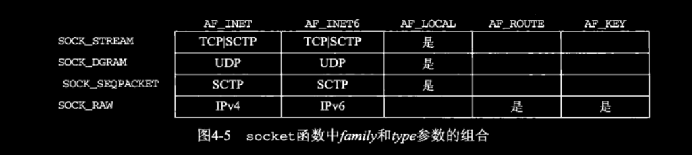
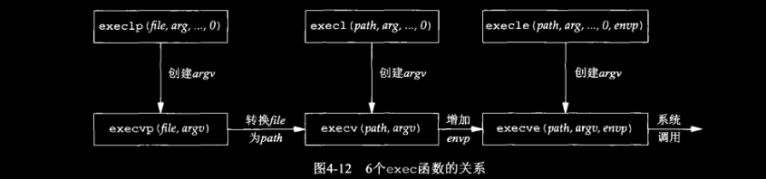
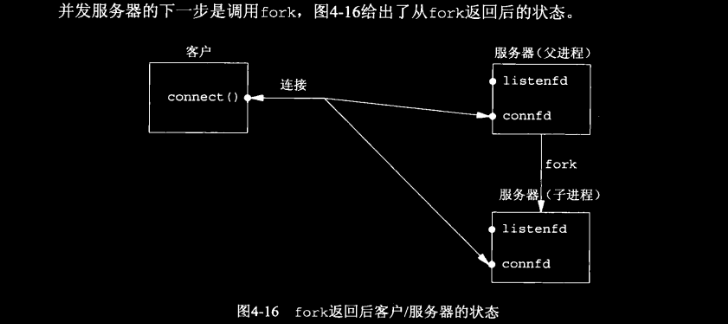
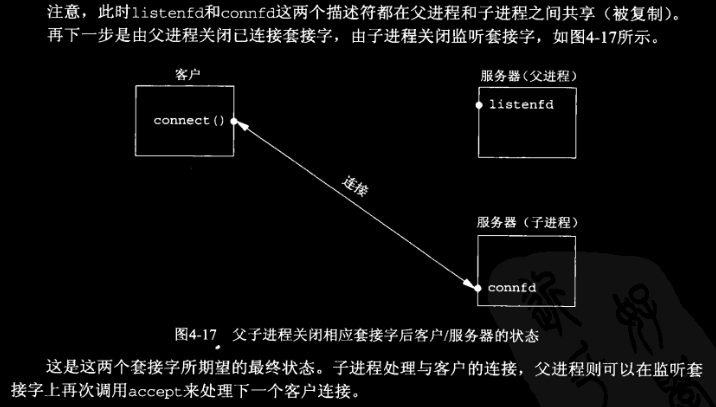

# ch04 基本TCP套接字编程

## 4.1 `socket` 函数

为了执行网络I/O，一个进程必须做的第一件事就是调用 `socket` 函数，指定期望的通信协议类型。

```c
#include <sys/socket.h>
int socket(int domain, int type, int protocol); // 返回：若成功则为非负描述符，若出错则为-1
```

- *domain* 参数指定协议族，见表4-2，该参数也被称为协议域。
- *type* 参数指明套接字类型，见表4-3。
- *protocol* 参数应设为图4-4所示的某个协议类型常值，或者设为0，以选择所给定 *domain* 和 *type* 参数组合的系统默认值。

表4-2 基本TCP客户/服务器程序的套接字函数

|*family*|说明|
| :----------: | :--------------------: |
|AF_INET|IPv4协议|
|AF_INET6|IPv6协议|
|AF_LOCAL|Unix域协议（见第15章）|
|AF_ROUTE|路由套接字（见第18章）|
|AF_KEY|密钥套接字（见第19章）|

表4-3 `socket` 函数的 *type* 常值

|*type*|说明|
| :-------------: | :---------------------: |
|SOCK_STREAM|字节流套接字|
|SOCK_DGRAM|数据报套接字|
|SOCK_SEQPACKET|有序分组套接字|
|SOCK_RAW|原始套接字|

表4-4 `socket` 函数 `AF_INET` 或 `AF_INET6` 的 *protocol* 常值

|*protocol*|说明|
| :-------------: | :-----------------: |
|IPPROTO_TCP|TCP传输协议|
|IPPROTO_UDP|UDP传输协议|
|IPPROTO_SCTP|SCTP传输协议|

并非所有套接字 *family* 与 *type* 的组合都是有效的，图4-5给出了一些有效的组合和对应的真正协议。其中标位 "是" 的项是有效的，但还没有找到便捷的缩略词。而空白项则是无效组合。



### *对比 AF_xxx 和 PF_xxx*

`AF_` 前缀表示地址族，`PF_` 表示协议族。历史上曾有这样的想法：单个协议族可以支持多个地址族，`PF_` 值用来创建套接字，而 `AF_` 值用于套接字地址结构。但实际上，支持多个地址族的协议族从来没实现过，而且头文件 `<sys/socket.h>` 中为一给定协议定义的 `PF_` 值总是与此协议的 `AF_` 值相等。尽管这种相等关系不一定永远成立，但若有人试图给已有协议改变这种约定，则许多现存代码都将崩溃。为了与现存代码一致，本书中使用了 `AF_` 常值。在 [TCP/IP 网络编程](https://github.com/lixichongAAA/TCP-IP-Network-Programming/blob/master/ch02-%E5%A5%97%E6%8E%A5%E5%AD%97%E7%B1%BB%E5%9E%8B%E4%B8%8E%E5%8D%8F%E8%AE%AE%E8%AE%BE%E7%BD%AE/README.md#2-%E5%8D%8F%E8%AE%AE%E6%97%8Fprotocol-family) 中使用的是 `PF_` 值。不过Linux Programmer's Manual 手册中给出的参数值是 `AF_` 常值，所以在Linux环境下也应用 `AF_` 常值吧。

## 4.3 `connect` 函数

```c
#include <sys/socket.h>
int connect(int sockfd, const struct sockaddr *addr, socklen_t addrlen);
// 若成功返回0，出错返回-1
```

*sockfd* 是由 `socket` 函数返回的套接字描述符，第二个、第三个参数分别是一个指向套接字地址结构的指针，和该结构的大小。  
客户在调用 `connect` 前不必非得调用 `bind` 函数，因为如果需要的话，内核会确定源IP地址，并选择一个临时端口作为源端口。  
如果是TCP套接字，调用 `connect` 函数将激发TCP的三路握手过程，而且仅在连接建立成功或出错时才返回，其中出错返回可能有以下几种情况。  
1. 若TCP客户没有收到SYNACK，则返回 `ETIMEOUT` 错误。举例来说，调用 `connect` 函数时，4.4BSD内核发送一个SYN，若无响应则等待6s后再发送一个，若仍无响应则等待24s后再发送一个。若总共等待75s后仍未收到响应则返回本错误。

2. 若对客户的SYN响应是RST（表示复位），则表明该服务器主机在我们指定的端口上没有进程在等待与之连接（例如服务器进程也许没在运行）。这是一种 ***硬错误（hard error）***，客户一接收到RST就马上返回 `ECONNREFUSED` 错误。RST是在TCP发生错误时发送的一种TCP分节。产生RST的三个条件是：目的地为某端口的SYN到达，然而该端口上没有正在监听的服务器（如前所述）；TCP想取消一个已有连接；TCP接收到一个根本不存在的连接上的分节。

3. 若客户发出的SYN在中间的某个路由器上引发了一个 "destination unreachable"（目的地不可达）ICMP错误，则认为是一种 ***软错误（soft error）***。客户主机内核保留该消息，并按第一种情况中所述的时间间隔继续发送SYN。若在某个规定的时间后仍未收到响应，则把保存的消息（即ICMP错误）作为 `EHOSTUNREACH` 或 `ENETUNREACH` 错误返回给进程。以下两种情形也是有可能的：一是只能找本地系统的转发表，根本没有到达远程系统的路径；二是 `connect` 调用根本不等待就返回。

## 4.4 `bind` 函数

`bind` 函数 把一个本地协议地址赋予一个套接字。对于网际网协议，协议地址是32位的IPv4地址或128位的Ipv6地址与16位的TCP或UDP端口号的组合。

```c
#include <sys/socket.h>
int bind(int sockfd, const struct sockaddr *addr, socklen_t addrlen);
// 返回：若成功则为0，若出错则为-1；
```

如果一个TCP客户或服务器未曾调用 `bind` 绑定一个端口，当调用 `connect` 或 `listen` 时，内核就要为相应的套接字选择一个临时端口。让内核来选择一个临时端口对于客户来说是常见的，除非应用需要一个预留端口。不过对于服务器而言，一般是要绑定它们的众所周知端口的（RPC服务器通常由内核为它们的监听套接字选择一个临时端口）。

调用 `bind` 函数可以指定一个端口号，或一个IP地址，也可以两者都指定，也可以都不指定。 下图汇总了如何根据预期的结果，设置 `sin_addr` 和 `sin_port` 或 `sin6_addr` 和 `sin6_port` 的值。

表4-6 给 `bind` 函数指定要捆绑的IP地址和或端口号产生的结果

|IP地址|端口|结果|
| :--------: | :-----: | :-----------------------------: |
|通配地址|0|内核选择IP地址和端口|
|通配地址|非0|内核选择IP地址，进程选择端口|
|本地IP地址|0|进程指定IP地址，进程选择端口|
|本地IP地址|非0|进程指定IP地址和端口|

如果指定端口号为0，那么内核就在 `bind` 被调用时选择一个临时端口。然而如果指定IP地址为通配地址，那么内核将等到套接字已连接（TCP）或已在套接字上发出数据报（UDP）时才选择一个本地IP地址。  
对于IPv4来说，***通配*** 地址由常值 `INADDR_ANY` 来指定，其值一般为0。它告知内核去选择IP地址。

```c
struct sockaddr_in serv_addr;
serv_addr.sin_addr.s_addr = htonl(INADDR_ANY); /* wildcard */
```

如此赋值对于IPv4是可行的，因为其IP地址是一个32位的值，可以用一个简单的数字常值表示，对于IPv6，我们就不能这么做了，因为128位的IPv6地址是存放在一个结构中的。

```c
struct sockaddr_in6 serv;
serv.sin6_addr = in6addr_any;
```

系统预先分配 `in6addr_any` 变量并将其初始化为常值 `IN6ADDR_ANY_INIT`。头文件 `<netinet/in.h>` 中含有 `in6addr_any` 的 extern声明。

不论网络字节序还是主机字节序，`INADDR_ANY` 的值（为0）都一样，因此使用 `htonl` 并非必需。不过 ***头文件 `netinet/in.h` 中定义的所有 `INADDR_` 常值都是按照主机字节序定义的，我们应该对任何这些常值都使用 `htonl`*** 。

如果让内核来为套接字选择一个临时端口号，那么必须注意，函数 `bind` 并不返回所选择的值。实际上，由于 `bind` 函数的第二个参数有 const 限定词，它无法返回所选之值。为了得到内核所选择的临时端口值，必须调用函数 `getsockname` 来返回协议地址。

从 `bind` 函数返回的一个常见错误是 `EADDRINUSE` （"address already in use"，地址已使用）。在7.5节时我们再详细说明。

## 4.5 `listen` 函数

`listen` 函数仅由TCP服务器调用，它做两件事。

1. 当 `socket` 函数创建一个套接字时，它被假设为一个主动套接字，也就是说，它是一个将调用 `connect` 发起连接的客户套接字。`listen` 函数把一个未连接的套接字转换成一个被动套接字（passive socket），指示内核应接受指向该套接字的连接请求。根据TCP的状态转化图（图2-4），调用 `listen` 导致套接字从 CLOSED 状态转换到 LISTEN 状态。
2. 该函数的第二个参数在书上说了一堆，简而言之，在Linux中，自Linux内核2.2以来，该参数表示已连接队列的最大长度（详见手册）。

```c
#include <sys/socket.h>
int listen(int sockfd, int backlog);
// 返回：若成功则为0，失败则为-1
```

为了理解其中的 *backlog* 参数，我们必须认识到内核为任何一个给定的监听套接字维护两个队列。

1. **未完成连接队列（incomplete connection queue）**，每个这样的SYN分节对应其中一项：已由某个客户发出并达到服务器，而服务器正在等待完成相应的三路握手过程。这些套接字处于 `SYN_RECV` 状态（见图2-4）。

2. **已完成连接队列（completed connection queue）**，每个已完成TCP三路握手过程的客户对应其中一项。这些套接字处于 `ESTABLISHED` 状态。 

当来自客户的SYN到达时，TCP在未完成连接队列中创建一个新项，然后响应以三路握手的第二个分节SYNACK：这一项一直保留在未完成连接队列中，直到三路握手的第三个分节（客户对服务器SYN的ACK）到达或者该项超时为止。如果三路握手正常完成，该项就从未完成连接队列移到已完成连接队列的队尾。当进程调用 `accept` 时，已完成连接队列的队头项将返回给进程，或者如果该队列为空，那么进程将被置于休眠状态，直到TCP在该队列中放入一项才唤醒它。

当一个客户SYN到达时，若这些队列是满的，TCP就忽略该分节，也就是不发送RST。这么做是因为：这种情况是暂时的，客户TCP将重发SYN，期望不久就能在这些队列找到可用空间。要是服务器TCP立即响应一个RST，客户的 `connect` 调用就会立即返回一个错误，强制应用进程处理这种情况，而不是让TCP的正常重传机制来处理。另外，客户无法区别响应SYN的RST究竟意味着 “该端口没有服务在监听” 还是 “该端口有服务在监听，不过它的队列满了”。有些实现在队列满时确实发送RST，这种做法是不正确的。

## 4.6 `accept` 函数

`accept` 函数由TCP服务器调用，用于从已完成连接队列队头返回下一个已完成连接。如果已完成连接队列为空，那么进程默认睡眠。

```c
#include <sys/socket.h>
int accept(int sockfd, struct sockaddr *addr, socklen_t *addrlen);
// 若成功则为已连接套接字的描述符，出错则-1
```

参数 *addr* 和 *addrlen* 用来返回已连接的对端进程的协议地址。*addrlen* 是值-结果参数。调用前，*addrlen* 是第二个参数的字节数，返回时，该整数值即为由内核存放在该套接字地址结构中的确切字节数。

本函数最多返回三个值：一个既可能是新套接字描述符也可能是出错指示的整数、客户进程的协议地址（第二个参数），以及该参数的大小（第三个参数）。如果我们对返回的客户协议的地址结构及大小不感兴趣，那么可以把这两个参数都置为空指针。

## 4.7 `fork` 和 `exec` 函数

Unix中派生新进程的唯一方法就是 `fork` 函数。

```c
#include <unistd.h>
pid_t fork(void);
// 返回：在子进程中为0，在父进程中为子进程ID，若出错则返回-1
```

`fork` 在子进程返回0而不是父进程ID的原因在于：任何子进程都只有一个父进程，而且子进程总是可以通过调用 `getppid` 获取父进程的PID。相反，父进程可以有许多子进程，而且无法获取各个子进程的进程ID。如果父进程想要跟踪所有子进程的进程ID，那么它必须记录每次调用 `fork` 的返回值。

父进程中调用 `fork` 之前打开的所有描述符在 `fork` 返回之后由子进程共享。我们将看到网络服务器利用了这个特性：父进程调用 `accept` 之后调用 `fork`。所接受的已连接套接字随后就在父进程与子进程之间共享，通常情况下，子进程接着读写这个已连接套接字，主动关闭监听套接字，父进程则关闭已连接套接字。

`fork` 有两个典型的用法：
1. 一个进程创建一个自身的副本，这样每个副本就可以在另一个副本执行其他任务的同时处理各自的操作。这是网络服务器的典型用法。
2. 一个进程想要执行另一个程序。既然创建新进程的唯一办法是调用 `fork`，该进程于是首先调用 `fork` 创建一个自身的副本，然后其中一个副本（通常为子进程）执行 `exec` 把自身替换成新的程序。这是诸如shell之类程序的典型用法。[参见 Linux命令行与shell脚本编程大全 笔记](https://github.com/lixichongAAA/Linux_Shell-Bash-/blob/master/ch15-%E5%91%88%E7%8E%B0%E6%95%B0%E6%8D%AE/README.md#2-%E6%B0%B8%E4%B9%85%E9%87%8D%E5%AE%9A%E5%90%91)

存放在硬盘上的可执行程序文件能够被Unix执行的唯一方法是：由一个现有进程调用六个 `exec` 函数中的一个（哪一个并不重要，我们把它们统称为 `exec` 函数）。`exec` 把当前进程映像替换成新的程序文件，而且新程序通常从main函数开始执行。进程ID并不改变。我们称调用 `exec` 的进程为 ***调用进程（calling process）***，称新执行的程序为 ***新程序（new program）***。

> 较老的手册和书本中不确切的称新程序为新进程，这是错误的，因为其中并没有创建新的进程。

这六个 `exec` 函数之间的区别在于：  
- 待执行的程序文件是由文件名（filename）还是路径名（pathname）指定；
- 新程序的参数是一一列出还是由一个指针数组来引用；
- 把调用进程的环境传递给新程序还是给新程序指定新的环境；

```c
SYNOPSIS
#include <unistd.h>

extern char **environ;
int execl(const char *path, const char *arg0, ... /*, (char *)0 */);
int execle(const char *path, const char *arg0, ... /*, (char *)0, char *const envp[]*/);
int execlp(const char *file, const char *arg0, ... /*, (char *)0 */);
int execv(const char *path, char *const argv[]);
int execve(const char *path, char *const argv[], char *const envp[]);
int execvp(const char *file, char *const argv[]);
    // 均返回：若成功则不返回，出错则-1
// 在POSIX Programmer's Manual中还有一个：
int fexecve(int fd, char *const argv[], char *const envp[]);
// 注意，和Linux环境下有点不同，具体参考手册
```

这些函数只有出错时才返回到调用者。否则，控制将被传递给新程序的起始点，通常就是main函数。
这6个函数间的关系如图4-12所示。一般来说，只有 `execve` 是内核中的系统调用，其他5个都是调用 `execve` 的库函数。



注意这6个函数的下列区别。

1. 上面那行的3个函数把新程序的每个参数字符串指定成 `exec` 的一个独立参数，并以一个空指针结束可变数量的这些参数。
下面那行的3个函数都有一个作为 `exec` 参数的 *argv* 数组，其中含有指向新程序各个参数字符串的所有指针。既然没有指定参数字符串的数目，这个 *argv* 数组必须含有一个用于指定其末尾的空指针。

2. 左列2个函数指定一个 *filename* 参数。`exec` 将使用当前的 `PATH` 环境变量把该文件名参数转换为一个路径名。然而一旦这2个函数的 *filename* 参数含有一个斜杠，就不再使用 `PATH` 环境变量。
右列四个函数指定一个全限定的 *pathname* 参数。

3. 左列4个函数不显式指定一个环境指针。相反，它们使用外部变量 `ENVIRON` 的当前值（参见[Linux命令行与shell脚本编程大全](https://github.com/lixichongAAA/Linux_Shell-Bash-/tree/master/ch22-gawk%E8%BF%9B%E9%98%B6#2-%E6%95%B0%E6%8D%AE%E5%8F%98%E9%87%8F)）来构造一个传递给新程序的环境列表。右列2个函数显式指定一个环境列表，其 *envp* 指针数组必须以一个空指针结束。

> **小提示：** 总结一下上面6个函数。
*l* 表示使用空指针结束的可变数量的参数。
*v* 表示 有一个作为 `exec` 参数的数组。
*p* 表示使用 `PATH` 环境变量转换文件名参数为一个路径名（文件名不含有斜杠的情况下）。 
*e* 表示显式指定一个环境列表，无 *e* 就是使用 `ENVIRON` 关联数组。

进程在调用 `exec` 之前打开着的描述符通常跨 `exec` 继续保持打开。我们使用限定词 “通常” 是因为本默认行为可以使用 `fcntl` 设置 `FD_CLOEXEC` 描述符禁止掉。inetd服务器就利用了这个特性，在13.5节讲到。

## 4.8 并发服务器

对于像时间获取这样的简单服务器来说，迭代服务器就足够了。然而当服务一个客户请求可能花费较长时间时，我们并不希望整个服务器被单个客户长期占用，而是希望同时服务于多个客户。Unix中编写并发服务器程序最简单的办法就是 `fork` 一个子进程来服务每个客户。下面给出了一个典型的并发服务器轮廓。

```c
pid_t pid;
int listenfd, connfd;
listenfd = socket(...);
bind(listenfd, ......);
listen(listenfd, ......);
for(;;)
{
    connfd = accept(listenfd, ......);
    if( (pid = fork()) == 0)
    {
        close(listenfd);
        doit();
        close(connfd);
        exit(0);
    }
        close(connfd);
}
```

上述代码片段中我们假设由函数 *doit* 执行服务客户所需的所有操作。当该函数返回时，我们在子进程中显式的关闭已连接套接字。这一点并非必需，因为下一个语句就是调用 `exit`，而进程终止处理的部分工作就是关闭由内核打开的所有描述符。是否显示调用 `close` 只和个人编程风格有关。

对一个TCP套接字调用 `close` 会导致发送一个 `FIN`，随后是正常的TCP连接终止序列。那为什么上述代码中父进程对 *connfd* 调用 `close` 没有终止它与客户的连接呢？为了便于理解，我们必须知道每个文件或套接字都有一个引用计数。引用计数在文件表项中维护，它是当前打开着的引用该文件或套接字的描述符的个数。上述代码中，`socket` 返回后与 *listenfd* 关联的文件表项的引用计数值为1。`accept` 返回后与 *connfd* 关联的文件表项的引用计数值也为1。然而 `fork` 返回后，这两个描述符就在父进程与子进程之间共享，因此与与这两个套接字相关联的文件表项各自的访问计数值均为2。这么一来，当父进程关闭 *connfd* 时，它只是把相应的引用计数值从2减为1。该套接字真正的清理和资源释放要等到其引用计数值到达0时才发生。这会在稍后子进程也关闭 *connfd* 时发生。

*下面看几个图就清楚了：*





## 4.9 `close` 函数

```c
#include <unistd.h>
int close(int fd); // 返回：若成功则为0，出错则为-1
```

`close` 一个套接字的默认行为是把该套接字标记成关闭，然后立即返回到调用进程。该套接字描述符不能再由调用进程使用，也就是说它不能再作为 `read` 或 `write` 的第一个参数。然而TCP将尝试发送已排队等待发送到对端的任何数据，发送完毕后是正常的TCP终止序列（四路挥手）。  
我们将在7.5节介绍的 `SO_LINGER` 选项可以改变TCP套接字的这种默认行为。我们还将在那节介绍TCP应用程序必须怎么做才能确信对端应用程序已收到所有未处理数据。

### 描述符引用计数

在4.8节的末尾我们提到过，并发服务器中父进程关闭已连接套接字只是导致相应描述符的引用计数值减1。既然引用计数值仍大于0，这个 `close` 调用并不引发TCP四分组连接终止序列。对于父进程与子进程共享的已连接套接字的并发服务器来说，这正是我们所期望的。

如果我们确实想在某个TCP连接上发送FIN，那么可以改用 `shutdown` 函数以代替 `close`。我们将在6.5节阐述这么做的动机。也可以参见 [TCP/IP网络编程](https://github.com/lixichongAAA/TCP-IP-Network-Programming/tree/master/ch16-%E5%85%B3%E4%BA%8EIO%E6%B5%81%E5%88%86%E7%A6%BB%E7%9A%84%E5%85%B6%E4%BB%96%E5%86%85%E5%AE%B9#3-%E6%B5%81-%E5%88%86%E7%A6%BB%E5%B8%A6%E6%9D%A5%E7%9A%84eof%E9%97%AE%E9%A2%98)。

我们还得清楚，如果父进程对每个 `accept` 返回的已连接套接字都不调用 `close`，那么并发服务器中将发生什么。首先，父进程最终将耗尽可用的描述符，因为任何进程任何时刻可拥有的打开着的描述符数通常是有限制的。不过更重要的是，没有一个客户连接会被终止。当子进程关闭已连接套接字时，它的引用计数值将由2递减为1且保持为1，因为父进程永不关闭任何已连接套接字。这将妨碍TCP终止序列的发生，导致连接一直打开着。所以，在子进程中我们关不关闭已连接套接字只是风格的问题，但是父进程是一直运行的，在其退出前已连接套接字是一直打开着的。

## 4.10 `getsockname` 和 `getpeername` 函数

这两个函数返回与某个套接字关联的本地协议地址（`getsockname`）或外地协议地址(`getpeername`)。

```c
#include <sys/socket.h>
int getsockname(int sockfd, struct sockaddr *addr, socklen_t *addrlen);
int getpeername(int sockfd, struct sockaddr *addr, socklen_t *addrlen);
// 均返回：若成功则为0，出错则-1
```

注意，这两个函数的最后一个参数都是值-结果参数。

需要这两个函数的一些场景如下：

- 在一个没有调用 `bind` 的TCP客户上，`connect` 返回成功后，`getsockname` 用于返回由内核赋予该连接的本地IP地址和本地端口号。
- 在以端口号0调用 `bind` （告知内核去选择本地端口）后，`getsockname` 用于返回由内核赋予的本地端口号。
- `getsockname` 可用于获取某个套接字的地址族。
- 在一个以通配地址调用 `bind` 的TCP服务器上，与某个客户的连接一旦建立（`accept` 调用成功返回），`getsockname` 就可以用于返回由内核赋予该连接的本地IP地址。在这样的调用中，套接字描述符参数必须是已连接套接字的描述符，而不是监听套接字的描述符。
- 当一个服务器是由调用过 `accept` 的某个进程通过 `exec` 执行程序时，它能够获取客户身份的唯一途径便是调用 `getpeername`。

### *例子：获取套接字的地址族*

```c
int
sockfd_to_family(int sockfd)
{
	struct sockaddr_storage ss;
    // 因为不知道要分配的套接字地址结构类型，我们于是采用 sockaddr_storage 这个通用结构，
    // 因为它能够承载系统支持的任何套接字地址结构
	socklen_t	len;

	len = sizeof(ss);
	if (getsockname(sockfd, (SA *) &ss, &len) < 0)
		return(-1);
	return(ss.ss_family);
    // 我们调用 getsockname 返回地址族。
    // 既然POSIX规范允许对未绑定的套接字调用 getsockname，该函数应该适合于任何已打开的套接字描述符。
}
```