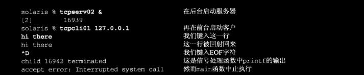
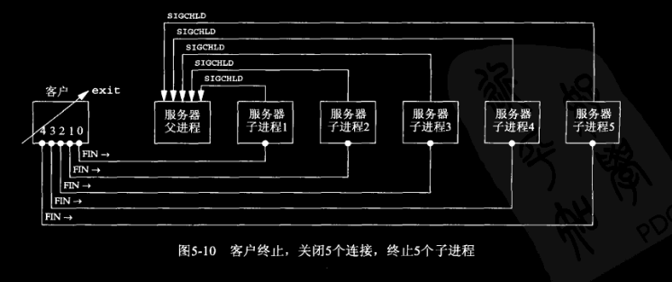
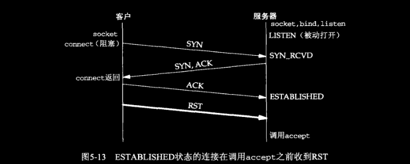
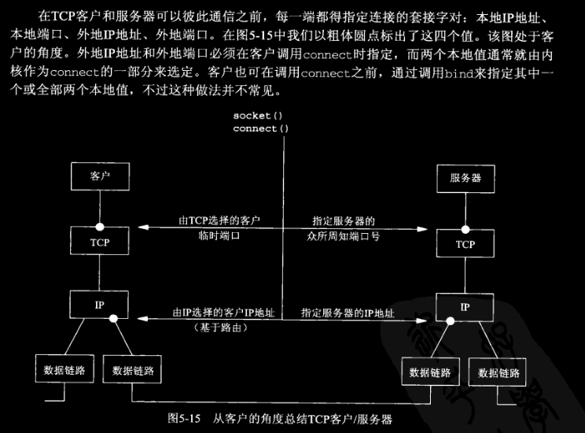
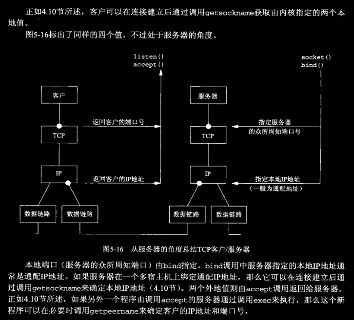

# ch05 TCP客户/服务器程序示例

## 5.1 概述

在本章实现一个TCP回声服务器。

## 5.2 TCP回射服务器程序：main函数

```c
#include	"unp.h"

int
main(int argc, char **argv)
{
	int					listenfd, connfd;
	pid_t				childpid;
	socklen_t			clilen;
	struct sockaddr_in	cliaddr, servaddr;

	listenfd = Socket(AF_INET, SOCK_STREAM, 0);

	bzero(&servaddr, sizeof(servaddr));
	servaddr.sin_family      = AF_INET;
	servaddr.sin_addr.s_addr = htonl(INADDR_ANY);
	servaddr.sin_port        = htons(SERV_PORT); 
    // 1024 <= SERV_PORT <= 49151(65536*0.75 - 1)

	Bind(listenfd, (SA *) &servaddr, sizeof(servaddr));

	Listen(listenfd, LISTENQ);

	for ( ; ; ) {
		clilen = sizeof(cliaddr);
		connfd = Accept(listenfd, (SA *) &cliaddr, &clilen);

		if ( (childpid = Fork()) == 0) {	/* child process */
			Close(listenfd);	/* close listening socket */
			str_echo(connfd);	/* process the request */
			exit(0); // 注意这里没有显式的调用 close(connfd),如前所述，因为下一行就是 exit
		}
		Close(connfd);			/* parent closes connected socket */
	}
}
```

## 5.3 TCP回射服务器程序：*str_echo* 函数

```c
#include	"unp.h"

void
str_echo(int sockfd)
{
	ssize_t		n;
	char		buf[MAXLINE];

again:
	while ( (n = read(sockfd, buf, MAXLINE)) > 0)
		Writen(sockfd, buf, n);

	if (n < 0 && errno == EINTR)
		goto again;
	else if (n < 0)
		err_sys("str_echo: read error");
}
```

## 5.4 TCP回射客户程序：main函数

```c
#include	"unp.h"

int
main(int argc, char **argv)
{
	int					sockfd;
	struct sockaddr_in	servaddr;

	if (argc != 2)
		err_quit("usage: tcpcli <IPaddress>");

	sockfd = Socket(AF_INET, SOCK_STREAM, 0);

	bzero(&servaddr, sizeof(servaddr));
	servaddr.sin_family = AF_INET;
	servaddr.sin_port = htons(SERV_PORT);
	Inet_pton(AF_INET, argv[1], &servaddr.sin_addr);

	Connect(sockfd, (SA *) &servaddr, sizeof(servaddr));

	str_cli(stdin, sockfd);		/* do it all */

	exit(0);
}
```

## 5.5 TCP回射客户程序：*str_cli* 程序

```c
#include	"unp.h"

void
str_cli(FILE *fp, int sockfd)
{
	char	sendline[MAXLINE], recvline[MAXLINE];

	while (Fgets(sendline, MAXLINE, fp) != NULL) {

		Writen(sockfd, sendline, strlen(sendline));

		if (Readline(sockfd, recvline, MAXLINE) == 0)
			err_quit("str_cli: server terminated prematurely");

		Fputs(recvline, stdout);
	}
}
```

## 5.6 正常启动

```bash
lxc@Lxc:~/C/unpv13e-master/tcpcliserv$ netstat -a
Proto Recv-Q Send-Q Local Address           Foreign Address         State      
tcp        0      0 0.0.0.0:9877            0.0.0.0:*               LISTEN     
tcp        0      0 localhost:37492         localhost:9877          ESTABLISHED

lxc@Lxc:~/C/unpv13e-master/tcpcliserv$ ps -t pts/3 -o pid,ppid,tty,stat,args,wchan
    PID    PPID TT       STAT COMMAND                     WCHAN
  18043   16153 pts/3    Ss+  /usr/bin/bash --init-file / do_select
  19490   18043 pts/3    S    ./tcpserv01                 inet_csk_accept
  19565   19490 pts/3    S    ./tcpserv01                 wait_woken

lxc@Lxc:~/C/unpv13e-master/tcpcliserv$ ps -t pts/4 -o pid,ppid,tty,stat,args,wchan
    PID    PPID TT       STAT COMMAND                     WCHAN
  19110   16153 pts/4    Ss   /usr/bin/bash --init-file / do_wait
  19564   19110 pts/4    S+   ./tcpcli01 127.0.0.1        wait_woken
```

三个网络进程的 *STAT* 列都是 “S”，表明进程在为等待某些资源而休眠。进程处于休眠状态时 *WCHAN* 列指出相应的条件。（这里与书上不同，毕竟内核版本差太多了，书上的Linux内核还是2的版本）该列表示进程正在休眠的内核函数名称。服务器父进程阻塞于 `accept` 函数，该列为 *inet_csk_accept*，服务器子进程与客户端进程分别阻塞于 `read` 和 `fgets` 函数，该列为 *wait_woken*。

## 5.7 正常终止

```bash
lxc@Lxc:~/C/unpv13e-master/tcpcliserv$ ./tcpcli01 127.0.0.1
hello, world                       
hello, world
good bye
good bye
# 这里按下了Ctrl+D

lxc@Lxc:~/C/unpv13e-master/tcpcliserv$ netstat -a | grep 9877
tcp        0      0 0.0.0.0:9877            0.0.0.0:*               LISTEN     
tcp        0      0 localhost:37492         localhost:9877          TIME_WAIT  

lxc@Lxc:~$ ps -t pts/3 -o pid,ppid,tty,stat,args,wchan
    PID    PPID TT       STAT COMMAND                     WCHAN
  18043   16153 pts/3    Ss+  /usr/bin/bash --init-file / do_select
  19490   18043 pts/3    S    ./tcpserv01                 inet_csk_accept
  19565   19490 pts/3    Z    [tcpserv01] <defunct>       -
```

我们可以总结出正常终止客户和服务器的步骤。

1. 当我们键入EOF字符（即按下Ctrl+D）时，`fgets` 返回一个空指针，于是 *str_cli* 函数返回。
2. *str_cli* 返回到客户端的 main 函数，main 函数通过调用 `exit` 终止。
3. 进程终止处理的部分工作是关闭所有打开的描述符，因此客户打开的套接字由内核关闭。这导致客户TCP发送一个FIN给服务器，服务器TCP则以ACK响应，这就是TCP终止序列的前半部分。至此，服务器套接字处于 *CLOSE_WAIT* 状态，客户套接字处于 *FIN_WAIT_2* 状态。
4. 当服务器TCP接收到FIN时，服务器子程序阻塞于 `read` 调用，于是 `read` 返回0。这导致 *str_echo* 函数返回服务器子程序的 main 函数。
5. 服务器子程序通过调用 `exit` 来终止。
6. 服务器子程序中打开的所有描述符随之关闭。由子程序关闭已连接套接字会引发TCP连接终止序列的最后两个分节：一个从服务器到客户端的FIN和一个从客户到服务器的ACK。至此，连接完全终止，客户套接字进入 *TIME_WAIT* 状态。
7. 进程终止处理的另一部分内容是：在服务器子进程终止时，给父进程发送一个 `SIGCHLD` 信号。这一点在本例中发生了，但是我们没有在代码中捕获该信号，而该信号的默认行为是被忽略。既然父进程未加处理，子进程于是进入僵死状态。我们使用了 `ps` 命令验证了这一点，如上所示。

我们必须处理僵死进程，这就涉及到了Unix信号处理。

## 5.8 POSIX信号处理

**信号（signal）** 就是告知某个进程发生了某个事件的通知，有时也称为 **软件中断（software interrupt）**。信号是 **异步** 发生的，也就是说进程预先不知道信号的准确发生时刻。也可参见[TCP/IP网络编程](https://github.com/lixichongAAA/TCP-IP-Network-Programming/tree/master/ch10-%E5%A4%9A%E8%BF%9B%E7%A8%8B%E6%9C%8D%E5%8A%A1%E5%99%A8%E7%AB%AF#3-%E4%BF%A1%E5%8F%B7%E5%A4%84%E7%90%86)。

信号可以：
- 由一个进程发给另一个进程（或自身）。
- 由内核发送给某个进程。

上一节结尾提到的 `SIGCHLD` 信号就是由内核在任何一个进程终止时发给它的父进程的一个信号。

每个信号都有一个与之关联的的 **处置（disposition）**，也称为 **行为（action）**。我们通过调用 `sigaction` 函数来设定一个信号的处置，并有三种选择。

1. 我们可以提供一个函数，只要有特定的信号发生它就被调用。这样的函数称为 ***信号处理函数（signal handler）***，这种行为称为 ***捕获（catching）*** 信号。有两个信号不能被捕获，它们是 `SIGKILL` 和 `SIGSTOP`。信号处理函数的函数原型如下。对于大多数信号来说，调用 `sigaction` 函数并指定信号发生时所调用的函数就是捕获信号所需做的全部工作。不过稍后我们将看到，`SIGIO`、`SIGPOLL`、`SIGURG` 这些个别信号还要求捕获它们的进程做些额外的工作。

```c
void handler(int signo);
```

2. 我们可以把某个信号的处置设为 `SIG_IGN` 来忽略它。`SIGKILL` 和 `SIGSTOP` 这两个信号不能忽略。
3. 我们可以把某个信号的处置设定为 `SIG_DFL` 来启用它的默认处置。默认处置通常是在收到信号后终止进程，其中某些信号还在当前工作目录产生一个进程的核心映像（core image，也称为内存映像）。另有个别信号的默认处置是忽略，`SIGCHLD` 和 `SIGURG` 就是本书中出现的默认处置为忽略的信号。

### `signal` 函数

书上定义了自己的 `signal` 函数：

```c
 1 /* include signal */
 2 #include     "unp.h"
 3 
 4 Sigfunc *
 5 signal(int signo, Sigfunc *func)
 6 {
 7      struct sigaction        act, oact;
 8 
 9      act.sa_handler = func;
10      sigemptyset(&act.sa_mask);
11      act.sa_flags = 0;
12      if (signo == SIGALRM) {
13 #ifdef       SA_INTERRUPT
14              act.sa_flags |= SA_INTERRUPT;   /* SunOS 4.x */
15 #endif
16      } else {
17 #ifdef       SA_RESTART
18              act.sa_flags |= SA_RESTART;             /* SVR4, 44BSD */
19 #endif
20      }
21      if (sigaction(signo, &act, &oact) < 0)
22              return(SIG_ERR);
23      return(oact.sa_handler);
24 }
25 /* end signal */
26 
27 Sigfunc *
28 Signal(int signo, Sigfunc *func)     /* for our signal() function */
29 {
30      Sigfunc *sigfunc;
31 
32      if ( (sigfunc = signal(signo, func)) == SIG_ERR)
33              err_sys("signal error");
34      return(sigfunc);
35 }
```

- 第10行 POSIX允许我们指定这样一组信号，它们在信号处理函数被调用时阻塞（此阻塞的反操作是解阻塞，不是阻塞非阻塞那个阻塞）。任何阻塞的信号都不能 ***递交（delivering）*** 给进程。我们把 `sa_mask` 成员设置为空集，意味着在该信号处理函数运行期间，不阻塞额外的信号。POSIX保证被捕获的信号在其信号处理函数运行期间总是阻塞的。

- 第11\~20行 `SA_RESTART` 标志是可选的。如果设置，由相应信号中断的系统调用将由内核自动重启。

### POSIX信号语义

- 一旦安装了信号处理函数，它便一直安装着（较早期的系统是每执行一次就将其拆除）。
- 在一个信号处理函数运行期间，正被递交的信号是阻塞的。而且，安装处理函数是在传递给 `sigaction` 函数的 `sa_mask` 信号集中指定的任何额外的信号也被阻塞。
- 如果一个信号在被阻塞期间产生了一次或多次，那么该信号被解阻塞之后通常只递交一次，也就是说Unix信号 ***默认是不排队的***。POSIX标准 1003.1b 定义了一些排队的可靠信号，不过本书中我们不使用。
- 利用 `sigprocmask` 函数选择性地阻塞或解阻塞一组信号是可能的。这使得我们可以做到在一段临界区代码执行期间，防止捕获某些信号，以此保护此段代码。

## 5.9 处理 `SIGCHLD` 信号

设置僵死（zombie）状态的目的是维护子进程信息，以便父进程在以后某个时候获取。这些信息包括子进程的进程ID，终止状态以及资源利用信息（CPU时间，内存使用量等等）。如果一个进程终止，而该进程有子进程处于僵死状态，那么它的所有僵死子进程的父进程ID将被重置为1（init进程）。继承这些子进程的init进程将清理它们（也就是说init进程将 `wait` 它们，从而去除它们的僵死状态）。有些Unix系统在 `ps` 命令输出的 *COMMAND* 栏以 *<defunct\>* 指明僵死进程。见 [上文](./README.md#56-正常启动)。

### 处理僵死进程

我们显然不愿意留存僵死进程。它们占用内核中的空间，最终可能导致我们耗尽进程资源。无论何时，我们 `fork` 子进程都得 `wait` 它们，以防止它们变成僵死进程。不再bb，见下。

```c
#include	"unp.h"

int
main(int argc, char **argv)
{
	int					listenfd, connfd;
	pid_t				childpid;
	socklen_t			clilen;
	struct sockaddr_in	cliaddr, servaddr;
	void				sig_chld(int);

	listenfd = Socket(AF_INET, SOCK_STREAM, 0);

	bzero(&servaddr, sizeof(servaddr));
	servaddr.sin_family      = AF_INET;
	servaddr.sin_addr.s_addr = htonl(INADDR_ANY);
	servaddr.sin_port        = htons(SERV_PORT);

	Bind(listenfd, (SA *) &servaddr, sizeof(servaddr));

	Listen(listenfd, LISTENQ);

	Signal(SIGCHLD, sig_chld);

	for ( ; ; ) {
		clilen = sizeof(cliaddr);
		connfd = Accept(listenfd, (SA *) &cliaddr, &clilen);

		if ( (childpid = Fork()) == 0) {	/* child process */
			Close(listenfd);	/* close listening socket */
			str_echo(connfd);	/* process the request */
			exit(0);
		}
		Close(connfd);			/* parent closes connected socket */
	}
}

#include	"unp.h"

void
sig_chld(int signo)
{
	pid_t	pid;
	int		stat;

	pid = wait(&stat);
	printf("child %d terminated\n", pid);
    // 警告，在信号处理函数中调用 printf 这样的标准I/O函数是不合适的，原因在11.18节讨论。
    // 这里为了方便。
	return;
}
```

结果见下：



具体的各个步骤如下：
1. 我们键入EOF字符来终止客户。客户TCP发送一个FIN给服务器，服务器响应一个ACK。
2. 收到客户的FIN导致服务器TCP递送一个EOF给子进程阻塞中的 *read*，从而子进程终止。
3. 当 `SIGCHLD` 信号递交时，父进程阻塞于 `accept` 调用。*sig_chld* 函数执行，其 `wait` 调用取到子进程的PID和终止状态，随后是 `printf` 调用，最后返回。
4. 既然信号是在父进程阻塞于慢系统调用（`accept`）时由父进程捕获的（可参考[TCP/IP网络编程](https://github.com/lixichongAAA/TCP-IP-Network-Programming/blob/master/ch10-%E5%A4%9A%E8%BF%9B%E7%A8%8B%E6%9C%8D%E5%8A%A1%E5%99%A8%E7%AB%AF/README.md#2-%E4%BF%A1%E5%8F%B7%E4%B8%8E-signal-%E5%87%BD%E6%95%B0)），内核就会使 `accept` 返回一个 `EINTR` 错误（被中断的系统调用）。而父进程不处理该错误，于是终止。

***这个例子是为了说明，在编写捕获信号的网络程序时，我们必须认清被中断的系统调用且处理它们***。在这个运行在 Solaris 9环境下的特定例子中，标准C函数库中提供的 `signal` 函数不会使内核自动重启被中断的系统调用。如果我们在4.4BSD环境下照样使用系统函数库版本的 `signal` 函数运行上述例子，那么内核将重启被中断的系统调用，于是 `accept` 不会返回错误。

### 处理被中断的系统调用

我们用术语慢系统调用（slow system call）描述过 `accept` 函数，该术语也适用于那些可能永远阻塞的系统调用。永远阻塞的系统调用是指调用有可能永远无法返回，多数网络支持函数都属于这一类。

适用于慢系统调用的基本规则是：当阻塞于慢系统调用的一个进程捕获某个信号且相应信号处理函数返回时，该系统调用可能返回一个 `EINTR` 错误。有些内核自动重启某些被中断的系统调用。不过为了便于移植，当我们编写捕获信号的程序时（多数并发服务器捕获 `SIGCHLD`），我们必须对慢系统调用返回 `EINTR` 有所准备。移植性问题是由早期使用的修饰词 “可能”、“有些” 和对POSIX的 `SA_RESTART` 标志的支持是可选的这一事实造成的。即使某个实现支持 `SA_RESTART` 标志，也并非所有被中断系统调用都可以被重启。举例来说，大多数源自Berkeley的实现从不自动重启 `select`，其中有些实现从不重启 `accept` 和 `recvfrom`。

为了处理被中断的 `accept`，我们改动上文的代码。如下所示：

```c
for ( ; ; ) {
		clilen = sizeof(cliaddr);
		if ( (connfd = accept(listenfd, (SA *) &cliaddr, &clilen)) < 0) {
			if (errno == EINTR)
				continue;		/* back to for() */
			else
				err_sys("accept error");
		}
	......
```

这段代码所做的事情就是自己重启被中断的系统调用。对于 `accept` 以及诸如 `read`、`write`、`select` 和 `open` 之类的函数来说，这是合适的。不过有一个函数我们不能重启：`connect`。如果该函数返回 `EINTR`，我们就不能再次调用它，否则将立即返回一个错误。当 `connect` 被一个捕获的信号中断而且不自动重启时，我们必须调用 `select` 来等待连接完成，如16.3节所述。

## 5.10 `wait` 和 `waitpid` 函数

```c
#include <sys/wait.h>
pid_t wait(int *wstatus);
pid_t waitpid(pid_t pid, int *wstatus, int options);
// 均返回：若成功则为进程ID，失败则为0或-1 详见手册
```

函数 `wait` 和 `waitpid` 均返回两个值：已终止子进程的进程ID号，以及通过 *wstatus* 返回的子进程终止状态（一个整数）。我们可以调用三个宏来检查终止状态，并辨别子进程是正常终止、由某个信号杀死还是仅仅由作业控制停止而已。另有些宏用于接着获取子进程的退出状态、杀死子进程的信号值或停止子进程的作业控制信号值。在图15-10中，我们将为此目的使用宏 `WIFEXISTED` 和 `WEXITSTATUS`。也可参见 [TCP/IP网络编程](https://github.com/lixichongAAA/TCP-IP-Network-Programming/tree/master/ch10-%E5%A4%9A%E8%BF%9B%E7%A8%8B%E6%9C%8D%E5%8A%A1%E5%99%A8%E7%AB%AF#1-%E9%94%80%E6%AF%81%E5%83%B5%E5%B0%B8%E8%BF%9B%E7%A8%8B1%E5%88%A9%E7%94%A8-wait-%E5%87%BD%E6%95%B0)。

如果调用 `wait` 的进程没有已终止的子进程，不过有一个或多个子进程仍在执行，那么 `wait` 将阻塞到现有子进程第一个终止为止。  
`waitpid` 函数就等待哪个进程以及是否阻塞给了我们更多的控制。首先，*pid* 参数允许我们指定想等待的进程ID，值-1表示等待第一个终止的子进程。（另有一些处理进程组ID的可选值，不过本书中用不上）其次 *options* 参数允许我们指定附加选项。最常用的选项是 `WNOHANG`，它告知内核在没有已终止子进程时不要阻塞。

### `wait` 和 `waitpid` 的区别

我们现在展示两者在清理已终止子进程时的区别。图5-9为客户程序。

```c
// 图5-9
#include	"unp.h"

int
main(int argc, char **argv)
{
	int					i, sockfd[5];
	struct sockaddr_in	servaddr;

	if (argc != 2)
		err_quit("usage: tcpcli <IPaddress>");

	for (i = 0; i < 5; i++) {
		sockfd[i] = Socket(AF_INET, SOCK_STREAM, 0);

		bzero(&servaddr, sizeof(servaddr));
		servaddr.sin_family = AF_INET;
		servaddr.sin_port = htons(SERV_PORT);
		Inet_pton(AF_INET, argv[1], &servaddr.sin_addr);

		Connect(sockfd[i], (SA *) &servaddr, sizeof(servaddr));
	}

	str_cli(stdin, sockfd[0]);		/* do it all */

	exit(0);
}
```

服务器程序如 *tcpcliserv/tcpserv03.c*

```c
// tcpcliserv/tcpserv03.c
#include	"unp.h"

int
main(int argc, char **argv)
{
	int					listenfd, connfd;
	pid_t				childpid;
	socklen_t			clilen;
	struct sockaddr_in	cliaddr, servaddr;
	void				sig_chld(int);

	listenfd = Socket(AF_INET, SOCK_STREAM, 0);

	bzero(&servaddr, sizeof(servaddr));
	servaddr.sin_family      = AF_INET;
	servaddr.sin_addr.s_addr = htonl(INADDR_ANY);
	servaddr.sin_port        = htons(SERV_PORT);

	Bind(listenfd, (SA *) &servaddr, sizeof(servaddr));

	Listen(listenfd, LISTENQ);

	Signal(SIGCHLD, sig_chld);

	for ( ; ; ) {
		clilen = sizeof(cliaddr);
		if ( (connfd = accept(listenfd, (SA *) &cliaddr, &clilen)) < 0) {
			if (errno == EINTR)
				continue;		/* back to for() */
			else
				err_sys("accept error");
		}

		if ( (childpid = Fork()) == 0) {	/* child process */
			Close(listenfd);	/* close listening socket */
			str_echo(connfd);	/* process the request */
			exit(0);
		}
		Close(connfd);			/* parent closes connected socket */
	}
}
```

当客户终止时，所有打开的描述符由内核自动关闭（我们不调用 `close`，仅调用 `exit`），且所有5个连接基本在同一时刻终止。这就引发了5个FIN，每个连接一个，它们反过来使服务器的5个子进程基本在同一时刻终止。这又导致差不多在同一时刻有5个 `SIGCHLD` 信号递交给父进程。如图5-10所示。



```bash
lxc@Lxc:~/C/unpv13e-master/tcpcliserv$ ./tcpserv03 &
[1] 10580
lxc@Lxc:~/C/unpv13e-master/tcpcliserv$ child 10810 terminated

lxc@Lxc:~/C/unpv13e-master/tcpcliserv$ ps
    PID TTY          TIME CMD
   3923 pts/1    00:00:00 bash
  10580 pts/1    00:00:00 tcpserv03
  10811 pts/1    00:00:00 tcpserv03 <defunct>
  10812 pts/1    00:00:00 tcpserv03 <defunct>
  10813 pts/1    00:00:00 tcpserv03 <defunct>
  10814 pts/1    00:00:00 tcpserv03 <defunct>
  10889 pts/1    00:00:00 ps

lxc@Lxc:~/C/unpv13e-master/tcpcliserv$ ./tcpcli04 127.0.0.1
hello
hello
# 这里按下了 Ctrl+D
```

我们注意到只有一个 `printf` 输出，而当时我们预期所有5个子进程都终止了。如果运行 `ps` 命令，我们将发现其他4个子进程仍然作为僵尸进程存在着：“\<defunct\>”

建立一个信号处理函数并在其中调用 `wait` 并不足以防止出现僵死进程。本问题在于：所有5个信号都是在信号处理函数执行之前产生，而信号处理函数只执行一次，因为Unix信号一般是 ***不排队的***。更严重的是，本问题是不确定的。依赖于FIN达到服务器主机的时机，信号处理函数可能会执行多次。

正确的解决办法是调用 `waitpid` 而不是 `wait`，图5-11给出了正确处理 `SIGCHLD` 的 *sig_chld* 函数。这个版本管用的原因在于：我们在一个循环内调用 `waitpid`，以获取所有已终止子进程的状态。我们必须指定 `WNOHANG` 选项，它告知 `waitpid` 在有尚未终止的子进程在运行时不要阻塞。我们在之前的 *sig_chld* 信号处理函数中不能再循环内调用 `wait`，因为没有办法防止 `wait` 在正运行的子进程尚有未终止时阻塞。

```c
// tcpcliserv/sigchldwaitpid.c
// 图5-11
#include	"unp.h"

void
sig_chld(int signo)
{
	pid_t	pid;
	int		stat;

	while ( (pid = waitpid(-1, &stat, WNOHANG)) > 0)
		printf("child %d terminated\n", pid);
	return;
}
```

本节的目的是示范我们在网络编程时可能会遇到的三种情况：

- ***当 `fork` 子进程时，必须捕获 `SIG_CHLD` 信号***
- ***当捕获信号时，必须处理被中断的系统调用***
- ***`SIG_CHLD` 信号处理函数必须正确编写，应使用 `waitpid` 函数以避免留下僵死进程***

## 5.11 `accept` 返回前连接中止

（注意此中止非终止）。
类似于前一节中介绍的被中断系统调用的例子，另有一种情形也能够导致 `accept` 返回一个非致命的错误，在这种情况下，只需再次调用 `accept`。这种情况如下所示：
三路握手完成从而建立连接之后，客户TCP却发送了一个RST。在服务器端看来，就在该连接已由TCP排队，等着服务器进程调用 `accept` 的时候RST到达。稍后，服务器进程调用 `accept`。



这种终止的连接不同的实现会返回不同的错误，POSIX是 `ECONNABORTED` 错误。这样的话，服务器就可以忽略它，再次调用 `accept` 就行。  
在16.6节会再次讨论中止的连接，查看在 `select` 和正常阻塞模式下的监听套接字组合时是如何产生问题的。

## 5.12 服务器进程终止

现在我们启动客户服务器对，然后杀死服务器子进程。这是在模拟服务器进程崩溃的情形，我们可从中看到客户将发生什么。（注意区别服务器进程崩溃和将在5.14节讨论的服务器主机崩溃）

```bash
lxc@Lxc:~/C/unpv13e-master/tcpcliserv$ ./tcpserv03 &
[1] 15538
lxc@Lxc:~/C/unpv13e-master/tcpcliserv$ ps --forest 
    PID TTY          TIME CMD
  14415 pts/3    00:00:00 bash
  15538 pts/3    00:00:00  \_ tcpserv03
  15555 pts/3    00:00:00  |   \_ tcpserv03
  15612 pts/3    00:00:00  \_ ps
lxc@Lxc:~/C/unpv13e-master/tcpcliserv$ kill -9 15555
child 15555 terminated
lxc@Lxc:~/C/unpv13e-master/tcpcliserv$ netstat -a | grep 9877
tcp        0      0 0.0.0.0:9877            0.0.0.0:*               LISTEN     
tcp        1      0 localhost:50006         localhost:9877          CLOSE_WAIT 
tcp        0      0 localhost:9877          localhost:50006         FIN_WAIT2  

lxc@Lxc:~/C/unpv13e-master/tcpcliserv$ ./tcpcli01 127.0.0.1
hello
hello
# 在这里已经杀死了服务器子进程。
another line
str_cli: server terminated prematurely
```	

1. 我们在同一个主机上启动服务器和客户，并在客户上键入一行文本，以验证一切正常，正常情况下，该行文本由服务器子进程回射给客户。
2. 找到服务器子进程的进程ID，并使用 `kill` 命令杀死它。作为终止处理的部分工作，子进程中所有打开着的文件描述符都被关闭。这就导致向客户发送一个FIN，而客户TCP则响应一个ACK。这就是TCP连接终止工作的前半部分。
3. `SIG_CHLD` 信号被发送给服务器父进程，并得到正确处理。
4. 客户上没有发生任何特殊之事。客户TCP接收来自服务器TCP的一个FIN并响应一个ACK，然而问题是客户进程阻塞在 `fgets` 调用上，等待从终端接收一行文本。
5. 此时，在另一个窗口上运行 `netstat` 命令，以观察套接字的状态。从上面我们可以看到，TCP连接终止序列的前半部分已经完成。
6. 我们可以在客户上再键入一行文本。

当我们键入 “another line”时，*str_cli* 调用 `write`，客户TCP接着把数据发送给服务器。TCP允许这么做，因为客户TCP收到FIN只是表示服务器进程已关闭了连接的服务器端，从而不再往其中发送任何数据而已。FIN的接收并没有告知客户TCP服务器进程已经终止（当然，本例子中它确实是终止了）。 
当服务器TCP收到来自客户的数据时，既然先前打开打开那个套接字的进程已经终止，于是响应一个RST。通过使用 `tcpdump` 我们可以看到该RST确实发送了。

7. 然而客户进程看不到这个RST，因为它在调用 `write` 后立即调用了 `read`，并且由于第2步中接收的FIN，所调用的 `read` 立即返回0（表示EOF）。我们的客户此时并未预期收到EOF，于是以出错信息 “server terminated prematurely” 退出。（如果此时客户已经收到RST，则 `read` 返回一个 `ECONNRESET`（“connection reset by peer”，对方连接复位错误））。
8. 当客户退出时，它所有打开着的描述符都被关闭。

本例子的问题在于：当FIN到达套接字时，客户正阻塞在 `fgets` 调用上。***客户实际上在应对两个描述符：套接字和用户输入，它不能单纯阻塞这两个源中某个特定源的输入上，而是应该阻塞在其中任何一个源的输入上***。 事实上这正是 `select` 和 `poll` 这两个函数的目的之一，我们会在6.4节重写 *str_cli* 函数，使得一旦杀死服务器子进程，客户就会立即被告知已收到FIN。

## 5.13 `SIGPIPE信号`

要是客户不理会 `read` 函数返回的错误，反而写更多的数据到服务器上，那又会发生什么呢？***第一次写操作会引发RST，第二次写操作会引发 `SIGPIPE` 信号。写一个已接收了FIN的套接字不成问题，但是写一个已接收了RST的套接字则是一个错误。***  
适用于此的规则是：当一个进程向某个已收到RST的套接字执行写操作时，内核向该进程发送一个 `SIGPIPE` 信号。该信号的默认行为是终止进程，因此进程必须捕获它以免不情愿的被终止。***不论该进程是捕获了该信号并从其信号处理函数返回，还是简单的忽略该信号，写操作都将返回 `EPIPE` 错误。***

## 5.14 服务器主机崩溃

这里我们假设的是服务器主机崩溃（或者主机未崩溃，但网络上不可达），与服务器主机关机不一样。  
服务器主机已崩溃，从而对客户的数据分节没有任何响应，那么所返回的错误是 `ETIMEOUT`（客户会不断重试直至达到最大尝试次数）。然而如果某个中间路由器判定服务器主机已不可达，从而响应一个 “destination unreachable（目的地不可达）”的ICMP消息，那么所返回的错误是 `EHOSTUNREACH`  或 `ENETUNREACH`。

我们刚刚讨论的情形只有在我们向服务器主机发送数据时才能检测出它已崩溃。如果我们不主动向它发送数据也想检测出服务器主机的崩溃，可以使用7.5节讨论的 `SO_KEEPALIVE` 套接字选项。

## 5.15 服务器主机崩溃后重启

此时，所发生的步骤如下：

1. 启动服务器和客户，并在客户键入一行文本以确认连接建立。
2. 服务器主机崩溃重启。
3. 在客户上键入一行文本，它将作为一个TCP数据分节发送到服务器主机。
4. 当服务器主机崩溃后重启时，它的TCP丢失了崩溃前的所有连接信息，因此服务器TCP对收到的来自客户的数据分节响应一个RST。
5. 当客户TCP收到RST时，客户正阻塞于 `read` 调用，导致该连接返回 `ECONNRESET` 错误。

如果对客户而言检测出服务器主机崩溃与否很重要，即使客户不主动发送数据也要能检测出来，就需要采用其他某种技术（比如 `SO_KEEPALIVE` 套接字选项或某些客户端/服务器端心博函数）。

## 5.16 服务器主机关机

Unix系统关机时，init进程通常先给所有进程发送 `SIGTERM` 信号（该信号可被捕获，该信号的默认处置是终止进程）。等待一段固定的时间，然后给所有仍在运行的进程发送 `SIGKILL` 信号（该信号不能被捕获）。这么做留给所有运行的进程一小段时间来清除和终止。当服务器子进程被终止时，它的所有打开着的描述符都被关闭，随后发生的事你知道的，就跟5.12节讨论的一样。正如那一节所述，我们必须在客户中使用 `select` 或 `poll` 函数，使得服务器进程一经终止，客户就能检测到。

## 5.17 TCP程序例子小结




## 5.18 数据格式

### 5.18.1 例子：在客户与服务器之间传递文本串

直接上结论：不论客户和服务器主机的字节序如何，把数值数据作为文本串来传递不会出现问题。

### 5.18.2 例子：在客户与服务器之间传递二进制结构

存在以下三个问题：

1. 不同的实现以不同的格式存储二进制数，这可能导致出现问题。
2. 不同的实现在存储相同的C数据类型上可能存在差异。
3. 不同的实现给结构打包的方式存在差异，取决于各种数据类型所用的位数以及机器的对齐限制。因此，穿越套接字传递二进制结构绝不是明智的。

解决这种数据格式问题有两个常用的方法：

1. 把所有的数值数据都作为文本串来传递。这是上一节的做法（这里假设客户和服务器主机具有相同的字符集）。
2. 显式定义所支持数据类型的二进制数据格式（位数、大端或小端字节序），并以这样的格式在客户与服务器之间传递所有数据。RPC通常这样做。