# ch06 I/O复用：`select` 和 `poll` 函数

## 6.1 概述

在5.12节中，我们看到TCP客户同时处理两个输入：标准输入和TCP套接字。我们遇到的问题是就在客户阻塞于（标准输入上 的）`fgets` 调用期间，服务器进程被杀死。这个时候服务器TCP虽然正确的给客户TCP发送了一个FIN，但是既然客户进程正阻塞于从标准输入读入的过程，它将看不到这个EOF。直到从套接字读时为止（可能已经过了很长时间）。这样的进程需要一种预先告知内核的能力，使得内核一旦发现进程指定的一个或多个I/O条件就绪（也就是说输入已准备好被读取，或描述符已能承接更多的输出），它就通知进程。这个能力称为 **I/O复用（I/O multiplexing）**，是由 `select` 和 `poll` 这两个函数支持的。  
有些系统提供了更为先进的让进程在一串事件上等待的条件。轮询设备（poll device）就是这样的机制之一，不过不同厂家提供的方式不近相同。14章会阐述这种机制。

I/O复用典型使用在下列网络应用场合：

- 当客户处理多个描述符时（通常是交互式输入或网络套接字），必须使用I/O复用。这是我们早先讲述过的场合。
- 一个客户同时处理多个套接字是可能的，不过比较少见。16.5节中结合一个Web客户的上下文给出这种场合使用 `select` 的例子
- 如果一个TCP服务器既要处理监听套接字，又要处理已连接套接字，一般就要使用I/O复用。如6.8节所述。
- 如果一个服务器既要处理TCP，又要处理UDP，一般就要使用I/O复用。8.15节给出例子。
- 如果一个服务器要处理多个服务或者多个协议（例如13.5节讲述的inetd守护进程），一般就要使用I/O复用。

I/O 复用并非只适用于网络编程，许多重要的应用程序也需要使用这项技术。

## 6.2 I/O模型

Unix下有5种可用的I/O模型。

- 阻塞式I/O
- 非阻塞式I/O
- I/O复用（ `select` 和 `poll` ）
- 信号驱动式I/O（ `SIGIO` ）
- 异步I/O（POSIX的 `aio_` 系列函数）

一个输入操作通常包括两个不同的阶段：

- 等待数据准备好
- 从内核向进程复制数据

对于一个套接字上的输入操作，第一步通常涉及等待数据从网络中到达。当所等待分组到达时，它被复制到内核中的某个缓冲区。第二步就是把数据从内核缓冲区复制到应用进程缓冲区。

### 6.2.1 阻塞式I/O模型

默认情形下，所有套接字都是阻塞的，以数据报套接字为例，如下图所示。

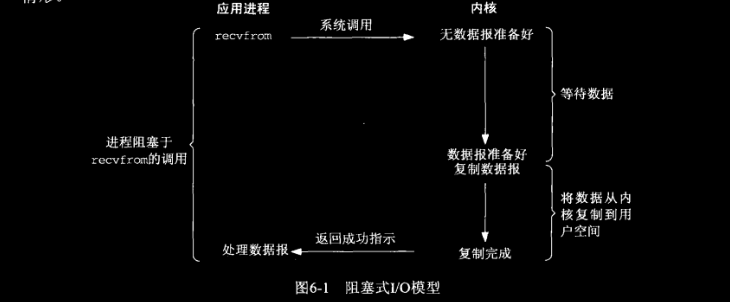

我们使用UDP而不是TCP作为例子的原因在于就UDP而言，数据准备好读取的概念比较简单：要么整个数据报已经收到，要么还没有。然而对于TCP来说，诸如套接字低水位标记（low-water mark）等额外变量开始起作用，导致这个概念变得复杂。  
在本节的例子中，我们把 `recvfrom` 函数视为系统调用，因为我们正在区分应用进程和内核。不论它如何实现（在源自Berkeley的内核上是作为系统调用，在System V内核上是作为调用系统调用 `getmsg` 的函数），一般都会从应用进程空间中运行切换到内核空间中运行，一段时间后再切换回来。  
在图6-1中，进程调用 `recvfrom`，其系统调用直到数据报到达且被复制到应用进程的缓冲区中或者发生错误才返回。最常见的错误是系统调用被信号中断，如5.9节所述。我们说进程在从调用 `recvfrom` 开始到它返回整段时间内是被阻塞的。`recvfrom` 成功返回后，应用进程开始处理数据报。

### 6.2.2 非阻塞式I/O模型

进程把套接字设置成非阻塞是在通知内核：当所请求的I/O操作非得把本进程置于休眠状态才能完成时，不要把本进程置于休眠状态，而是返回一个错误。我们将在16章中详细介绍非阻塞式I/O（noblocking I/O）。不过图6.2概要展示了该模型。

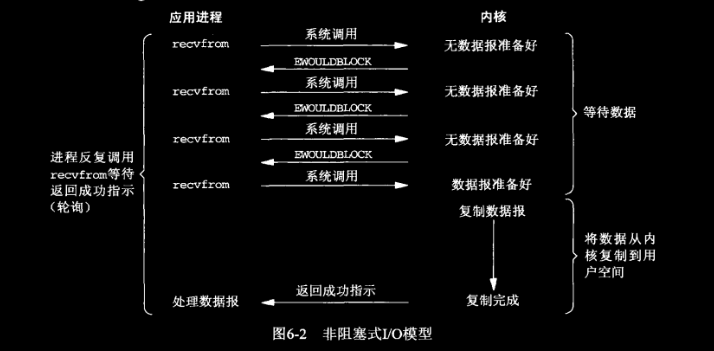

前三次调用 `recvfrom` 时没有数据可返回，因而内核转而立即返回一个 `EWOULDBLOCK` 错误。第四次调用 `recvfrom` 时已有一个数据准备好。它被复制到应用进程缓冲区，于是 `recvfrom` 成功返回，我们接着处理数据。  
当一个应用进程像这样对一个非阻塞描述符循环调用 `recvfrom` 时，我们称之为轮询（polling）。应用进程持续轮询内核，以查看某个操作是否就绪。这么做往往耗费大量CPU时间，不过这种模型也会遇到，通常是在专门提供某一种功能的系统中才有。

### 6.2.3 I/O复用模型

有了I/O复用（I/O multiplexing），我们就可以调用 `select` 或 `poll`，阻塞在这两个系统调用中的某一个之上，而不是阻塞在真正的I/O系统调用之上。图6-3概括展示了I/O复用模型。

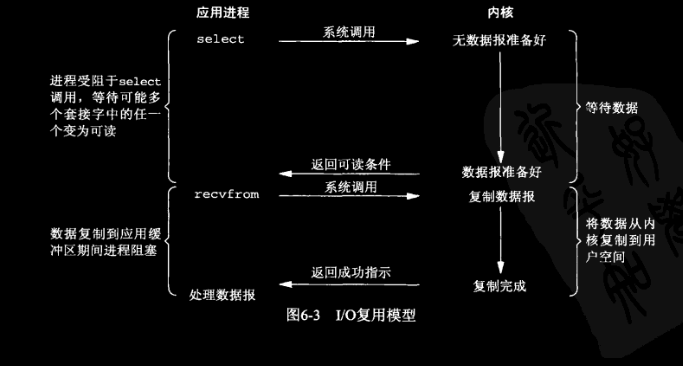

我们阻塞于 `select` 调用，等待数据报套接字变得可读。当 `select` 返回套接字可读这一条件时，我们调用 `recvfrom` 把所读数据复制到应用进程缓冲区。  
比较图6-3和图6-1，I/O复用并不显得有什么优势，事实上由于使用 `select` 需要两个而不是单个系统调用，I/O 复用还稍有劣势。不过我们将在本章稍后看到，使用 `select` 的优势在于我们可以等待多个描述符就绪。

与I/O复用密切相关的另一种模型是在多线程中使用阻塞式I/O，这种模型与上述模型极为相似，但它没有使用 `select` 阻塞在多个文件描述符上，而是使用多个线程（每个文件描述符一个），这样每个线程都可以自由地调用诸如 `recvfrom` 之类的阻塞式I/O系统调用了。

### 6.2.4 信号驱动式I/O模型

我们也可以用信号，让内核在描述符就绪时发送 `SIGIO` 信号通知我们。我们称这种模型为 **信号驱动式I/O（signal-driven I/O）**，图6-4是它的概要展示。

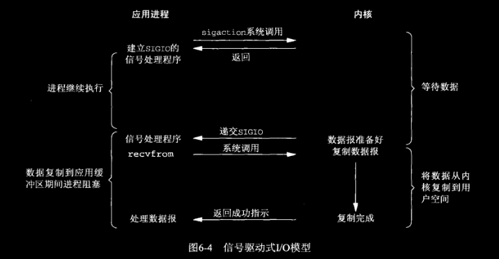

我们首先开启套接字的信号驱动I/O功能（25.2节），并通过 `sigaction` 系统调用安装一个信号处理函数。该系统调用立即返回，我们的进程继续工作，也就是说它没有被阻塞。当数据报准备好时，内核就为该进程产生一个 `SIGIO` 信号。我们随后既可以在信号处理函数中调用 `recvfrom` 读取数据报，并通知主循环数据已准备好处理（这正是我们将在25.3节中所要做的事），也可以立即通知主循环，让它读取数据报。  
无论如何处理 `SIGIO` 信号，这种模型的优势在于等待数据报到达期间进程不被阻塞。主循环可以继续执行，只要等待来自信号处理函数的通知：既可以是数据已准备好被处理，也可以是数据报已准备好被读取。

### 6.2.5 异步I/O模型

**异步I/O（asynchronous I/O）** 由POSIX规范定。演变成当前POSIX规范的各种早期标准所定义的 ***实时函数*** 中存在的差异已经取得一致。一般来说，这些函数的工作机制是：告知内核启动某个操作，并让内核在整个操作（包括将数据从内核复制到我们自己的缓冲区）完成后通知我们。这种模型与前一节介绍的信号驱动模型主要的区别在于：***信号驱动式I/O是由内核通知我们何时可以启动一个I/O操作，而异步I/O模型是由内核通知我们I/O操作何时完成。*** 图6-5给出了一个例子。

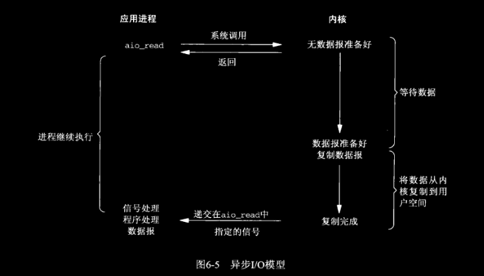

我们调用 `aio_read` 函数（POSIX异步函数以 `aio_` 或 `lio_` 开头），给内核传递描述符、缓冲区指针、缓冲区大小（与 `read` 相同的三个参数）和文件偏移（与 `lseek` 类似），并告诉内核当整个操作完成时如何通知我们。该系统调用立即返回，而且在等待I/O完成期间，我们的进程不被阻塞。本例子中我们假设要求内核在操作完成时产生某个信号。该信号直到数据复制到应用进程缓冲区才产生，这一点不同于信号驱动式I/O模型。

### 6.2.6 各种I/O模型的比较

图6-6对比了上述5种不同的I/O模型。可以看出，前4种模型的主要区别在于第一阶段，因为它们的第二阶段是一样的：在数据从内核复制到调用者的缓冲区期间，进程阻塞于 `recvfrom` 调用。相反，异步I/O模型在这两个阶段都要处理，从而不同于其他4种模型。

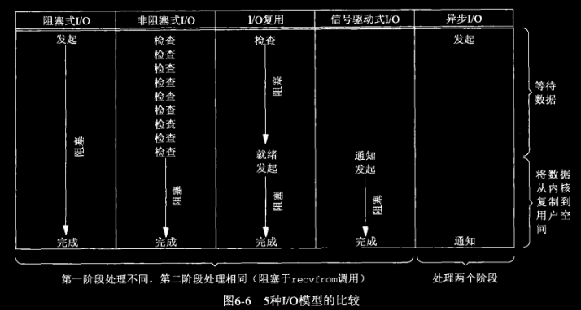

### 6.2.7 同步I/O和异步I/O对比

POSIX把这两个术语定义如下：

- **同步I/O操作（synchronous I/O operation）** 导致请求进程阻塞，直到I/O操作完成。
- **异步I/O操作（asynchronous I/O operation）** 不导致请求进程阻塞。

前四种模型：阻塞式I/O模型、非阻塞式I/O模型、I/O复用模型和信号驱动式I/O模型都是同步I/O模型。因为其中真正的I/O操作（ `recvfrom` ）将阻塞进程。只有异步I/O模型与POSIX定义的异步I/O相匹配。

## 6.3 `select` 函数

该函数允许进程指示内核等待多个事件中的任何一个发生，并只在由一个或多个事件发生或经历一段指定时间后才唤醒它。我们调用 `select` 告知内核对哪些描述符（就读、写或异常）感兴趣以及等待多长时间。我们感兴趣的描述符不局限于套接字，任何描述符都可以使用 `select` 来测试。

```c
#include <sys/select.h>
#include <sys/time.h>
int select(int nfds, fd_set *readfds, fd_set *writefds,
                  fd_set *exceptfds, struct timeval *timeout);
// 发生错误时返回-1（譬如被一个所捕获的信号中断），超时返回0。
// 因发生关注的事件返回时，返回发生事件的文件描述符数。
```

关于该函数的描述参见 [TCP/IP网络编程](https://github.com/lixichongAAA/TCP-IP-Network-Programming/tree/master/ch12-IO%E5%A4%8D%E7%94%A8#2-%E7%90%86%E8%A7%A3-select-%E5%B9%B6%E5%AE%9E%E7%8E%B0%E6%9C%8D%E5%8A%A1%E5%99%A8%E7%AB%AF)。需要注意的是，书上的版本中 *timeout* 参数是一个 `const struct` ，不过现在我查POSIX或者Linux手册该函数的这个参数均无 const 限定（书上的标准比较古老吧。。），所以我贴的是Linux手册上的函数原型。

*timeout* 参数告知内核等待所指定描述符中的任何一个就绪可花多少时间。其 `timeval` 结构用于指定这段时间的秒数和微秒数。

```c
struct timeval 
{
    long    tv_sec;         /* seconds */
    long    tv_usec;        /* microseconds */
};
```

这个参数有以下三种可能。

- 永远等待下去：仅在有一个描述符准备好I/O时才返回。为此，我们把该参数设置为空指针。
- 等待一段固定时间：在有一个描述符准备好I/O时返回，但是不超过由该参数所指向的 `timeval` 结构中指定的秒数和微秒数。
- 根本不等待：检查描述符后立即返回，这称为 **轮询（polling）**。为此，该参数必须指向一个 `timeval` 结构，而且其中的定时器值必须为0。

前两种情形的等待通常会被进程在等待期间捕获的信号中断，并从信号处理函数返回。源自Berkeley的内核绝不自动重启被中断的 `select`，然而SVR4可以自动重启被中断的 `select`，条件是在安装信号处理函数时指定了 `SA_RESTART` 标志。这意味着从可移植性考虑，如果我们在捕获信号，那么必须做好 `select` 返回 `EINTR` 错误的准备。

尽管 `timeval` 结构允许我们指定一个微秒级的分辨率，然而内核支持的真实分辨率往往粗糙的多。举例来说，许多Unix 内核把超时值向上舍入成10ms的倍数。另外还涉及调度延迟，也就是说定时器时间到后，内核还需花一点时间调度相应进程运行。  
如果 *timeout* 参数所指向的 `timeval` 结构中的 `tv_sec` 成员值超过一亿秒，那么有些系统的 `select` 函数将以 `EINVAL` 错误失败返回。当然这是一个非常大的超时值（超过三年），不大可能有用，不过就此指出：`timeval` 结构能够表达 `select` 不支持的值。

中间的三个参数 *readset*、*writeset* 和 *excepts* 指定我们要让内核测试读、写和异常条件的描述符。如果我们对某一个条件不感兴趣，就可以把它设为空指针。事实上，如果这三个指针均为空，我们就有了一个比Unix的 `sleep` 函数更为精确的定时器。`poll` 函数提供类似的功能。目前支持的异常条件只有两个：

- 某个套接字带外数据到达，见24章。
- 某个已置为分组模式的伪终端存在可从其主端读取的控制状态信息，本书不讨论伪终端。

这几个参数以及第一个参数见 [TCP/IP网络编程](https://github.com/lixichongAAA/TCP-IP-Network-Programming/tree/master/ch12-IO%E5%A4%8D%E7%94%A8#2-%E8%AE%BE%E7%BD%AE%E6%96%87%E4%BB%B6%E6%8F%8F%E8%BF%B0%E7%AC%A6)

头文件 `<sys/select.h>` 中定义的 `FD_SETSIZE` 常值是数据类型 `fd_set` 中的描述符总数，其值通常是1024，不过很少有程序用到这么多的描述符。存在这个参数以及计算其值（最大描述符值+1）的额外负担纯粹是为了效率原因。每个 `fd_set` 都有大量描述符（典型值为1024）的空间，然而一个普通进程所用的数量却少得多。内核正是通过在进程与内核之间不复制描述符集中不必要的部分，从而不测试总为0得那些位来提高效率的。

`select` 函数修改由指针 *readset*、*writeset* 和 *exceptset* 所指向的描述符集，因而这三个参数都是值-结果参数。调用该函数时，我们指定所关注的描述符的值，该函数返回时，结果将指示哪些描述符已就绪。该函数返回后，我们使用 `IF_ISSET` 宏来测试 `fd_set` 数据类型中的描述符。描述符集内任何与未就绪描述符所对应的位均清成0。为此，每次重新调用 `select` 函数时，我们都得再次把所有描述符集内所关心的位均置为1。

### 6.3.1 描述符就绪条件

我们一直在讨论等待某个描述符准备好I/O或是等待其上发生一个待处理的异常条件（带外数据）。尽管可读性和可写性对于普通文件这样的描述符显而易见，然而对于引起 `select` 返回套接字“就绪”的条件我们必须讨论的更明确些。

1. 满足下列四个条件中的一个时，一个套接字准备好读

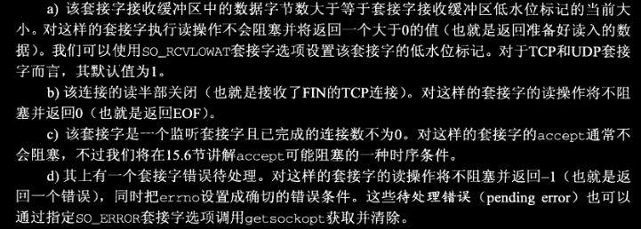

2. 下列四个条件中的任何一个满足时，一个套接字准备好写

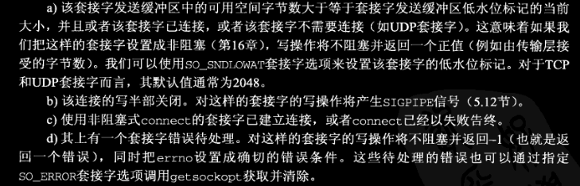

3. 如果一个套接字存在带外数据或仍处于带外标记，那么它有异常条件待处理。（我们将在第24章讲述带外数据）

注意：当某个套接字上发生错误时，它将由 `select` 标记为既可读又可写。

接收低水位标记和发送低水位标记的目的在于：允许应用进程控制在 `select` 返回可读或可写条件之前有多少数据可读或有多大空间可用于写。举例来说，如果我们知道除非至少存在64字节的数据，否则我们的应用进程没有任何有效工作可做，那么可以把接收低水位标记设置为64，以防止少于64字节的数据准备好读时 `select` 唤醒我们。  
任何UDP套接字只要其发送低水位标记小于等于发送缓冲区大小（默认应该总是这种关系）就总是可写的，这是因为UDP套接字不需要连接。  
图6-7汇总了上述导致 `select` 返回某个套接字就绪的条件。

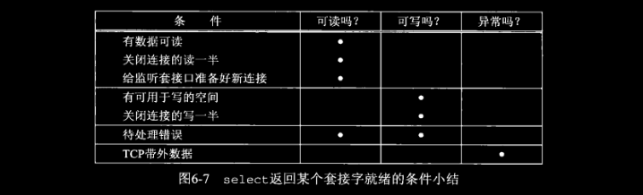

### 6.3.2 `select` 的最大描述符数

早些时候我们说过，大多数应用程序不会用到许多描述符。譬如说我们很少找到一个使用几百描述符的应用程序。然而使用那么多描述符的应用程序确实存在，它们往往使用 `select` 来复选描述符。最初设计 `select` 时，操作系统通常对每个进程可用的最大描述符数设置了上限（4.2BSD的限制为31），`select` 就使用了相同的限制值。然而当今的Unix版本允许进程使用事实上无限制数目的描述符（往往受限于内存总量和管理性限制），因此我们的问题是：这对 `select` 有什么影响？  

在Linux的该文件中 `FD_SETSIZE` 的大小为1024。在4.2BSD的该文件中 `FD_SETSIZE` 大小为256。

这使我们可以想到，可以在包括该头文件之前把 `FD_SETSIZE` 定义为某个更大的值以增加 `select` 所用描述符集的大小。不过，这样行不通。增大描述符集大小的唯一方法是先增大 `FD_SETSIZE` 的值，再重新编译内核，不重新编译内核而改变其值是不够的。

## 6.4 *str_cli* 函数（修订版）

现在我们可以使用 `select` 重写5.5节中的 *str_cli* 函数了，这样服务器进程一终止，客户就能马上得到通知。早先那个版本的问题在于：当套接字上发生某些事件时，客户可能阻塞于 `fgets` 调用。新版本改为阻塞于 `select` 调用，或是等待标准输入可读，或是等待套接字可读，图6-8展示了调用 `select` 所处理的各种条件。

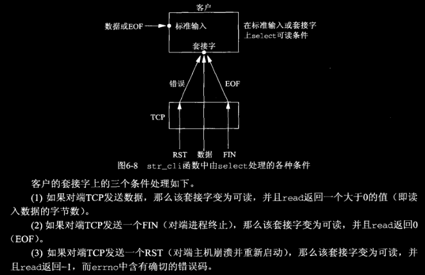

图6-9给出了这个版本的源代码。

```c
// 图6-9
// select/strcliselect01.c
 1 #include	"unp.h"
 2 
 3 void
 4 str_cli(FILE *fp, int sockfd)
 5 {
 6 	int			maxfdp1;
 7 	fd_set		rset;
 8 	char		sendline[MAXLINE], recvline[MAXLINE];
 9 
10 	FD_ZERO(&rset);
11 	for ( ; ; ) {
12 		FD_SET(fileno(fp), &rset);
13 		FD_SET(sockfd, &rset);
14 		maxfdp1 = max(fileno(fp), sockfd) + 1;
15 		Select(maxfdp1, &rset, NULL, NULL, NULL);
16 
17 		if (FD_ISSET(sockfd, &rset)) {	/* socket is readable */
18 			if (Readline(sockfd, recvline, MAXLINE) == 0)
19 				err_quit("str_cli: server terminated prematurely");
20 			Fputs(recvline, stdout);
21 		}
22 
23 		if (FD_ISSET(fileno(fp), &rset)) {  /* input is readable */
24 			if (Fgets(sendline, MAXLINE, fp) == NULL)
25 				return;		/* all done */
26 			Writen(sockfd, sendline, strlen(sendline));
27 		}
28 	}
29 }
```

## 6.5 批量输入

不幸的是，这个版本的 *str_cli* 仍是不正确的。我们把标准输入和标准输出重定向到文件来运行新的客户程序时，会发现输出文件总是小于输入文件（而对于回射服务器而言，它们应总是相等）。

问题的起因在于我们对标准输入中的EOF的处理：*str_cli* 函数就此返回到main函数，而main函数随后终止。然而在批量方式下，标准输入中的EOF并不意味着我们同时也完成了从套接字的读入；可能仍有请求在去往服务器的路上，或者仍有应答在返回客户的路上。  
我们需要的是一种关闭TCP连接其中一半的方法。也就是说，我们想给服务器发送一个FIN，告诉它我们已经完成了数据发送，但是仍然保持套接字描述符打开以便读取。这由下一节讲述的 `shutdown` 函数完成。

一般来说，为提升性能而引入缓冲机制增加了网络程序的复杂性，图6-9所示的代码就遭受这种复杂性之害。考虑有多个来自标准输入的文本输入行可用的情况。`select` 将使用第24行代码用 `fgets` 读取输入，这又转而使已可用的文本输入行被读入到 *stdio* 所用的缓冲区中。然而 `fgets` 只返回其中第一行，其余输入行仍在 *stdio* 缓冲区中。第26行代码将 `fgets` 返回的单个输入行写给服务器，随后 `select` 被再次调用以等待新的工作，而不管 *stdio* 缓冲区中还有额外的输入行待消费。究其原因在于 `select` 不知道 *stdio* 使用了缓冲区，它只是从 `read` 系统调用的角度指出是否有数据可读，而不是从 `fgets` 之类调用的角度考虑。基于上述原因，混合使用 *stdio* 和 *select* 被认为是非常容易犯错的，在这样做时必须极其小心。

## 6.6 `shutdown` 函数

终止网络连接的通常方法是调用 `close` 函数。不过 `close` 有两个限制，却可以使用 `shutdown` 来避免。

1. `close` 把描述符的引用计数减1，仅在该计数变为0时才关闭套接字。4.8节已有讨论。使用 `shutdown` 可以不管引用计数就激发TCP的正常连接终止序列。

2. `close` 终止读和写两个方向的数据传递。既然TCP是全双工的，有时候我们需要告知对端我们已经完成了数据发送，即使对端仍有数据要发送给我们。这是我们在前一节中遇到的 *str_cli* 函数在批量输入的情况。图6-12展示了这样情况下典型的函数调用。

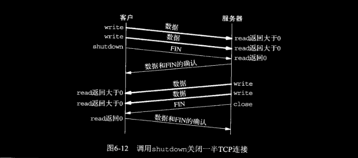

```c
#include <sys/socket.h>
int shutdown(int sockfd, int how);
// 返回：若成功则为0，若出错则为-1。
```

该函数也可见 [TCP/IP网络编程](https://github.com/lixichongAAA/TCP-IP-Network-Programming/tree/master/ch07-%E4%BC%98%E9%9B%85%E5%9C%B0%E6%96%AD%E5%BC%80%E5%A5%97%E6%8E%A5%E5%AD%97%E8%BF%9E%E6%8E%A5#3-%E9%92%88%E5%AF%B9%E4%BC%98%E9%9B%85%E6%96%AD%E5%BC%80%E7%9A%84-shutdown-%E5%87%BD%E6%95%B0)

该函数的行为依赖于 *how* 参数：

- SHUT_RD 关闭连接的读一半，套接字中不再有数据可接收，而且套接字接收缓冲区中的现有数据都被丢弃。进程不能再对这样的套接字调用任何读函数。对一个TCP套接字调用 `shutdown` 函数后，由该套接字接收的来自对端的任何数据都被确认，然后悄然丢弃。

- SHUT_WR 关闭连接的写一半，对于TCP套接字，这称为 **半关闭（half-close）**。当前保留在套接字缓冲区中的数据将被发送掉，后跟TCP的正常连接终止序列。我们已经说过，不管套接字描述符的引用计数是否等于0，这样的写半部关闭照样执行。进程不能再对这样的套接字调用任何写函数。

- SHUT_RDWR 这样的读半部和写半部都关闭，这与调用 `shutdown` 两次等效：第一次调用指定 `SHUT_RD`，第二次调用指定 `SHUT_WR`。

图7-12将汇总进程调用 `shutdown` 或 `close` 的各种可能。`close` 的操作取决于 `SO_LINGER` 套接字选项的值。

> 这三个SHUT_xxx名字由POSIX规范定义，*how* 参数的典型值将会是0（关闭读半部）、1（关闭写半部）和2（两者都关闭）。

## 6.7 *str_cli* 函数（再修订版）

图6-13给出了 *str_cli* 函数的改进（且正确）版本，它使用了 `select` 和 `shutdown`，其中前者只要服务器关闭它那一端的连接就会通知我们，后者允许我们正确的处理批量输入。这个版本还废弃了以文本行为中心的代码，改而针对缓冲区操作，从而消除了6.5节中提出的复杂性问题。

```c
// 图6-13
// select/strcliselect02.c
 1 #include	"unp.h"
 2 
 3 void
 4 str_cli(FILE *fp, int sockfd)
 5 {
 6 	int			maxfdp1, stdineof;
 7 	fd_set		rset;
 8 	char		buf[MAXLINE];
 9 	int		n;
10 
11 	stdineof = 0;
12 	FD_ZERO(&rset);
13 	for ( ; ; ) {
14 		if (stdineof == 0)
15 			FD_SET(fileno(fp), &rset);
16 		FD_SET(sockfd, &rset);
17 		maxfdp1 = max(fileno(fp), sockfd) + 1;
18 		Select(maxfdp1, &rset, NULL, NULL, NULL);
19 
20 		if (FD_ISSET(sockfd, &rset)) {	/* socket is readable */
21 			if ( (n = Read(sockfd, buf, MAXLINE)) == 0) {
22 				if (stdineof == 1)
23 					return;		/* normal termination */
24 				else
25 					err_quit("str_cli: server terminated prematurely");
26 			}
27 
28 			Write(fileno(stdout), buf, n);
29 		}
30 
31 		if (FD_ISSET(fileno(fp), &rset)) {  /* input is readable */
32 			if ( (n = Read(fileno(fp), buf, MAXLINE)) == 0) {
33 				stdineof = 1;
34 				Shutdown(sockfd, SHUT_WR);	/* send FIN */
35 				FD_CLR(fileno(fp), &rset);
36 				continue;
37 			}
38 
39 			Writen(sockfd, buf, n);
40 		}
41 	}
42 }
```

- 第20\~29行：当我们在套接字上读到EOF时，如果我们已在标准输入上遇到EOF，那就是正常的终止，于是函数返回，但是如果我们在标准输入上还没遇到EOF，那么服务器进程已过早终止。我们改用 `read` 和 `write` 对缓冲区而不是文本行进行操作，使得 `select` 能够如期的工作。

- 第31\~40行：当我们在标准输入上碰到EOF时，我们把新标志 *stdineof* 置为1，并把第二个参数指定为 `SHUT_WR` 来调用 `shutdown` 以发送FIN。同时 `continue` 以等待接收还在传输过程中的套接字数据。这儿我们也改用 `read` 和 `write` 对缓冲区而不是文本行进行操作。

我们对 *str_cli* 的讨论还没有结束。16.2节我们将开发一个使用非阻塞式I/O模型的版本。26.3我们将开发一个使用线程的版本。

## 6.8 TCP回射服务器程序（修订版）

```c
// 图6-21 6-22
// tcpcliserv/tcpservselect01.c
/* include fig01 */
#include	"unp.h"

int
main(int argc, char **argv)
{
	int					i, maxi, maxfd, listenfd, connfd, sockfd;
	int					nready, client[FD_SETSIZE];
	ssize_t				n;
	fd_set				rset, allset;
	char				buf[MAXLINE];
	socklen_t			clilen;
	struct sockaddr_in	cliaddr, servaddr;

	listenfd = Socket(AF_INET, SOCK_STREAM, 0);

	bzero(&servaddr, sizeof(servaddr));
	servaddr.sin_family      = AF_INET;
	servaddr.sin_addr.s_addr = htonl(INADDR_ANY);
	servaddr.sin_port        = htons(SERV_PORT);

	Bind(listenfd, (SA *) &servaddr, sizeof(servaddr));

	Listen(listenfd, LISTENQ);

	maxfd = listenfd;			/* initialize */
	maxi = -1;					/* index into client[] array */
	for (i = 0; i < FD_SETSIZE; i++)
		client[i] = -1;			/* -1 indicates available entry */
	FD_ZERO(&allset);
	FD_SET(listenfd, &allset);
/* end fig01 */

/* include fig02 */
	for ( ; ; ) {
		rset = allset;		/* structure assignment */
		nready = Select(maxfd+1, &rset, NULL, NULL, NULL);

		if (FD_ISSET(listenfd, &rset)) {	/* new client connection */
			clilen = sizeof(cliaddr);
			connfd = Accept(listenfd, (SA *) &cliaddr, &clilen);
#ifdef	NOTDEF
			printf("new client: %s, port %d\n",
					Inet_ntop(AF_INET, &cliaddr.sin_addr, 4, NULL),
					ntohs(cliaddr.sin_port));
#endif

			for (i = 0; i < FD_SETSIZE; i++)
				if (client[i] < 0) {
					client[i] = connfd;	/* save descriptor */
					break;
				}
			if (i == FD_SETSIZE)
				err_quit("too many clients");

			FD_SET(connfd, &allset);	/* add new descriptor to set */
			if (connfd > maxfd)
				maxfd = connfd;			/* for select */
			if (i > maxi)
				maxi = i;				/* max index in client[] array */

			if (--nready <= 0)
				continue;				/* no more readable descriptors */
		}

		for (i = 0; i <= maxi; i++) {	/* check all clients for data */
			if ( (sockfd = client[i]) < 0)
				continue;
			if (FD_ISSET(sockfd, &rset)) {
				if ( (n = Read(sockfd, buf, MAXLINE)) == 0) {
						/*4connection closed by client */
					Close(sockfd);
					FD_CLR(sockfd, &allset);
					client[i] = -1;
				} else
					Writen(sockfd, buf, n);

				if (--nready <= 0)
					break;				/* no more readable descriptors */
			}
		}
	}
}
/* end fig02 */
```

## 6.9 `pselect` 函数

`pselect` 函数是由POSIX发明的，如今有许多Unix变种支持它。

```c
#include <sys/select.h>
int pselect(int nfds, fd_set *restrict readfds,
            fd_set *restrict writefds, fd_set *restrict errorfds,
            const struct timespec *restrict timeout,
            const sigset_t *restrict sigmask);
// 来自 Unix Programming's Manual
// 返回：若有就绪描述符则为其数目，若超时则为0，若出错则为-1
```

`pselect` 相对于通常的 `select` 有两个变化。

1. `pselect` 使用 `timespec` 结构，而不使用 `timeval` 结构。`timespec` 结构是POSIX的又一个发明。

```c
struct timespec
{
    long tv_sec;  /* seconds */
    long tv_nsec; /* nanoseconds */
};
```

这两个结构的区别在于第二个成员：新结构的该成员 `tv_nsec` 指定纳秒数，而 `timeval` 结构的该成员 `tv_usec` 指定指定微秒数。

2. `pselect` 函数增加了第六个参数：一个指向信号掩码的指针。该参数允许程序先禁止递交某些信号，再测试由这些当前被禁止信号的信号处理函数设置的全局变量，然后调用 `pselect`，告诉它重新设置信号掩码。

需要 pselect() 的原因是，如果想要等待信号或文件描述符准备就绪，则需要进行原子测试来防止竞争条件。 （假设信号处理程序设置了一个全局标志并返回。然后，如果信号在测试之后但在调用之前到达，则对该全局标志进行测试，然后调用 select() 可能会无限期挂起。相比之下，pselect() 允许首先阻止信号，处理进入的信号，然后使用所需的 sigmask 调用 pselect()，从而避免竞争。）没太明白。。。。见书上p143。

> 这两个函数还有另外一个小区别，`timeval` 结构的第一个成员是有符号的长整数，而 `timespec` 结构的的第一个成员是 `time_t`。前者的有符号长整数本应该也是 `time_t`，不过并没有做这样的追溯性的修改，以防止破坏已有代码。而新的 `pselect` 函数可以做这样的修改。

## 6.10 `poll` 函数

`poll` 提供的功能与 `select` 类似，不过在处理流设备时，它能够提供额外的信息。

```c
#include <poll.h>
int poll(struct pollfd *fds, nfds_t nfds, int timeout);
// 返回：若有就绪描述符则为其数目，若超时则为0，若出错则为-1。
```

第一个参数是指向一个结构数组第一个元素的指针。每个数组元素都是一个 `pollfd` 结构，用于指定测试某个给定描述符fd的条件。

```c
struct pollfd
{
    int fd;        /* file descriptor */
    short events;  /* requested events */
    short revents; /* returned events */
};
```

要测试的条件由 `events` 成员指定，函数在相应的 `revents` 成员中返回该描述符的状态。（每个描述符都有两个变量，一个为调用值，一个为返回结果，从而避免使用值-结果参数。回想 `select` 中间三个参数都是值-结果参数）这两个成员中的每一个都由指定某个特定条件的一位或者多位构成。图6-23列出了用于指定 `events` 标志以及测试 `revents` 标志的一些常值。

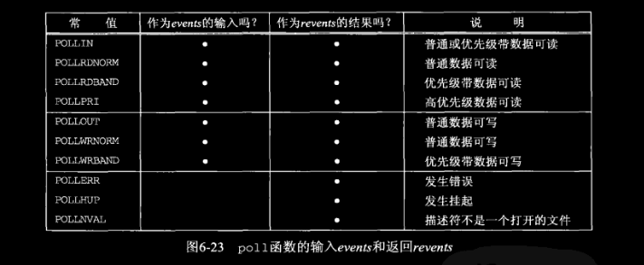

我们将该图分为三个部分：第一部分是处理输入的四个常值，第二部分是处理输出的三个常值，第三部分是处理错误的三个常值。其中第三部分的三个常值不能在 *events* 中设置，但是当相应条件存在时就在 *revents* 中返回。

`poll` 识别三类数据：普通（normal）、优先级带（priority band）和高优先级（high priority）。这些术语均出自基于流的实现（图31-5）。

> `POLLIN` 可被定义为 `POLLRDNORM` 和 `POLLRDBAND` 的逻辑或。`POLLIN` 自SVR3实现就存在，早于SVR4中的优先级带，为了向后兼容，该常值继续保留。类似的，`POLLOUT` 等同于 `POLLWRNORM`，前者早于后者。

就TCP和UDP套接字而言，以下条件引起 `POLL` 返回特定的 *revents*。不幸的是，POSIX在其 `poll` 的定义中留了许多空洞（也就是说有多种方法可返回相同的条件）。

- 所有正规TCP数据和所有UDP数据都被认为是普通数据。
- TCP的带外数据（第24章）被认为是优先级带数据。
- 当TCP连接的读半部关闭时（譬如收到了一个来自对端的FIN），也被认为是普通数据，随后的读操作将返回0。
- TCP连接存在错误既可认为是普通数据，也可认为是错误（`POLLERR`）。无论哪种情况，随后的读操作将返回-1，并把 `errno` 设置成合适的值。这可用于处理诸如接收到RST或发生超时等条件。
- 在监听套接字上有新的连接可用可认为是普通数据，也可认为是优先数据。大多数实现视之为普通数据。
- 非阻塞式 `connect` 的完成被认为是使相应套接字可写。

结构数组中的元素个数是由 *nfds* 参数指定。  
*timeout* 参数指定 `poll` 函数返回前等待多长时间。它是一个指定应等待毫秒数的正值。图6-24给出了它的可能取值。

|*timeout* 值|说明|
| :-------: | :------------------------: |
|INFTIM|永远等待|
|0|立即返回，不阻塞进程|
|>0|等待指定数目的毫秒数|

`INFTIM` 常值被定义为一个负值。如果系统不能提供毫秒级精度的定时器，该值就向上舍入到最接近的支持值。

> POSIX规范要求在头文件 \<poll.h\>中定义 `INFTIM`，不过许多系统仍然把它定义在头文件 \<sys/stropts.h\> 中。正如 `select`，给 `poll` 指定的任何超时值都受限于实际系统实现的分辨率（通常是10ms）。Linux不支持。

如果我们不关心某个特定描述符，那么可以把与它对应的 `pollfd` 结构的 `fd` 成员设置成一个负值。`poll` 函数将忽略这样的 `pollfd` 结构的 `events` 成员，返回时将它的 `revents` 成员的值置为0。  
回顾6.3节结尾处我们就 `FD_SETSIZE` 以及就每个描述符集中最大描述符数目相比每个进程中最大描述符数目展开的讨论。有了 `poll` 就不再有那样的问题了，因为分配一个 `pollfd` 结构的数组并把该数组中元素的数目通知内核成了调用者的责任。内核不再需要直到类似 `fd_set` 的固定大小数据类型。

> POSIX规范对 `select` 和 `poll` 都有需要。然而从当今的可移植性考虑，支持 `select` 的系统比支持 `poll` 的系统要多。另外POSIX还定义了 `pselect`，它是能够处理信号阻塞并提供了更高时间分辨率的 `select` 的增强版本。POSIX没有为 `poll` 定义类似的东西。

## 6.11 TCP回射服务器程序（再修订版）

我们现在用 `poll` 代替 `select` 重写6.8节的TCP回射服务器程序。在使用 `select` 早先那个版本中，我们必须分配一个 *client* 数组以及一个名为 `rset` 的描述符集。改用 `poll` 后，我们只需分配一个 `pollfd` 结构的数组来维护客户信息，而不必分配另外一个数组。我们以与图6-15中处理 *clinet* 数组相同的方法处理该数组的 `fd` 成员：值-1表示所在项未用，否则即为描述符值。回顾前一节，我们知道传递给 `poll` 的 `pollfd` 结构数组中的任何 `fd` 成员为负值的项都被 `poll` 忽略。

```c
// 图6-25 6-26
// tcpcliserv/tcpservpoll01.c
 1 /* include fig01 */
 2 #include	"unp.h"
 3 #include	<limits.h>		/* for OPEN_MAX */
 4 
 5 int
 6 main(int argc, char **argv)
 7 {
 8 	int					i, maxi, listenfd, connfd, sockfd;
 9 	int					nready;
10 	ssize_t				n;
11 	char				buf[MAXLINE];
12 	socklen_t			clilen;
13 	struct pollfd		client[OPEN_MAX];
14 	struct sockaddr_in	cliaddr, servaddr;
15 
16 	listenfd = Socket(AF_INET, SOCK_STREAM, 0);
17 
18 	bzero(&servaddr, sizeof(servaddr));
19 	servaddr.sin_family      = AF_INET;
20 	servaddr.sin_addr.s_addr = htonl(INADDR_ANY);
21 	servaddr.sin_port        = htons(SERV_PORT);
22 
23 	Bind(listenfd, (SA *) &servaddr, sizeof(servaddr));
24 
25 	Listen(listenfd, LISTENQ);
26 
27 	client[0].fd = listenfd;
28 	client[0].events = POLLRDNORM;
29 	for (i = 1; i < OPEN_MAX; i++)
30 		client[i].fd = -1;		/* -1 indicates available entry */
31 	maxi = 0;					/* max index into client[] array */
32 /* end fig01 */
33 
34 /* include fig02 */
35 	for ( ; ; ) {
36 		nready = Poll(client, maxi+1, INFTIM);
37 
38 		if (client[0].revents & POLLRDNORM) {	/* new client connection */
39 			clilen = sizeof(cliaddr);
40 			connfd = Accept(listenfd, (SA *) &cliaddr, &clilen);
41 #ifdef	NOTDEF
42 			printf("new client: %s\n", Sock_ntop((SA *) &cliaddr, clilen));
43 #endif
44 
45 			for (i = 1; i < OPEN_MAX; i++)
46 				if (client[i].fd < 0) {
47 					client[i].fd = connfd;	/* save descriptor */
48 					break;
49 				}
50 			if (i == OPEN_MAX)
51 				err_quit("too many clients");
52 
53 			client[i].events = POLLRDNORM;
54 			if (i > maxi)
55 				maxi = i;				/* max index in client[] array */
56 
57 			if (--nready <= 0)
58 				continue;				/* no more readable descriptors */
59 		}
60 
61 		for (i = 1; i <= maxi; i++) {	/* check all clients for data */
62 			if ( (sockfd = client[i].fd) < 0)
63 				continue;
64 			if (client[i].revents & (POLLRDNORM | POLLERR)) {
65 				if ( (n = read(sockfd, buf, MAXLINE)) < 0) {
66 					if (errno == ECONNRESET) {
67 							/*4connection reset by client */
68 #ifdef	NOTDEF
69 						printf("client[%d] aborted connection\n", i);
70 #endif
71 						Close(sockfd);
72 						client[i].fd = -1;
73 					} else
74 						err_sys("read error");
75 				} else if (n == 0) {
76 						/*4connection closed by client */
77 #ifdef	NOTDEF
78 					printf("client[%d] closed connection\n", i);
79 #endif
80 					Close(sockfd);
81 					client[i].fd = -1;
82 				} else
83 					Writen(sockfd, buf, n);
84 
85 				if (--nready <= 0)
86 					break;				/* no more readable descriptors */
87 			}
88 		}
89 	}
90 }
91 /* end fig02 */
```

- 第13行：我们声明在 `pollfd` 结构数组中存在 *OPEN_MAX* 个元素、确定一个进程任何时刻能够打开的最大描述符数目并不容易，我们将在图13-4再次遇到这个问题。方法之一是以参数 `_SC_OPEN_MAX` 调用POSIX的 `sysconf` 函数，然后动态分配一个合适大小的数组。然而 `sysconf` 的可能返回之一是 “indeterminate（不确定）”，意味着我们仍然不得不猜测一个值。这里我们就用POSIX的 `OPEN_MAX` 常值（在Linux已被弃用）。
- 第61\~88行：我们检查 `POLLERR` 的原因在于：有些实现在一个连接上接收到RST时返回的是 `POLLERR` 事件，而其他实现返回的只是 `POLLRDNORM` 事件。不论哪种情形，我们都调用 `read`，当有错误发生时，`read` 将返回这个错误。当一个现有连接由它的客户终止时，我们就把它的 `fd` 成员置为-1。

## 习题

> 6.2 在6.3节讨论 `select` 返回 “可写” 条件时，为什么必须限定套接字为非阻塞才可以说一次写操作将返回一个正值？

如果 `select` 告诉我们某个套接字可写，该套接字的发送缓冲区就有8192字节的可用空间，但是当我们以8193字节的缓冲区长度对这个阻塞式套接字调用 `write` 时，`write` 将会阻塞，等待最后1字节的可用空间。对阻塞式套接字的读操作只要有数据总会返回一个不足计数（short count），然而对阻塞式套接字的写操作将一直阻塞到所有数据都能被内核接受为止。可见当使用 `select` 测试某个套接字的可写条件时，我们必须把该套接字预先设置成非阻塞以避免阻塞。

> 6.3 不再比比，就是水平触发就完事儿了

可以认为 `select` 模型是以条件（水平）触发的方式工作的。见[TCP/IP网络编程](https://github.com/lixichongAAA/TCP-IP-Network-Programming/tree/master/ch17-%E4%BC%98%E4%BA%8Eselect%E7%9A%84epoll#2-%E6%8E%8C%E6%8F%A1%E6%9D%A1%E4%BB%B6%E8%A7%A6%E5%8F%91%E7%9A%84%E4%BA%8B%E4%BB%B6%E7%89%B9%E6%80%A7)

> 6.6 为什么应用程序会以参数 `SHUT_RDWR` 来调用 `shutdown`，而不是仅仅调用 `close`？

以参数 `SHUT_RD` 或 `SHUT_WR` 调用 `shutdown` 总是发送FIN，而 `close` 只在调用描述符引用计数为1的条件下才发送FIN。