# ch07 套接字选项

## 7.1 概述

有很多方法来获取和设置影响套接字的选项：

- `getsockopt` 和 `setsockopt` 函数
- `fcntl` 函数
- `ioctl` 函数

我们按以下分类详细介绍：通用、IPv4、IPv6、TCP和SCTP。

## 7.2 `getsockopt` 和 `setsockopt` 函数

这两个函数仅用于套接字

```c
int getsockopt(int sockfd, int level, int optname,
               void *optval, socklen_t *optlen);
int setsockopt(int sockfd, int level, int optname,
               const void *optval, socklen_t optlen);
// 均返回：若成功则为0，若出错则为-1
```

其中 *sockfd* 必须指向一个打开的套接字描述符，*level（级别）* 指定系统中解释选项的代码或为通用套接字代码。或为某个特定于协议的代码（例如IPv4、IPv6、TCP或SCTP）。  
*optval* 是指向某个变量（ *\*optval* ）的指针，`setsockopt` 从中取得选项待设置的新值，`getsockopt` 则是把已获取的选项当前值存放到 *\*optval* 中。*\*optval* 选项的大小由最后一个参数指定，它对于 `setsockopt` 是一个值参数，对于 `getsockopt` 是一个值-结果参数。  
图7-1和图7-2汇总了可由 `getsockopt` 获取或由 `setsockopt` 设置的选项。其中的 “数据类型” 列，给出了指针 *optval* 必须指向的每个选项的数据类型。我们用后跟一个花括号的记法来表示一个结构，如 linger{} 就表述 struct linger。  
套接字选项粗分为两大基本类型：一是启用或禁用某个特性的二元选项（称为标志选项），二是取得并返回我们可以设置或检查的特定值的选项（称为值选项）。标有 “标志” 的列指出一个选项是否为标志选项。当给这些标志选项调用 `getsockopt` 函数时，*\*optval* 是一个整数，*\*optval* 中返回的值为0表示相应的选项被禁止，不为0表示相应选项被启用。类似的，`setsockopt` 函数需要一个不为0的 *\*optval* 来启用选项，一个为0的的 *\*optval* 来禁用选项。如果标志列不含有 “·”，那么相应选项用于在用户进程和系统之间传递所指数据类型的值。

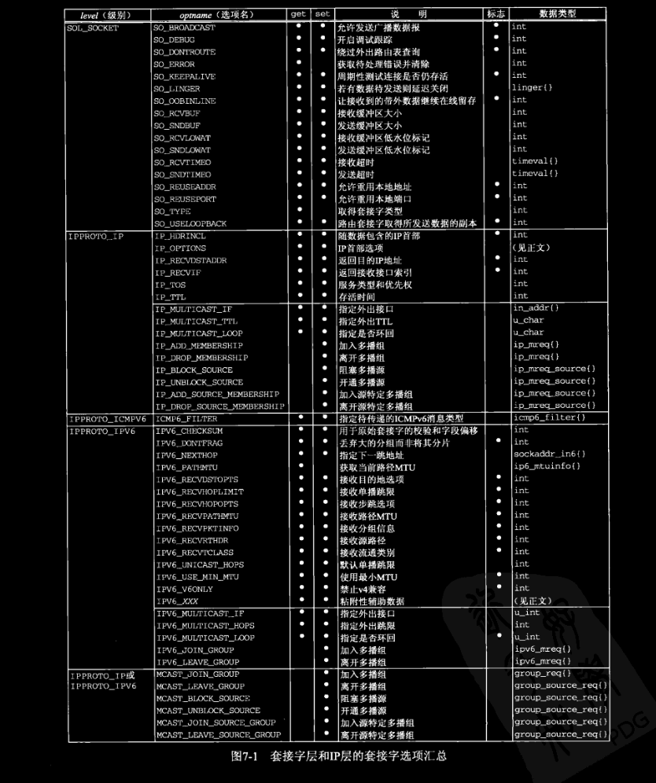
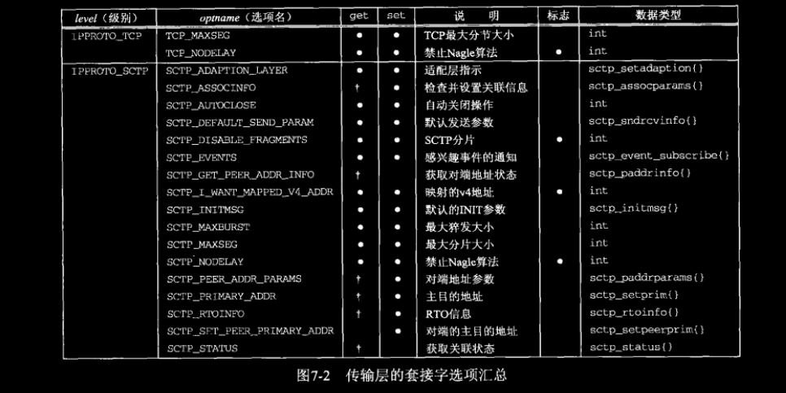

## 7.3 检查选项是否受支持并获取默认值

一个程序，检查图7-1和图7-2中定义的大多数选项是否受到支持，若是则输出它们的默认值。见 *sockopt/checkopts.c* 不再列出。

## 7.4 套接字状态

对于某些套接字选项，针对套接字的状态，什么时候设置或获取选项有时序上的考虑。我们对受影响的选项论及这一点。  
下面的套接字选项是由TCP已连接套接字从监听套接字继承而来的：`SO_DEBUG`、`SO_DONTROUTE`、`SO_KEEPALIVE`、`SO_LINGER`、`SO_OOBINLINE`、`SO_RCVBUF`、`SO_RCVLOWAT`、`SO_SNDBUF`、`SO_SNDLOWAT`、`TCP_MAXSEG` 和 `TCP_NODELAY`。这对TCP是很重要的，因为 `accept` 一直要到TCP层完成三路握手后才会给服务器返回已连接套接字。如果想在三路握手完成时确保这些套接字选项中的某一个是给已连接套接字设置的，那么我们必须先给监听套接字设置该选项。

## 7.5 通用套接字选项

我们从通用套接字选项开始。这些选项是协议无关的（也就是说，它们是由内核中的协议无关代码处理，而不是由诸如IPv4之类特殊的协议模块处理），不过其中有些选项只能应用到某些特定类型的套接字中。举例来说，尽管我们称 `SO_BROADCAST` 套接字选项是通用的，它却只能应用于数据报套接字。

### 7.5.1 `SO_BROADCAST` 套接字选项

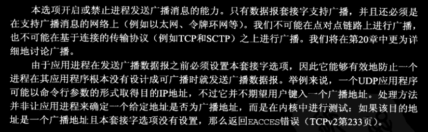

### 7.5.2 `SO_DEBUG` 套接字选项


### 7.5.3 `SO_DONTROUTE` 套接字选项

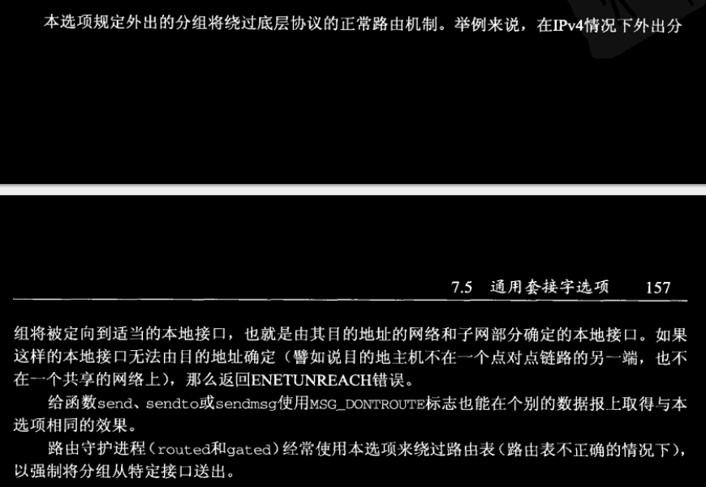

### 7.5.4 `SO_ERROR` 套接字选项

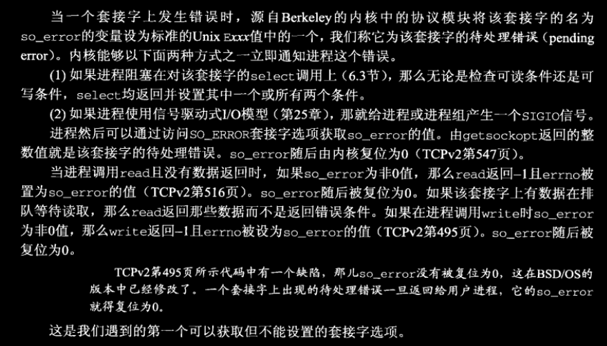

### 7.5.5 `SO_KEEPALIVE` 套接字选项

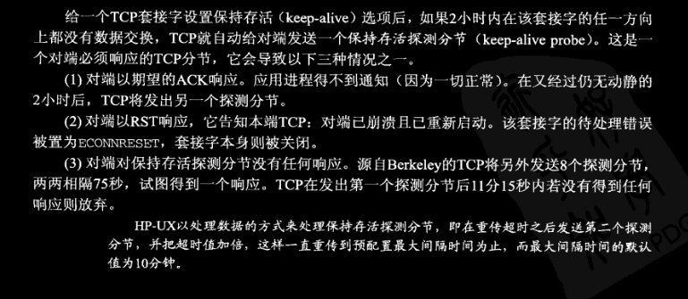


### 7.5.6 `SO_LINGER` 套接字选项

本选项指定 `close` 函数对面向连接的协议（例如TCP和SCTP，但不是UDP）如何操作。默认操作是 `close` 立即返回，但是如果有数据残留在套接字发送缓冲区中，系统将试着把这些数据发送给对端。

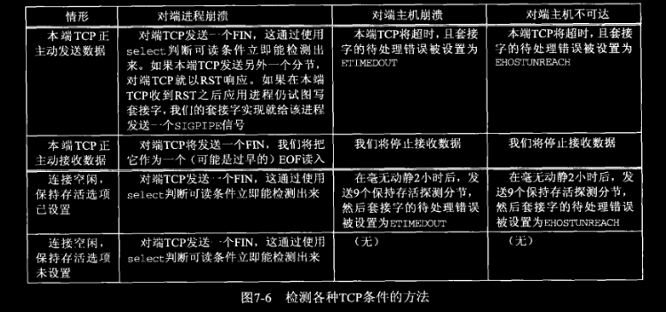

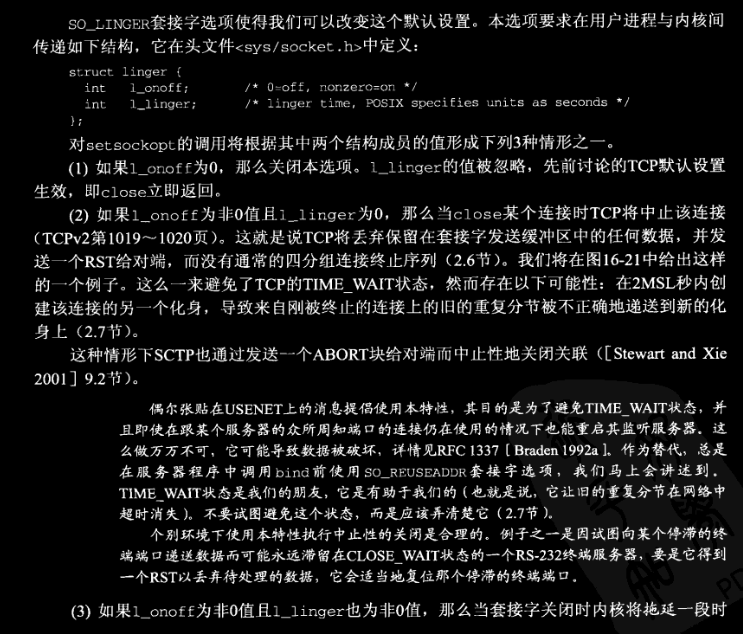

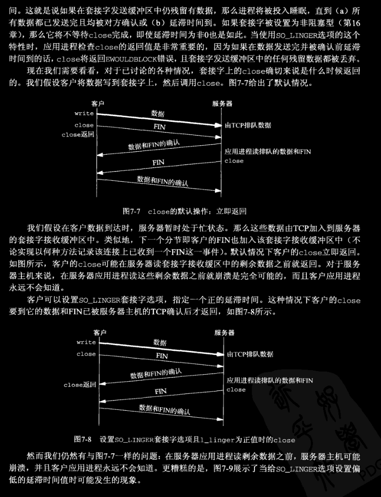

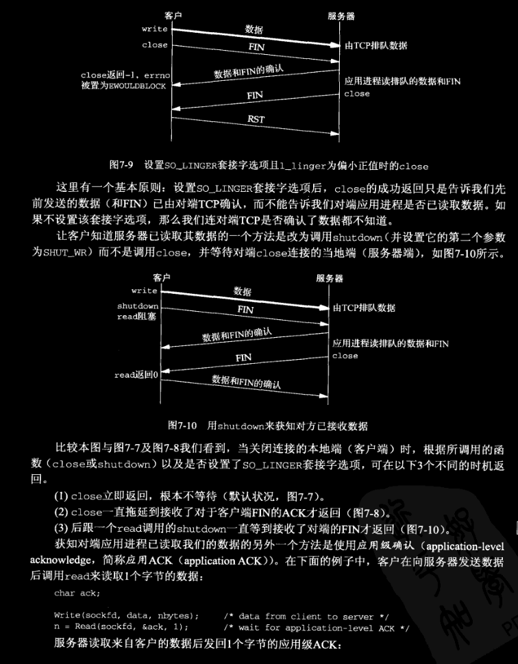

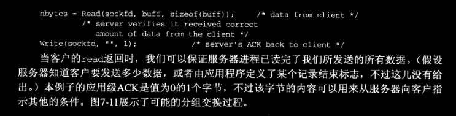

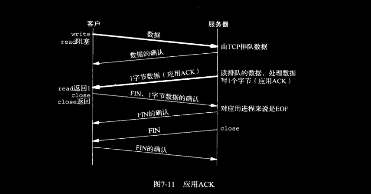

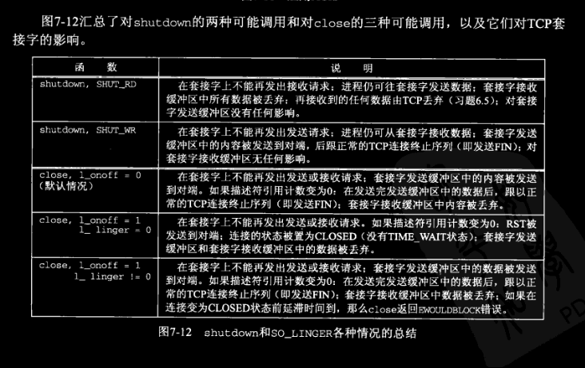

### 7.5.7 `SO_OOBINLINE` 套接字选项


### 7.5.8 `SO_RCVBUF` 和 `SO_SNDBUF` 选项


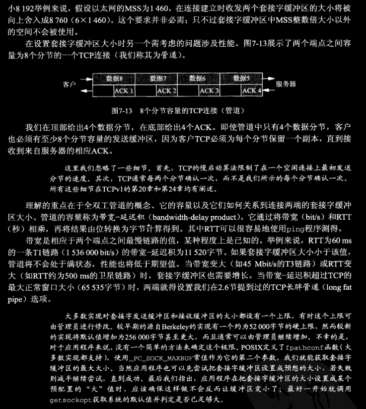

### 7.5.9 `SO_RCVLOWAT` 和 `SO_SNDLOWAT` 选项

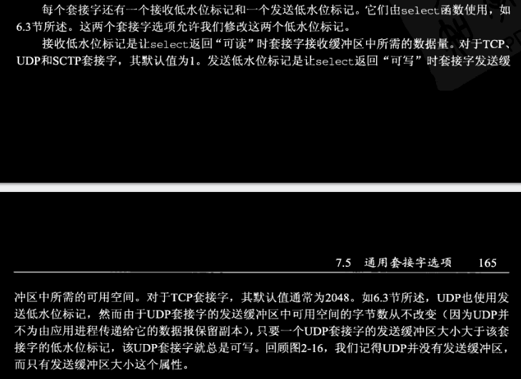

### 7.5.10 `SO_RCVTIMEO` 和 `SO_SNDIMEO` 套接字选项

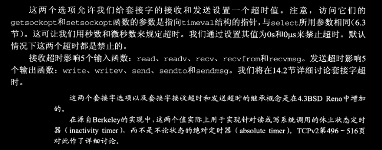

### 7.5.11 `SO_REUSEADDR` 和 `SO_REUSEPORT` 套接字选项

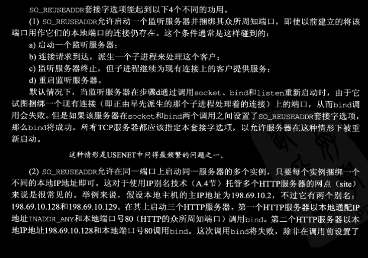


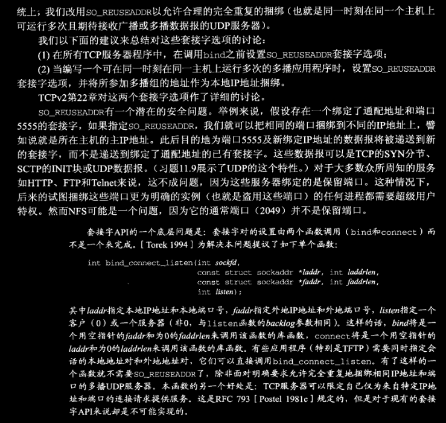

### 7.5.12 `SO_TYPE` 套接字选项


### 7.5.13 `SO_USELOOPBACK` 套接字选项


## 7.6 IPv4套接字选项

这些套接字选项由IPv4处理，它们的级别（即 `getsockopt` 和 `setsockopt` 函数的第二个参数）为 `IPPROTO_IP`。

### 7.6.1 `IP_HDINCL` 套接字选项

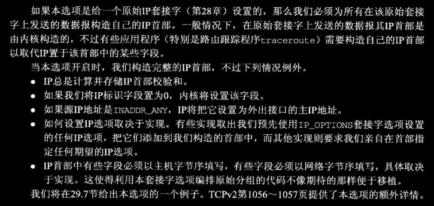

### 7.6.2 `IP_OPTIONS` 选项


### 7.6.3 `IP_RCVDSTADDR` 套接字选项


### 7.6.4 `IP_RECVIF` 套接字选项


### 7.6.5 `IP_TOS` 套接字选项

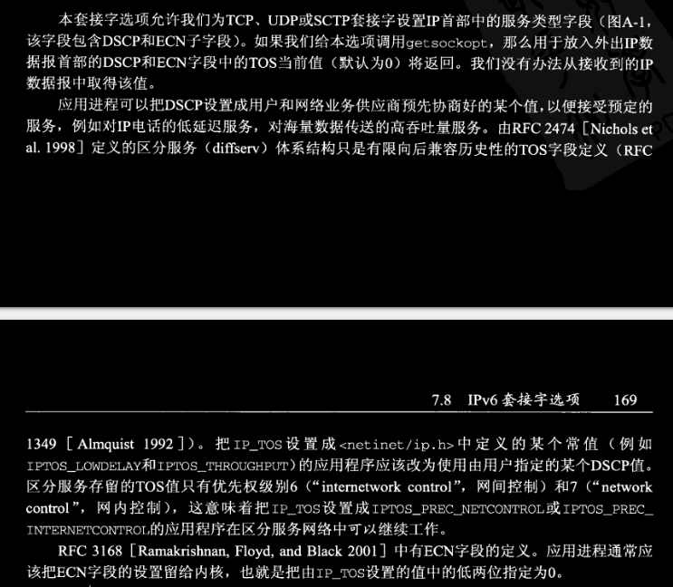

### 7.6.6 `IP_TTL` 套接字选项

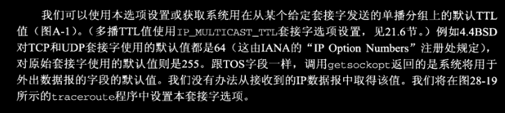

## 7.7 ICMPv6 套接字选项

这个唯一的套接字选项由ICMPv6处理，它的级别（即 `getsockopt` 和 `setsockopt` 函数的第二个参数）为 `IPPROTO_ICMPV6`。

### ICMPV6_FILTER 套接字选项

本选项允许我们获取或设置一个 `icmp6_filter` 结构，该结构指出256个可能的ICMPv6消息类型中哪些将经由某个原始套接字传递给所在进程。我们将在28.4节再讨论本选项。

## 7.8 IPv6套接字选项

这些套接字选项由IPv6处理，它们的级别（即 `getsockopt` 和 `setsockopt` 函数的第二个参数）为 `IPPROT_IPV6`。我们把多播套接字选项推迟到21.6节再讨论。这些选项中有许多用上了 `recvmsg` 函数的 ***辅助数据（ancillary data）*** 参数，我们将在14.6节讨论它们。

### 7.8.1 `IPV6_CHECKSUM` 套接字选项

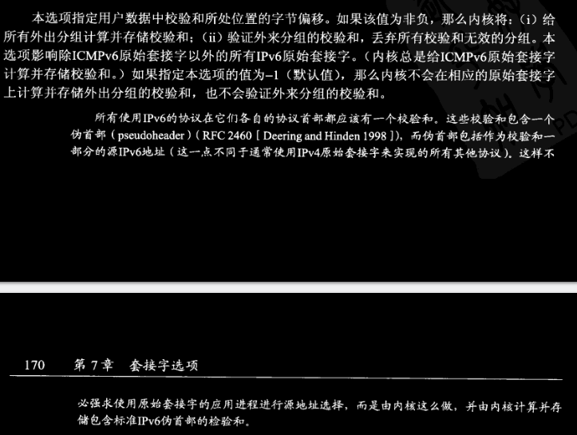

### 7.8.2 `IPV6_DONTFRAG` 套接字选项


### 7.8.3 `IPV6_NEXTHOP` 套接字选项


### 7.8.4 `IPV6_PATHMTU` 套接字选项


### 7.8.5 `IPV6_RECVDSTOPTS` 套接字选项


### 7.8.6 `IPV6_RECVHOPLIMIT` 套接字选项


### 7.8.7 `IPV6_RECVHOPOPTS` 套接字选项


### 7.8.8 `TPV6_RECVPATHMTU` 套接字选项


### 7.8.9 `IPV6_RECVPKGINFO` 套接字选项


### 7.8.10 `IPV6_RECVRTHDR` 套接字选项


### 7.8.11 `IPV6_RECVTCLACSS` 套接字选项


### 7.8.12 `IPV6_UNICAST_HOPS` 套接字选项

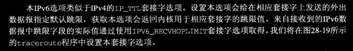

### 7.8.13 `IPV6_USE_MIN_MTU` 套接字选项


### 7.8.14 `IPV6_V6ONLY` 套接字选项


### 7.8.15 `IPV6_XXX` 套接字选项

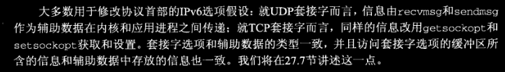

## 7.9 TCP 套接字选项

TCP有两个套接字选项，它们的级别（即 `getsockopt` 和 `setsockopt` 函数的第二个参数）为 `IPPROTO_TCP`。

### 7.9.1 `TCP_MAXSEG` 套接字选项

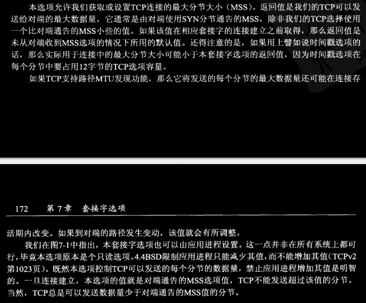

### 7.9.2 `TCP_NODELAY` 套接字选项


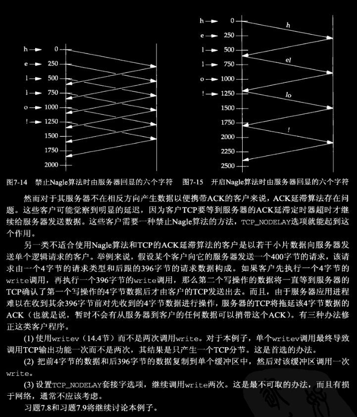

## 7.10 SCTP 套接字选项

略。。

## 7.11 `fcntl` 函数

与代表 “file control” 的名字相符，`fcntl` 函数可执行各种描述符控制操作。图7-20 汇总了由 `fcntl`、`ioctl` 和路由套接字执行的不同操作。

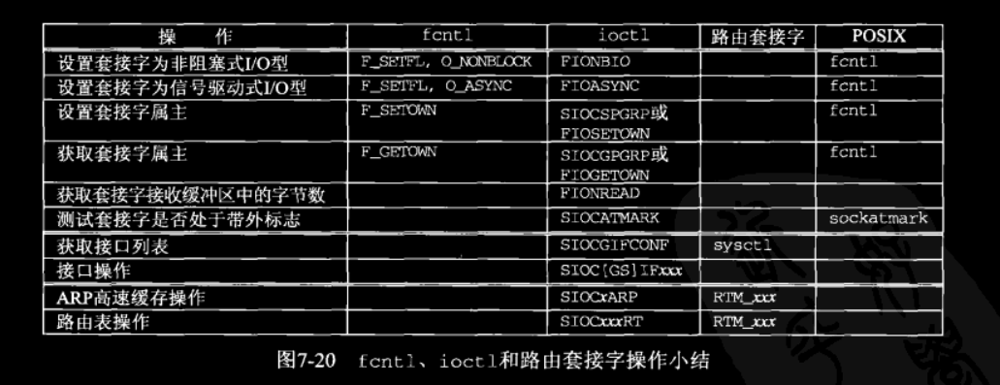

其中前六个操作可由任何进程应用于套接字，接着两个操作（接口操作）比较少见，不过也是通用的，后两个操作（ARP和路由表操作）由诸如 `ifconfig` 和 `route` 之类管理程序执行。我们将在第17章讨论各种 `ioctl` 操作，在第18章中详细讨论路由套接字。  
前四个操作的方法不止一种，不过我们在最后一列指出，POSIX规定 `fcntl` 方法是首选的。我们还指出，POSIX提供 `sockatmark` 函数作为测试是够处于带外标志的首选方法。最后一列空白的其余操作没有被POSIX标准化。

`fcntl` 函数提供了与网络编程相关的如下特性。

- 非阻塞式I/O。通过使用 `F_SETFL` 命令设置 `O_NONBLOCK` 文件状态标志，我们可以把一个套接字设置为非阻塞型。16章讲述非阻塞式I/O。
- 信号驱动式I/O。通过使用 `F_SETFL` 命令设置 `O_ASYNC` 文件状态标志，我们可以把一个套接字设置成一旦其状态发生变化，内核就产生一个 `SIGIO` 信号。第25章讨论这一点。
- `F_SETOWN` 命令允许我们指定用于接收 `SIGIO` 和 `SIGURG` 信号的套接字属主（进程ID或进程组ID）。其中 `SIGIO` 信号是套接字被设置为信号驱动型I/O后产生的。`SIGURG` 信号是在新的带外数据到达套接字时产生的，`F_GETOWN` 命令返回套接字的当前属主。

> 术语 “套接字属主” 由POSIX定义，历史上源自Berkeley的实现称之为 “套接字的进程组ID”，因为存放该ID的变量是 socket 结构的 *so_pgid* 成员。

```c
#include <fcntl.h>
int fcntl(int fd, int cmd, ... /* arg */);
// 返回：若成功则取决于 cmd，若出错则为-1。
```

每种描述符（包括套接字描述符）都有一组由 `F_GETFL` 命令获取或由 `F_SETFL` 命令设置的文件标志。其中影响套接字描述符的两个标志是：

- `O_NONBLOCK` 非阻塞式I/O
- `O_ASYNC` 信号驱动式I/O

后面我们将详细讲述这两个特性。现在我们只需注意，使用 `fcntl` 开启非阻塞式I/O的典型代码将是：

也可见 [TCP/IP网络编程](https://github.com/lixichongAAA/TCP-IP-Network-Programming/tree/master/ch17-%E4%BC%98%E4%BA%8Eselect%E7%9A%84epoll#3-%E8%BE%B9%E7%BC%98%E8%A7%A6%E5%8F%91%E6%9C%8D%E5%8A%A1%E5%99%A8%E7%AB%AF%E5%AE%9E%E7%8E%B0%E4%B8%AD%E5%BF%85%E7%9F%A5%E7%9A%84%E4%B8%A4%E7%82%B9)

```c
int flags;
if( (flags = fcntl(fd, F_GETFL, 0)) < 0)
    err_sys("F_GETFL error");
flags |= O_NONBLOCK;
if(fcntl(fd, F_SETFL, flags) < 0)
    err_sys("F_SETFL error");
```

设置某个文件状态标志的唯一正确的方法是：先取得当前标志，与新标志逻辑或后再设置标志。  
以下代码关闭非阻塞标志，其中假设 *flags* 是由上面所示的 `fcntl` 调用来设置的：

```c
flags |= ~O_NONBLOCK;
if(fcntl(fd, F_SETFL, flags) < 0)
    err_sys("F_SETFL error");
```

信号 `SIGIO` 和 `SIGURG` 与其他信号的不同之处在于，这两个信号仅在已使用 `F_SETOWN` 命令给相关套接字指派了属主后才会产生。`F_SETOWN` 命令的整数类型 *arg* 参数既可以是一个正整数，指出接收信号的进程ID，也可以是一个负整数，其绝对值指出接收信号的进程组ID。`F_GETOWN` 命令把套接字属主作为 `fcntl` 函数的返回值返回，它既可以是进程ID（一个正的返回值），也可以是进程组ID（一个除-1以外的负值）。指定接收信号的套接字属主为一个进程或一个进程组的差别在于：前者仅导致单个进程接收信号，而后者将导致整个进程组的所有进程接收信号。

使用 `socket` 函数新创建的套接字并没有属主。然而如果一个新的套接字是从一个监听套接字创建而来的，那么套接字属主将由已连接套接字从监听套接字继承而来（许多套接字选项也是这样继承的）。

## 习题

> 7.4 假设有两个TCP客户在同一时间启动，都设置 `SO_REUSEADDR` 套接字选项，且以相同的本地IP地址和相同的端口（譬如说，1500）调用 `bind`，但一个客户连接到198.69.10.2的端口7000，另一个客户连接到相同IP地址的端口8000。阐述所出现的竞争状态。

第一个客户调用 `setsockopt`、`bind` 和 `connect`。如果第二个客户在第一个客户调用 `bind` 和 `connect` 之间调用 `bind`，那么它将返回 `EADDRINUSE` 错误。然而一旦第一个客户已连接到对端，第二个客户的 `bind` 就正常工作，因为第一个客户的套接字当时处于已连接状态。处理这种竞争状态的唯一办法是让第二个客户在 `bind` 调用返回 `EADDRINUSE` 错误的情况下再尝试调用 `bind` 多次，而不是一返回错误就放弃。

> 7.8 继续我们在讨论 `TCP_NODELAY` 套接字选项结尾处的例子。假设客户执行了两个 `write` 调用：第一个写4字节，第二个写396字节。另外假设服务器的ACK延滞时间为100ms，客户与服务器之间的RTT为100ms，服务器处理客户请求的时间为50ms。画一个时间线图展示延滞的ACK与Nagle算法的相互作用。

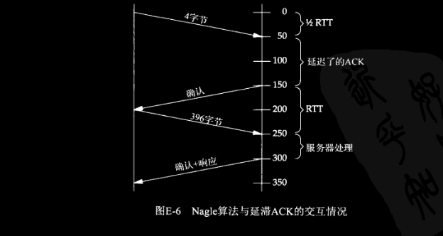

> 7.9 假设设置了 `TCP_NODELAY` 套接字选项，重做上个习题。

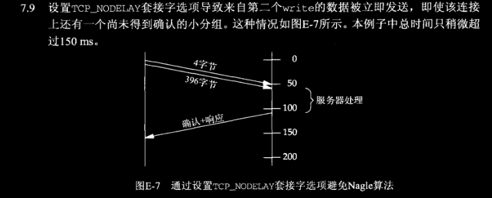

> 7.10 假设进程调用 `writev` 一次性处理完4字节缓冲区和396字节缓冲区，重做习题7.8。


> 7.12 图5-2和图5-3中的服务器程序什么地方耗时最多？假设服务器设置了 `SO_KEEPALIVE` 套接字选项，而且连接上没有数据在交换，如果客户主机崩溃且没有重启，那将发生什么？


> 7.13 图5-4和图5-5中的客户程序什么地方耗时最多？假设客户设置了 `SO_KEEPALIVE` 套接字选项，而且连接上没有数据在交换，如果服务器主机崩溃且没有重启，那将发生什么？

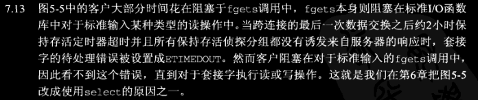

> 7.14 图5-4和图6-13中的客户程序什么地方耗时最多？假设客户设置了 `SO_KEEPALIVE` 套接字选项，而且连接上没有数据在交换，如果服务器主机崩溃且没有重启，那将发生什么？


> 7.15 假设客户和服务器都设置了 `SO_KEEPALIVE` 套接字选项，连接两端维护连通性，但是连接上没有应用数据在交换。当保持存活定时器每2小时到期时，在连接上有多少TCP分节被交换？

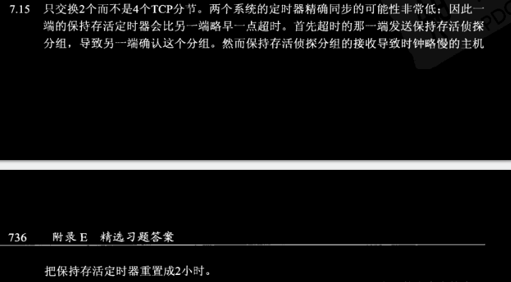

> 7.16 几乎所有实现都在头文件 `sys/socket.h` 中定义了 `SO_KEEPALIVE` 常值，不过我们没有讲述这个选项。该选项为什么存在？

