# ch08 基本UDP套接字编程

## 8.2 `recvfrom` 和 `sendto` 函数

这两个函数类似于标准的 `read` 和 `write` 函数，不过需要三个额外的参数。

```c
#include <sys/types.h>
#include <sys/socket.h>
ssize_t recvfrom(int sockfd, void *buf, size_t len, int flags,
                        struct sockaddr *src_addr, socklen_t *addrlen);
ssize_t sendto(int sockfd, const void *buf, size_t len, int flags,
                      const struct sockaddr *dest_addr, socklen_t addrlen);
// 均返回：若成功则为读或写的字节数，若出错则为-1
```

前三个参数 *sockfd*、*buf* 和 *len* 等同于 `read` 和 `write` 函数的三个参数：描述符、指向读入或写出缓冲区的指针和读写字节数。  
*flags* 参数在第14章介绍，时下我们总是置为0。  
- `sendto` 的 *to* 参数指向一个含有数据报接收者的协议地址（如IP地址及端口号）的套接字地址结构，其大小由 *addrlen* 参数指定。

- `recvfrom` 的 *from* 参数指向一个将由该函数在返回时填写数据报发送者的协议地址的套接字地址结构，而在该套接字地址结构中填写的字节数则放在 *addrlen* 参数所指的整数中返回给调用者。

注意，`sendto` 的最后一个参数是一个整数值，而 `recvfrom` 的最后一个参数值是一个指向整数值的指针（即值-结果参数）。

- `recvfrom` 的最后两个参数类似于 `accept` 的最后两个参数：返回时其中套接字地址结构的内容告诉我们是谁发送了数据报（UDP的情况下）或是谁发起了连接（TCP情况下）。

- `sendto` 的最后两个参数类似于 `connect` 的最后两个参数：调用时其中套接字地址结构被我们填入数据报将发往（UDP情况下）或与之建立连接（TCP情况下）的协议地址。

写一个长度为0的数据报是可行的。在UDP情况下，这会形成一个只包含一个IP首部（对于IPv4为20字节，对于IPv6为40字节）和一个8字节UDP首部而没有数据的IP数据报。这也意味着对于数据报协议，`recvfrom` 返回0值是可接受的：它并不像TCP套接字上 `read` 返回0值表示对端已关闭连接。既然UDP是无连接的，因此也就没有诸如关闭一个UDP连接之类的事情。  
如果 `recvfrom` 的 *from* 参数是一个空指针，那么相应的长度参数也必须是一个空指针，表示我们并不关心数据发送者的协议地址。  

`recvfrom` 和 `sendto` 都可以用于TCP，尽管通常没有理由这样做。

## 8.3 UDP回射服务器程序：main函数

```c
// udpcliserv/udpserv01.c
// 图8-3
#include	"unp.h"

int
main(int argc, char **argv)
{
	int					sockfd;
	struct sockaddr_in	servaddr, cliaddr;

	sockfd = Socket(AF_INET, SOCK_DGRAM, 0);

	bzero(&servaddr, sizeof(servaddr));
	servaddr.sin_family      = AF_INET;
	servaddr.sin_addr.s_addr = htonl(INADDR_ANY);
	servaddr.sin_port        = htons(SERV_PORT);

	Bind(sockfd, (SA *) &servaddr, sizeof(servaddr));

	dg_echo(sockfd, (SA *) &cliaddr, sizeof(cliaddr));
}
```

## 8.4 UDP回射服务器程序：*dg_echo* 函数

```c
// 图8-4
// lib/dg_echo.c
#include	"unp.h"

void
dg_echo(int sockfd, SA *pcliaddr, socklen_t clilen)
{
	int			n;
	socklen_t	len;
	char		mesg[MAXLINE];

	for ( ; ; ) {
		len = clilen;
		n = Recvfrom(sockfd, mesg, MAXLINE, 0, pcliaddr, &len);

		Sendto(sockfd, mesg, n, 0, pcliaddr, len);
	}
}
```

## 8.5 UDP回射客户程序：main函数

```c
// 图8-7
// UDP回射客户程序
#include	"unp.h"

int
main(int argc, char **argv)
{
	int					sockfd;
	struct sockaddr_in	servaddr;

	if (argc != 2)
		err_quit("usage: udpcli <IPaddress>");

	bzero(&servaddr, sizeof(servaddr));
	servaddr.sin_family = AF_INET;
	servaddr.sin_port = htons(SERV_PORT);
	Inet_pton(AF_INET, argv[1], &servaddr.sin_addr);

	sockfd = Socket(AF_INET, SOCK_DGRAM, 0);

	dg_cli(stdin, sockfd, (SA *) &servaddr, sizeof(servaddr));

	exit(0);
}
```

## 8.6 UDP回射客户程序：*dg_cli* 函数

```c
// 图8-8
// lib/dg_cli.c
#include	"unp.h"

void
dg_cli(FILE *fp, int sockfd, const SA *pservaddr, socklen_t servlen)
{
	int	n;
	char	sendline[MAXLINE], recvline[MAXLINE + 1];

	while (Fgets(sendline, MAXLINE, fp) != NULL) {

		Sendto(sockfd, sendline, strlen(sendline), 0, pservaddr, servlen);

		n = Recvfrom(sockfd, recvline, MAXLINE, 0, NULL, NULL);

		recvline[n] = 0;	/* null terminate */
		Fputs(recvline, stdout);
	}
}
```

我们的客户尚未请求内核给它的套接字指派一个临时端口（对于TCP客户而言，我们说过 `connect` 调用正是这种指派发生之处）。对于UDP套接字，如果其进程首次调用 `sendto` 时它没有绑定一个本地端口，那么内核就在此时为它选择一个临时端口。跟TCP一样，客户可以显示地调用 `bind`，不过很少这样做。  
注意，调用 `recvfrom` 指定的第五个和第六个参数是空指针，这告知内核我们并不关心应答数据报由谁发送。这样做存在一个风险：任何进程不论是在与本客户进程相同的主机上还是在不同的主机上，都可以向本客户的IP地址和端口发送数据报，这些数据报将被客户读入并被认为是服务器的应答。我们将在8.8节解决这个问题。

## 8.7 数据报的丢失

我们的UDP客户/服务器例子是不可靠的。如果一个客户数据报丢失（譬如说，被客户主机与服务器主机之间的某个路由器丢弃），客户将永远阻塞于 *dg_cli* 函数中的 `recvfrom` 调用，等待一个永远不会到达的服务器应答。类似地，如果客户数据包到达服务器，但是服务器的应答丢失了，客户也将永远阻塞于 `recvfrom` 调用。防止这样永久阻塞的一般方法是给客户的 `recvfrom` 调用设置一个超时。我们将在14.2节讨论这一点。  
仅仅给 `recvfrom` 调用设置超时并不是完整的解决办法。举例来说，如果确实超时了，我们也将无从判定超时原因是我们的数据报没有到达服务器，还是服务器的应答没有回到客户。如果客户的请求是“从账户A往账户B转一定数目的钱”而不是我们的简单回射服务器例子，那么请求丢失和应答丢失是极不相同的。我们将在22.5节具体讨论如何给UDP客户/服务器程序增加可靠性。

## 8.8 验证接收到的响应

在8.6节的结尾我们提到，知道客户临时端口号的任何进程都可往客户发送数据报，而且这些数据报会与正常的服务器应答混杂。我们的解决方法是修改图8-8中的 `recvfrom` 调用以返回数据报发送者的IP地址和端口号，保留来自数据报所发往服务器的应答，而忽略任何其他数据报。然而这样做照样存在一些缺陷，我们马上就会看到。

我们首先把客户程序的main函数改为使用标准回射服务器。就是把客户的端口号改成7了。书上说，这样我们的客户就可以使用任何标准运行回射服务器的主机了（不明白）。

```c
// 图8-9
// udpcliserv/dgcliaddr.c
#include	"unp.h"

void
dg_cli(FILE *fp, int sockfd, const SA *pservaddr, socklen_t servlen)
{
	int				n;
	char			sendline[MAXLINE], recvline[MAXLINE + 1];
	socklen_t		len;
	struct sockaddr	*preply_addr;

	preply_addr = Malloc(servlen);

	while (Fgets(sendline, MAXLINE, fp) != NULL) {

		Sendto(sockfd, sendline, strlen(sendline), 0, pservaddr, servlen);

		len = servlen;
		n = Recvfrom(sockfd, recvline, MAXLINE, 0, preply_addr, &len);
		if (len != servlen || memcmp(pservaddr, preply_addr, len) != 0) {
			printf("reply from %s (ignored)\n",
					Sock_ntop(preply_addr, len));
			continue;
		}

		recvline[n] = 0;	/* null terminate */
		Fputs(recvline, stdout);
	}
}
```


> 大多数IP实现接受目的地址为本主机任一IP地址的数据报，而不管数据报到达的接口。RFC 1122称之为弱端系统模型（weak end system model）。如果一个系统实现了该RFC所说的强端系统模型（strong end system model），那么它将只接受到达端口与目的地址一致的数据报。

`recvfrom` 返回的IP地址（UDP数据报的源IP地址）不是我们所发送数据报的目的IP地址。当服务器发送应答时，目的IP地址是172.24.37.78（见图1-16）。主机freebsd4内核中的路由功能为之选择172.24.37.94作为外出接口。既然服务器没有在其套接字上绑定一个实际的IP地址（服务器上绑定的是通配地址），因此内核将为封装这些应答的IP数据报选择源地址。选为源地址的是外出接口的主IP地址。还有，既然它是外出接口的主IP地址，如果我们指定发送数据报到该接口的某个非主IP地址（即一个IP别名），那么也将导致图8-9版本客户程序测试失败。  
一个解决办法是：得到由 `recvfrom` 返回的IP地址后，客户通过在DNS（第11章）中查找服务器主机的名字来验证该主机的域名（而不是它的IP地址）。另一个解决办法是：UDP服务器给服务器主机上配置的每个IP地址创建一个套接字，用 `bind` 绑定每个IP地址到各自的套接字，然后在所有这些套接字上使用 `select`（等待其中任何一个变得可读），再从可读的套接字给出应答。既然用于给出应答的套接字上绑定的IP地址就是客户请求的目的地址（否则该数据报不会被投递到该套接字），这就保证了应答的源地址与请求的目的地址相同。我们将在第22.6节给出这样一个例子。

> 在多宿Solaris系统上，服务器应答的源IP地址就是客户请求的目的IP地址。本节讲述的情形针对源自Berkeley的实现，这些实现基于外出接口选择源IP地址。

## 8.9 服务器进程未运行

这个情形是在不启动服务器的前提下启动客户。如果我们这么做后在客户上键入一行文本，那么什么也不发生。客户永远阻塞于它的 `recvfrom` 调用，等待一个永远不出现的服务器应答。

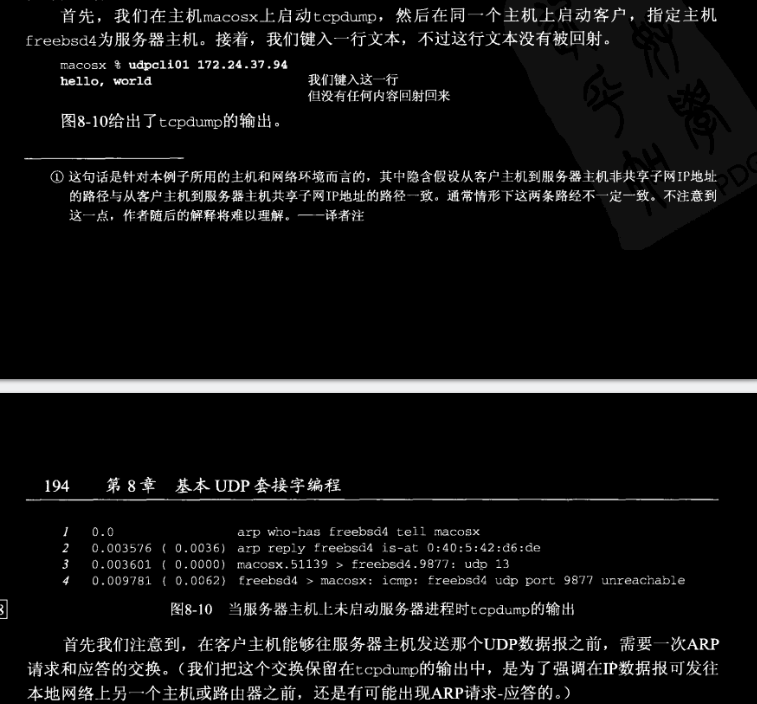

我们从第3行中看到客户数据报发出，然而第四行看到，服务器主机响应的是一个“port unreachable”（端口不可达）ICMP消息。（长度13是12个字符加一个换行符）不过这个ICMP错误不返回给客户进程，其原因我们稍后讲述。客户永远阻塞于图8-8中的 `recvfrom` 调用。我们还指出ICMPv6也有端口不可达错误类型类似于ICMPv4，因此这里讨论的结果对于IPv6也类似。

我们称这个ICMP错误为 **异步错误（asynchronous error）**，该错误由 `sendto` 引起，但是 `sendto` 本身却成功返回。回顾2.11节，我们知道从UDP输出操作成功返回仅仅表示在接口输出队列中具有存放所形成IP数据报的空间。该ICMP错误直到后来才返回（图8-10所示为4ms之后），这就是称其为异步的原因。

***一个基本规则是：对于一个UDP套接字，由它引发的异步错误却并不返回给它，除非它已连接。***

> 只要 `SO_BSDCOMPAT` 套接字选项没有开启，Linux甚至对未连接的套接字也返回大多数ICMP“destination unreachable”（目的地不可达）错误。我们将在28.7节再次讨论UDP套接字上异步错误的这个问题。

## 8.10 UDP程序例子小结

图8-11以圆点的形式给出了在客户发送UDP数据报时必须指定或选择的四个值。

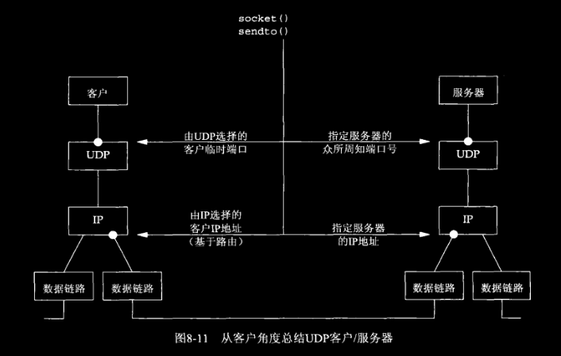

客户必须给 `sendto` 调用指定服务器的IP地址和端口号。一般来说，客户的IP地址和端口号都由内核自动选择，尽管我们提到过，客户也可以调用 `bind` 指定它们。在客户的这两个值内由内核选择的情形下我们也提到过，客户的临时端口是在第一次调用 `sendto` 时一次性选定，不能改变；然而客户的IP地址却可以随客户发送的每个UDP数据报而变动（假设客户没有捆绑一个具体的IP地址到其套接字上）。其原因如图8-11所示：如果客户主机是多宿的，客户有可能在两个目的地之间交替选择，其中一个由左边的数据链路外出，另一个由右边的数据链路外出。在这种最坏的情形下，由内核基于外出链路选择的客户IP地址将随每个数据报而改变。  
如果客户捆绑了一个IP地址到其套接字上，但是内核决定外出数据报必须从另一个数据链路发出，那么将发生什么？这种情形下，IP数据报将包含一个不同于外出链路IP地址的源IP地址（见[习题8.6](./README.md#习题)）。

图8-12给出了同样的四个值，不过是从服务器的角度出发的。

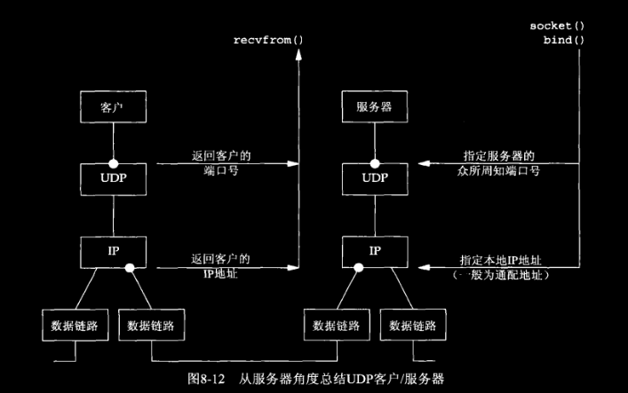

服务器可能想从到达的IP数据报上取得至少四条信息：源IP地址、目的IP地址、源端口号和目的端口号。图8-13给出了从TCP服务器或UDP服务器返回这些信息的函数调用。


TCP服务器总是能便捷地访问已连接套接字的所有这四条信息，而且这四个值在连接的整个生命期内保持不变。然而对于UDP套接字，目的IP地址只能通过为IPv4设置 `IP_RECVDSTADDR` 套接字选项（或为IPv6设置 `IPV6_PKTINFO` 套接字选项）然后调用 `recvmsg` （而不是 `recvfrom` ）取得。由于UDP是无连接的，因此目的IP地址可随发送到服务器的每个数据报而改变。UDP服务器也可接受目的地址为服务器主机的某个广播地址或多播地址的数据报，这些我们将在第20章和第21章讨论。我们将在第22.2节讨论 `recvmsg` 函数之后，展示如何确定一个UDP数据报的目的地址。

## 8.11 UDP 的 `connect` 函数

在8.9节的结尾我们提到，除非套接字已连接，否则异步错误是不会返回到UDP套接字的。我们确实可以给UDP套接字调用 `connect`，然而这样做的结果却与TCP连接大相径庭：没有三路握手过程。内核只是检查是否存在立即可知的错误（例如一个显然不可达的目的地），记录对端的IP地址和端口号（取自传递给 `connect` 的套接字地址结构），然后立即返回到调用进程。

有了这个能力后，我们必须区分：

- 未连接UDP套接字（unconnected udp socket），新创建UDP套接字默认如此。
- 已连接UDP套接字（connected udp socket），对UDP套接字调用 `connect` 的结果。

对于已连接UDP套接字，与默认的未连接UDP套接字相比，发生了三个变化。

1. 我们再也不能给输出操作指定目的IP地址和端口号。也就是说，我们不使用 `sendto`，而改用 `write` 或 `send`。写到已连接UDP套接字上的任何内容都自动发送到由 `connect` 指定的协议地址。

> 其实我们可以给已连接UDP套接字调用 `sendto`，但是不能指定目的地址。`sendto` 的第5个参数（指向目的地址的套接字地址结构的指针）必须为空指针，第6个参数（该套接字地址结构的大小）应该为0。POSIX规范指出当第5个参数是空指针时，第6个参数的取值就不再考虑。

2. 我们不必使用 `recvfrom` 以获悉数据报的发送者，而改用 `read`、`recv` 或 `recvmsg`。在一个已连接UDP套接字上，由内核为输入操作返回的数据报只有那些来自 `connect` 所指定协议地址的数据报。目的地为这个已连接UDP套接字的本地协议地址，发源地却不是该套接字早先 `connect` 到的协议地址的数据报，不会投递到该套接字。这样就限制一个已连接套接字能且只能与一个对端交换数据报。

> 确切的说，一个已连接UDP套接字仅仅与一个IP地址交换数据报，因为 `connect` 到多播或广播地址是可能的。

3. 由已连接的UDP套接字引发的异步错误会返回给它们所在的进程，而未连接UDP套接字不接收任何异步错误。

图8-14就4.4BSD总结了上列第一点。

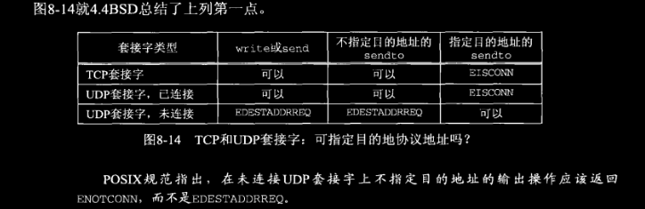

图8-15总结了我们给已连接UDP套接字归纳的三点。

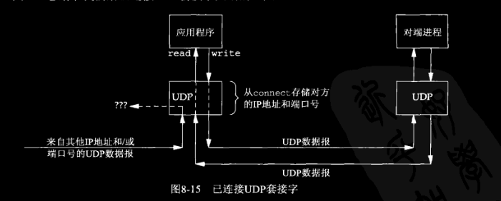

来自任何其他IP地址或端口的数据报（图8-15中我们用“？？？”来表示）不投递给这个已连接套接字，因为它们要么源IP地址要么源UDP端口不与该套接字 `connect` 到的协议地址相匹配。这些数据报可能投递给同一主机上的其它某个UDP套接字。如果没有相匹配的其它套接字，UDP将丢弃它们并生成相应的ICMP端口不可达错误。

作为小结，我们可以说UDP客户进程或服务器进程只在使用自己的UDP套接字与确定的唯一对端通信时，才可以调用 `connect`。调用 `connect` 的通常是UDP客户，不过有些网络应用中的UDP服务器会与单个客户长时间通信（如TFTP），这种情况下，客户和服务器都可能调用 `connect`。

### 8.11.1 给一个UDP套接字多次调用 `connect`

拥有一个已连接UDP套接字的进程可出于下列两个目的之一再次调用 `connect` ：

- 指定新的IP地址和端口号
- 断开套接字

第一个目的（即给一个已连接UDP套接字指定新的对端）不同于TCP套接字中 `connect` 的使用；对于TCP套接字，`connect` 只能调用一次。  
为了断开一个已连接UDP套接字，我们再次调用 `connect` 时把套接字地址结构的地址族成员（对于IPv4为 `sin_family`，对于IPv6为 `sin6_family`）设置为 `AF_UNSPEC`。这么做可能会返回一个 `EAFNOSUPPORT` 错误，不过没有关系。使套接字断开连接的是在已连接UDP套接字上调用 `connect` 的进程。

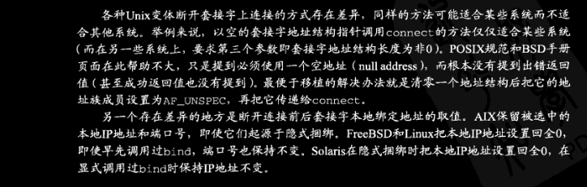

### 8.11.2 性能

可参见 [TCP/IP网络编程](https://github.com/lixichongAAA/TCP-IP-Network-Programming/tree/master/ch06%E5%9F%BA%E4%BA%8EUDP%E7%9A%84%E6%9C%8D%E5%8A%A1%E5%99%A8%E7%AB%AF%E5%92%8C%E5%AE%A2%E6%88%B7%E7%AB%AF#2-%E5%B7%B2%E8%BF%9E%E6%8E%A5connectedudp%E5%A5%97%E6%8E%A5%E5%AD%97%E4%B8%8E%E6%9C%AA%E8%BF%9E%E6%8E%A5unconnectedudp%E5%A5%97%E6%8E%A5%E5%AD%97)

## 8.12 *dg_cli* 函数（修订版）

```c
// 图8-17
// udpcliserv/dgcliconnect.c
#include	"unp.h"

void
dg_cli(FILE *fp, int sockfd, const SA *pservaddr, socklen_t servlen)
{
	int		n;
	char	sendline[MAXLINE], recvline[MAXLINE + 1];

	Connect(sockfd, (SA *) pservaddr, servlen);

	while (Fgets(sendline, MAXLINE, fp) != NULL) {

		Write(sockfd, sendline, strlen(sendline));

		n = Read(sockfd, recvline, MAXLINE);

		recvline[n] = 0;	/* null terminate */
		Fputs(recvline, stdout);
	}
}
```

所做的修改时调用 `connect`，并以 `read` 和 `write` 调用代替 `sendto` 和 `recvfrom` 调用。该函数不查看传递给 `connect` 的套接字地址结构的内容，因此它仍然是协议无关。

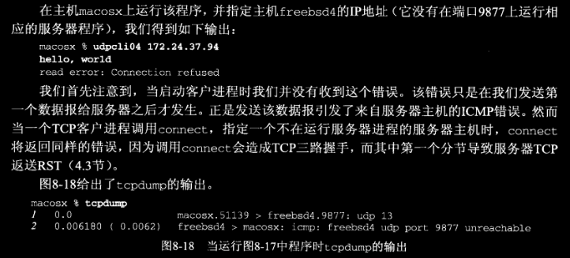

## 8.13 UDP缺乏流量控制

UDP没有流量控制并且是不可靠的。UDP发送端淹没其接收端是轻而易举之事。

### UDP套接字接收缓冲区

见本章同名文件 [dgecholoop2.c](./dgecholoop2.c)。

## 8.14 UDP中的外出接口的确定

已连接UDP套接字还可用来确定用于某个特定目的地的外出接口。这是由 `connect` 函数应用到UDP套接字时的一个副作用造成的：内核选择本地IP地址（假设其进程未曾调用 `bind` 显式指派它）。这个本地IP地址通过为目的IP地址搜索路由表得到外出接口，然后选用该接口的主IP地址而选定。

图8-23给出了一个简单的UDP程序，它 `connect` 到一个指定的IP地址后，调用 `getsockname` 得到本地IP地址和端口号并显示输出。

```c
// 图8-23
// udpcliserv/udpcli09.c
#include	"unp.h"

int
main(int argc, char **argv)
{
	int					sockfd;
	socklen_t			len;
	struct sockaddr_in	cliaddr, servaddr;

	if (argc != 2)
		err_quit("usage: udpcli <IPaddress>");

	sockfd = Socket(AF_INET, SOCK_DGRAM, 0);

	bzero(&servaddr, sizeof(servaddr));
	servaddr.sin_family = AF_INET;
	servaddr.sin_port = htons(SERV_PORT);
	Inet_pton(AF_INET, argv[1], &servaddr.sin_addr);

	Connect(sockfd, (SA *) &servaddr, sizeof(servaddr));

	len = sizeof(cliaddr);
	Getsockname(sockfd, (SA *) &cliaddr, &len);
	printf("local address %s\n", Sock_ntop((SA *) &cliaddr, len));

	exit(0);
}
```

结果参考图1-16，结果如下。

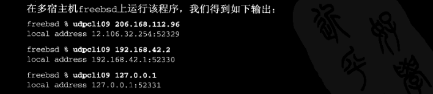

第一次运行该程序是所用命令行参数是一个遵循默认路径的IP地址。内核把本地IP地址指派成默认路径所指接口的主IP地址。第二次运行该程序时所用命令行参数是连接到另一个以太网接口的一个系统的IP地址，因此内核把本地IP地址指派成该接口的主地址。在UDP套接字上调用 `connect` 并不给对端主机发送任何信息，它完全是一个本地操作，只是保存对端的IP地址和端口号。我们还看到，在一个未绑定端口号的UDP套接字上调用 `connect` 同时也给该套接字指派一个临时端口。


## 8.15 使用 `select` 函数的 TCP 和 UDP 回射服务器程序

现在，我们把第5章中的并发TCP回射服务器程序与本章中的迭代UDP回射服务器程序组合成单个使用 `select` 来复用TCP和UDP套接字的服务器程序。

```c
// 图8-24
// udpcliserv/udpservselect01.c
/* include udpservselect01 */
#include	"unp.h"

int
main(int argc, char **argv)
{
	int					listenfd, connfd, udpfd, nready, maxfdp1;
	char				mesg[MAXLINE];
	pid_t				childpid;
	fd_set				rset;
	ssize_t				n;
	socklen_t			len;
	const int			on = 1;
	struct sockaddr_in	cliaddr, servaddr;
	void				sig_chld(int);

		/* 4create listening TCP socket */
	listenfd = Socket(AF_INET, SOCK_STREAM, 0);

	bzero(&servaddr, sizeof(servaddr));
	servaddr.sin_family      = AF_INET;
	servaddr.sin_addr.s_addr = htonl(INADDR_ANY);
	servaddr.sin_port        = htons(SERV_PORT);

	Setsockopt(listenfd, SOL_SOCKET, SO_REUSEADDR, &on, sizeof(on));
	Bind(listenfd, (SA *) &servaddr, sizeof(servaddr));

	Listen(listenfd, LISTENQ);

		/* 4create UDP socket */
	udpfd = Socket(AF_INET, SOCK_DGRAM, 0);

	bzero(&servaddr, sizeof(servaddr));
	servaddr.sin_family      = AF_INET;
	servaddr.sin_addr.s_addr = htonl(INADDR_ANY);
	servaddr.sin_port        = htons(SERV_PORT);

	Bind(udpfd, (SA *) &servaddr, sizeof(servaddr));
/* end udpservselect01 */

/* include udpservselect02 */
	Signal(SIGCHLD, sig_chld);	/* must call waitpid() */

	FD_ZERO(&rset);
	maxfdp1 = max(listenfd, udpfd) + 1;
	for ( ; ; ) {
		FD_SET(listenfd, &rset);
		FD_SET(udpfd, &rset);
		if ( (nready = select(maxfdp1, &rset, NULL, NULL, NULL)) < 0) {
			if (errno == EINTR)
				continue;		/* back to for() */
			else
				err_sys("select error");
		}

		if (FD_ISSET(listenfd, &rset)) {
			len = sizeof(cliaddr);
			connfd = Accept(listenfd, (SA *) &cliaddr, &len);
	
			if ( (childpid = Fork()) == 0) {	/* child process */
				Close(listenfd);	/* close listening socket */
				str_echo(connfd);	/* process the request */
				exit(0);
			}
			Close(connfd);			/* parent closes connected socket */
		}

		if (FD_ISSET(udpfd, &rset)) {
			len = sizeof(cliaddr);
			n = Recvfrom(udpfd, mesg, MAXLINE, 0, (SA *) &cliaddr, &len);

			Sendto(udpfd, mesg, n, 0, (SA *) &cliaddr, len);
		}
	}
}
/* end udpservselect02 */
```

## 习题

> 8.5 对于图8-5我们说过每个已连接TCP套接字都有自己的套接字接收缓冲区。监听套接字怎样？你认为它们有自己的套接字接收缓冲区吗？

监听TCP套接字也许有一个套接字接收缓冲区大小（注意，这里说的是大小），但是它绝不会接受数据。大多数实现并不预先给套接字发送缓冲区或接收缓冲区分配内存空间。使用 `SO_SNDBUF` 和 `SO_RCVBUF` 套接字选项指定的套接字缓冲区大小仅仅是给套接字设定的上限。

> 8.6 用 *sock* 程序（C.3节）和诸如 *tcpdump* 之类的工具测试我们在8.10节给出的声明：如果客户 `bind` 一个IP地址到它的套接字上，但是发送一个从其他接口外出的数据报，那么该数据报仍然包含绑定在该套接字上的IP地址，即使该IP地址与该数据报的外出接口不相符也不管。

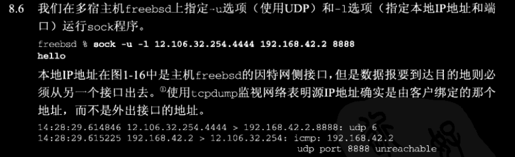

> 8.8 对于UDP/IPv4套接字，可传递给 `sendto` 的最大长度是多少；也就是说，可装填在一个UDP/IPv4数据报中的最大数据量是多少？UDP/IPv6又有什么不同？

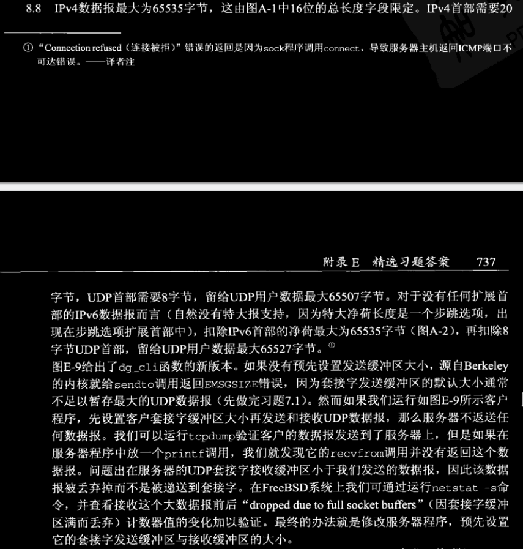

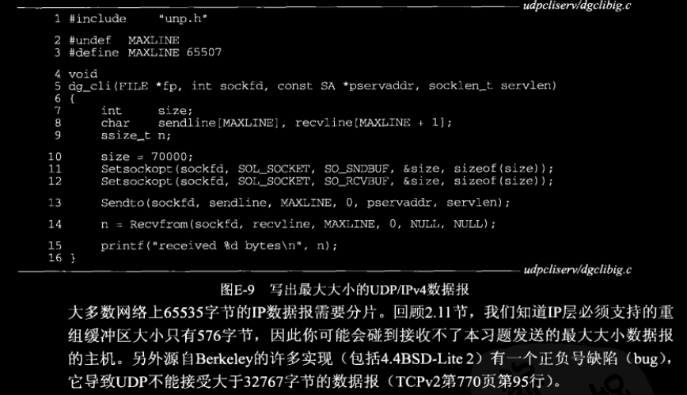