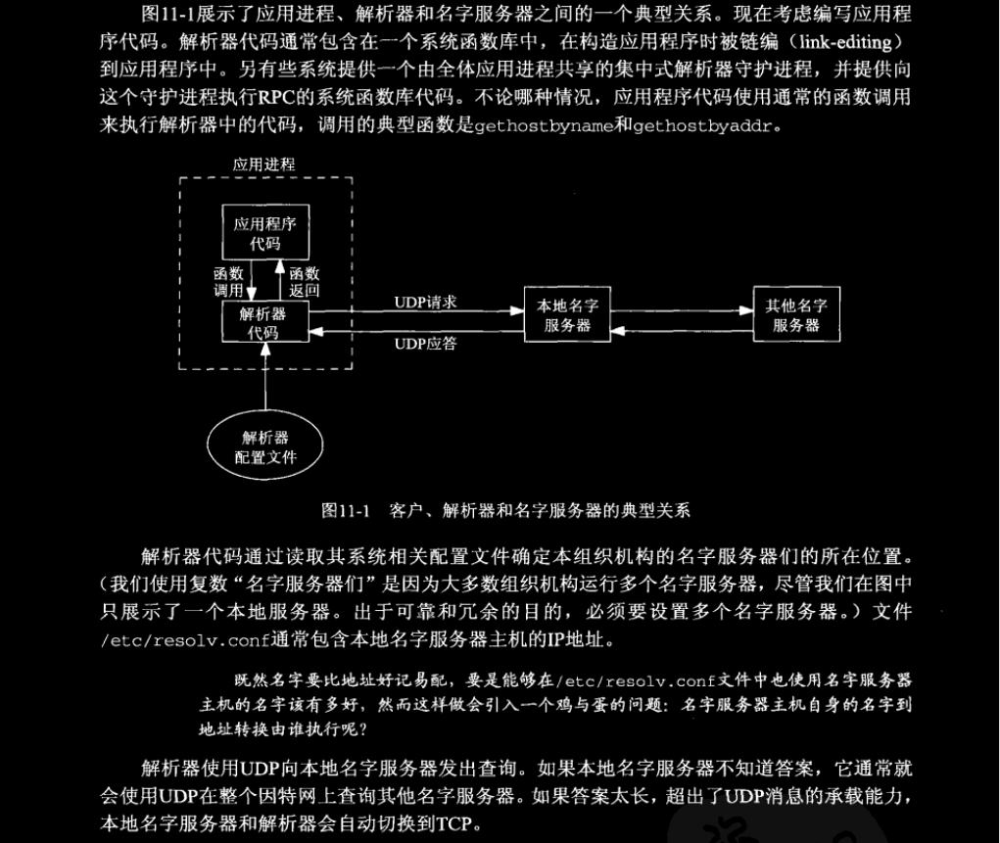
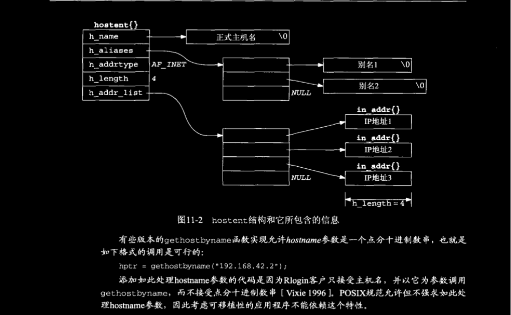
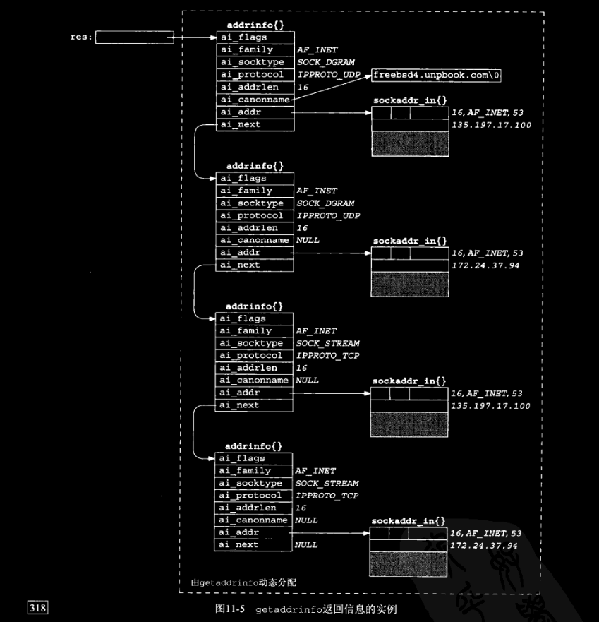
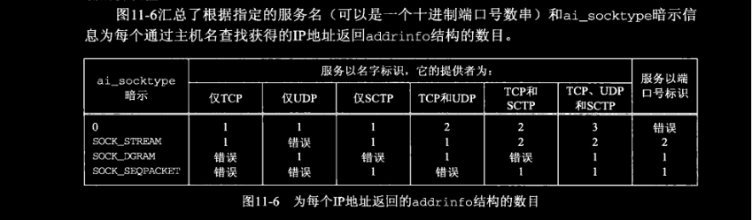
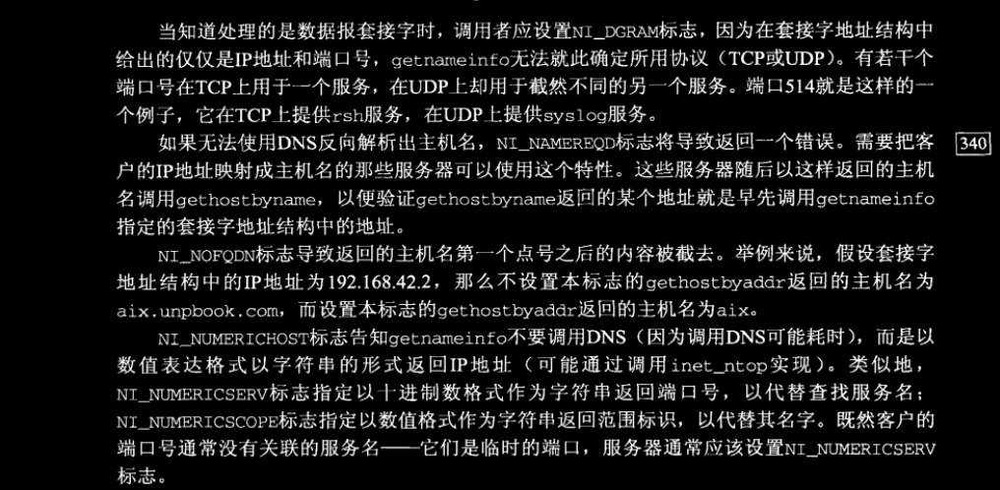

# ch11 名字与地址转换

## 11.1 概述

本章讲述在名字与数值地址间转换的函数：`gethostbyname` 与 `gethostbyaddr` 在主机名字与IPv4地址之间进行转换，`getservbyname` 和 `getservbyport` 在服务名字与端口号之间进行转换。本章还讲述两个协议无关的转换函数：`getaddrinfo` 和 `getnameinfo`，分别用于主机名字与IP地址之间以及服务名字和端口号之间的转换。

## 11.2 域名系统

域名系统（Domain Name System，DNS）主要用于主机名字与IP地址之间的映射。主机名字可以是一个 **简单名字（simple name）**，例如 *solaris* 或 *bsdi*，也可以是一个 **全限定域名（Fully Qualified Domain Name，FQDN）**，例如 *solaris.unpbook.com*。严格来说，全限定域名也称为绝对名字（absolute name），而且必须以一个点号结尾，不过用户们往往省略结尾的点号。这个点号告诉DNS解析器该名字是全限定的，从而不必搜索解析器自己维护的可能域名列表。

### 11.2.1 资源记录

DNS中的条目称为 **资源记录（resource record，RR）**。这里简介几个我们感兴趣的RR类型。

- `A` ：A记录把一个主机名映射成一个32位的IPv4地址。
- `AAAA` ：称为 “四A（quad A）” 记录的AAAA记录把一个主机名映射成一个128位的IPv6地址。选择 “四A” 这个称呼是由于128位地址是32位地址的四倍。
- `PTR` ：称为 “指针记录（pointer record）” 的PTR记录把IP地址映射成主机名。
- `MX` ：MX记录把一个主机指定作为给定主机的 “邮件交换器（mail exchanger）”。
- `CNAME` ：CNAME代表 “canonical name（规范名字）”，它的常见用法是为常用的服务（例如ftp 和 www）指派CNAME记录。

### 11.2.2 解析器和名字服务器

每个组织机构往往运行一个或多个 ***名字服务器（name server）***，它们通常就是所谓的 **BIND（Berkeley Internet Name Domain）** 程序。诸如我们在本书中编写的客户和服务器等应用进程通过调用称为 **解析器（resolver）** 的函数库中的函数接触DNS服务器。常见的解析器函数是将在本章讲解的 `gethostbyname` 和 `gethostbyaddr`。



### 11.2.3 DNS替代方法

不使用DNS也可能获取名字和地址信息。常用的替代方法有静态主机文件（通常是 */etc/hosts* 文件）、网络信息系统（Network Information System， NIS）以及轻权目录访问协议（LightWeight Directory Access Protocol， LDAP）。不幸的是，系统管理员如何配置一个主机以使用不同类型的名字服务是实现相关的。幸运的是，这些差异对于应用程序开发人员来说，通常是透明的，我们只需要调用诸如 `gethostbyname` 和 `gethostbyaddr` 这样的解析器函数。

## 11.3 `gethostbyname` 函数

主机名 --------> IPv4地址  
查找主机名最基本的函数是 `gethostbyname`。如果调用成功，它就返回一个指向 `hostent` 结构的指针，该结构中含有所查找主机的所有IPv4地址。这个函数的局限是只能返回IPv4地址。

```c
#include <netdb.h>
extern int h_errno;
struct hostent *gethostbyname(const char *name);
// 返回：若成功则为空指针，若出错则为NULL且设置 h_errno
// 来自Linux Programmer's Manual，详见手册
```
 
本函数返回的空指针指向如下的 `hostent` 结构。

```c
struct hostent
{
    char *h_name;       /* official name of host */
    char **h_aliases;   /* alias list */
    int h_addrtype;     /* host address type */
    int h_length;       /* length of address */
    char **h_addr_list; /* list of addresses */
}
```

按照DNS的说法，`gethostbyname` 执行的是对A记录的查询。它只能返回IPv4地址。  
图11-2所示为 `hostent` 结构和它所指向的各种信息之间的关系，其中假设所查询的主机名有2个别名和3个IPv4地址。在这些字段中，所查询主机的正式主机名和所有别名都是以空字符结尾的C字符串。



`gethostbyname` 与我们介绍过的其它套接字函数的不同之处在于：当发生错误时，它不设置 `errno` 变量，而是将全局整数变量 `h_errno` 设置为在头文件 `<netdb.h>` 中定义的下列常值之一：

- HOST_NOT_FOUND
- NO_RECOVERY
- NO_DATA（等同于 NO_ADDRESS）

NO_DATA错误表示指定的名字有效，但是它没有A记录。只有MX记录的主机名就是这样的一个例子。  
如今多数解析器都提供名为 `hstrerror` 的函数，它以某个 `h_errno` 值作为唯一参数，返回的是一个 const char* 指针，指向相应的错误说明。

### 例子

[hostent.c](./hostent.c)

```bash
lxc@Lxc:~/C/unp/ch11-名字与地址转换$ bin/hostent www.baidu.com
Official name: www.a.shifen.com
        address alias: www.baidu.com
        IPv4 address: 39.156.66.14
        IPv4 address: 39.156.66.18
```

## 11.4 `gethostbyaddr` 函数

二进制IP地址 ---------> 主机名  

```c
#include <sys/socket.h>       /* for AF_INET */
struct hostent *gethostbyaddr(const void *addr, socklen_t len, int type);
// 返回：若成功则为非空指针，若出错则为NULL且设置 h_errno
```

该函数返回一个指向与之前所述同样的 `hostent` 结构指针。该函数支持IPv6，但不推荐在IPv6时使用该函数。  
按照DNS的说法，`gethostbyaddr` 在 `in_addr.apra` 域中向一个名字服务器查询PTR记录。

## 11.5 `getservbyname` 和 `getservbyport` 函数

从名字到端口号的映射关系保存在一个文件中，通常是 `/etc/services`。  
`getservbyname` 用于根据给定名字查找相应的服务。

```c
#include <netdb.h>
struct servent *getservbyname(const char *name, const char *proto);
// 返回：若成功则为非空指针，若出错则为NULL。
```

本函数返回的非空指针指向如下的结构。

```c
struct servent
{
    char *s_name;     /* official service name */
    char **s_aliases; /* alias list */
    int s_port;       /* port number, newwork byte order */
    char *s_proto;    /* protocol to use */
}
```

本函数的典型调用如下：

```c
struct servent* sptr;

sptr = getservbyname("domain", "udp"); // DNS using UDP
sptr = getservbyname("ftp", "tcp");    // FTP using TCP
sptr = getservbyname("ftp", "NULL");   // FTP using TCP
sptr = getservbyname("ftp", "udp");    // this call will fail
```

FTP仅仅支持TCP，第二个调用和第三个调用等效，第四个调用则会失效。

`getservbyport` 根据端口号和可选协议查找相应的服务。

```c
struct servent *getservbyport(int port, const char *proto);
// 返回：若成功则为非空指针，若出错则为NULL。
```

*port* 参数必须为网络字节序。本函数的典型调用如下。

```c
struct servent* sptr;

sptr = getservbyport(htons(53), "udp"); // DNS using UDP
sptr = getservbyport(htons(21), "tcp"); // FTP using TCP
sptr = getservbyport(htons(21), NULL);  // FTP using TCP
sptr = getservbyport(htons(21), "udp"); // this call will fail
```

因为UDP上没有服务使用端口21，所以最后一个调用失败。  

必须清楚的是，有些端口号在TCP上用于一种服务，在UDP上却用于完全不同的另一种服务，例如：

```c
lxc@Lxc:~$ grep 514 /etc/services 
shell		514/tcp		cmd syslog	# no passwords used
syslog		514/udp
syslog-tls	6514/tcp			# Syslog over TLS [RFC5425]
```

如上所示，端口514在TCP和UDP上用于不同的服务。

### 例子：使用 `gethostbyname` 和 `getservbyname`

[daytimtcpcli1.c](./daytimetcpcli1.c)

我们把图1-5中的TCP时间获取客户程序改为使用以上两个函数，并改用命令行参数：主机名和服务名。它还展示了一个期望的行为，尝试连接到多宿服务器主机的每个IP地址，直到有一个连接成功或所有地址尝试完毕为止。

## 11.6 `getaddrinfo` 函数

`gethostbyname` 和 `gethostbyaddr` 这两个函数仅仅支持IPv4（书上的标准有点老，后者支持IPv6（在Linux下），见 [gethostbyaddr.c](./gethostbyaddr.c)）。解析IPv6地址的API经历了若干次反复的变化，最终结果是 `getaddrinfo` 函数。该函数能够处理名字到地址以及服务到端口这两种转换，返回的是一个 `sockaddr` 结构而不是一个地址列表。这些 `sockaddr` 结构随后可由套接字函数直接使用。如此一来，`getaddrinfo` 函数把协议相关性完全隐藏在这个库函数内部。应用程序只需处理由 `getaddrinfo` 填写的套接字地址结构。

```c
#include <netdb.h>
int getaddrinfo(const char *node, const char *service, 
                const struct addrinfo *hints,
                struct addrinfo **res);
void freeaddrinfo(struct addrinfo *res);
const char *gai_strerror(int errcode);
// 返回：若成功则为0，出错为非0（见图11-7）。
```

本函数通过 *result* 指针返回一个指向 `addrinfo` 结构链表的指针，而 `addrinfo` 结构定义在头文件 `<netdb.h>` 中。

```c
struct addrinfo
{
    int ai_flags;             // AI_PASSIVE, AI_CANONNAME
    int ai_family;            // AF_xxx
    int ai_socktype;          // SOCK_xxx
    int ai_protocol;          // 0 or IPPROTO_xxx for IPv4 and IPv6
    socklen_t ai_addrlen;     // length of ai_addr
    struct sockaddr *ai_addr; // ptr to socket address structure
    char *ai_canonname;       // ptr to canonical name for host
    struct addrinfo *ai_next; // ptr to next structure in linked list
};
```

- *node* 参数是一个主机名或地址串（IPv4的点分十进制数串或IPv6的十六进制数串）。
- *service* 参数是一个服务名或十进制端口号数串。
- *hints* 参数可以是空指针，也可以是一个指向某个 `addrinfo` 结构的指针，调用者在这个结构中填入关于期望返回信息类型的暗示。该结构中可以设置的成员有：
    - `ai_flags` （零个或多个或在一起的 `AI_xxx` 值）；
    - `ai_family` （某个 `AF_xxx` 值）；
    - `ai_socktype`（某个 `SOCK_xxx` 值）；
    - `ai_protocol`

其中 `ai_flags` 成员可用的标志值及其含义如下。

- AI_PASSIVE ：套接字用于被动打开。
- AI_CANONNAME ：告知 `getaddrinfo` 函数返回主机的规范名字。
- AI_NUMERICHOST ：防止任何类型的名字到服务映射，*service* 参数必须是一个十进制端口号数串。
- AI_V4MAPPED ： 如果同时指定 `ai_family` 成员值为 `AF_INET6`，那么如果没有可用的AAAA记录，就返回与A记录对应的IPv4映射的IPv6地址。
- AI_ALL ：如果同时指定AI_V4MAPPED标志，那么除了返回与AAAA记录对应的IPv6地址外，还返回与A记录对应的IPv4映射的IPv6地址。
- AI_ADDRCONFIG ：按照所在主机的配置选择返回地址类型，也就是只查找与所在主机回馈接口以外的网络接口配置的IP地址版本一致的地址。

如果 *hints* 参数是一个空指针，本函数就假设 `ai_flags`、`ai_socktype` 和 `ai_protocol` 的值均为0，`ai_family` 的值为 `AF_UNSPEC`。  
如果本函数返回成功（0），那么由 *result* 参数指向的变量已被填入一个指针，它指向的是由其中的 `ai_next` 成员串接起来的 `addrinfo` 结构链表。可导致返回多个 `addrinfo` 结构的情形有以下两个。

1. 如果与 *node* 参数关联的地址有多个，那么适用于所请求地址族（可通过 *hints* 结构的 `ai_family` 成员设置）的每个地址都返回一个对应的结构。
2. 如果 *service* 参数指定的服务支持多个套接字类型，那么每个套接字类型都可能返回一个对应的结构，具体取决于 *hints* 结构的 `ai_socktype` 成员。（注意，`getaddrinfo` 的多数实现认为只能按照由 `ai_socktype` 成员请求的套接字类型端口号数串到端口的转换，如果没有指定这个成员，那就返回一个错误。）

举例来说，如果在没有提供任何暗示信息的前提下，请求查找有2个IP地址的某个主机上的 domain 服务，那将返回4个 `addrinfo` 结构，分别是：

- 第一个IP地址组合 `SOCK_STREAM` 套接字类型。
- 第二个IP地址组合 `SOCK_DGRAM` 套接字类型。
- 第三个IP地址组合 `SOCK_STREAM` 套接字类型。
- 第四个IP地址组合 `SOCK_DGRAM` 套接字类型。

图11-5展示了本例子。当有多个 `addrinfo` 结构返回时，这些结构的先后顺序没有保证，也就是说，我们并不能假定TCP服务总是先于UDP服务返回。（尽管没有保证，本函数的实现却应该按照DNS返回的顺序返回各个IP地址。有些解析器允许系统管理员在 /etc/resolv.conf 文件中指定地址的排序顺序。IPv6可指定地址选择规则可能影响由该函数返回地址的顺序。）



图11-6汇总了根据指定的服务名（可以是一个十进制端口号数串）和 `ai_socktype` 暗示信息为每个通过主机名查找获得的IP地址返回 `addrinfo` 结构数目。



尽管 `getaddrinfo` 函数确实比 `gethostbyname` 和 `getservbyname` 这两个函数“好”（它方便我们编写协议无关的程序代码，单个函数能够同时处理主机名和服务，所有返回信息都是动态而不是静态分配到的），不过它仍没有像期待的那样好用。问题在于我们必须先分配一个 *hints* 结构，把它清零后填写需要的字段，再调用该函数，然后遍历一个链表逐一尝试每个返回地址。

## 11.7 `gai_strerror` 函数

图11-7给出了可由 `getaddrinfo` 返回的非0错误值的名字和含义。`gai_strerror` 以这些值为它的唯一参数，返回一个指向对应的出错信息串的指针。

```c
#include <netdb.h>
const char *gai_strerror(int errcode);
// 返回：指向错误描述信息字符串的指针。
```

|常值|说明|
| :----------: | :------------------------------------------------: |
|EAI_AGAIN|名字解析中临时失败|
|EAI_BAGFLAGS|`ai_flags` 的值无效|
|EAI_FAIL|名字解析中不可恢复的失败|
|EAI_FAMILY|不支持 `ai_family`|
|EAI_MEMORY|内存分配失败|
|EAI_NONAME|*hostname* 或 *service* 未提供，或者不可知|
|EAI_OVERFLOW|用户参数缓冲区溢出（仅限 `getnameinfo` 函数）|
|EAI_SERVICE|不支持 `ai_socktype` 类型的 *service* |
|EAI_SOCKTYPE|不支持 `ai_socktype`|
|EAI_SYSTEM|在 `errno` 变量中有系统错误返回|

## 11.8 `freeaddrinfo` 函数

由 `getaddrinfo` 返回的所有存储空间都是动态获取的（譬如来自 `malloc` 调用）。这些存储空间通过调用 `freeaddrinfo` 返还给系统。

```c
#include <netdb.h>
void freeaddrinfo(struct addrinfo *res);
```

*res* 参数应指向由 `getaddrinfo` 返回的第一个 `addrinfo` 结构。注意深浅复制问题。

## 11.9 `getaddrinfo` 函数：IPv6

`getaddrinfo` 在处理两个不同的输入：一个是套接字地址结构类型，调用者期待返回的地址结构符合这个类型；另一个是资源记录类型，在DNS或其它数据库中执行的查找符合这个类型。  
由调用者在 *hints* 结构中提供的地址族指定调用者期待返回的套接字地址结构的类型。如果调用者指定 `AF_INET`，`getaddrinfo` 函数就不能返回任何 `sockaddr_in6` 结构；如果调用者指定 `AF_INET6`，`getaddrinfo` 函数就不能返回任何 `sockaddr_in` 结构。  
POSIX声称如果调用者指定 `AF_UNSPEC`，那么 `getaddrinfo` 函数返回的是适用于指定主机名和服务名且适合任意协议族的地址。这就意味着如果某个主机既有AAAA记录又有A记录，那么AAAA记录将作为 `sockaddr_in6` 结构返回，A记录将作为 `sockaddr_in` 结构返回。  
POSIX的这个声明也意味着如果设置了 `AI_PASSIVE` 标志但是没有指定主机名，那么IPv6通配地址（ `IN6ADDR_ANY_INIT` 或者 `0::0` ）应该作为 `sockaddr_in6` 结构返回，同样IPv4通配地址（ `INADDR_ANY` 或 `0.0.0.0` ）应该作为 `sockaddr_in` 结构返回。首先返回IPv6地址是有意义的，因为我们将在12.2节看到双栈主机上的IPv6服务器能够同时处理IPv6客户和IPv4客户。  
在 *hints* 结构的 `ai_family` 成员中指定的地址族以及在 `ai_flags` 成员中指定的 `AI_V4MAPPED` 和 `AI_ALL` 等标志决定了在DNS中查找的资源记录类型（A和/或AAAA），也决定了返回地址的类型（IPv4、IPv6和/或IPv4映射的IPv6）图11-8对此作了总结。  
主机参数还可以是IPv6的十六进制数串或IPv4的点分十进制数串。这个数串的有效性取决于调用者指定的地址族。如果指定 `AF_INET`，那就不能接受IPv6的十六进制数串；如果指定 `AF_INET6`，那就不能接受IPv4的点分十进制数串。然而如果指定的是 `AF_UNSPEC`，那么两种数串都可以接受，返回的是相应类型的套接字地址结构。

图11-8汇总了 `getaddrinfo` 如何处理IPv4和IPv6地址。“结果” 一栏是在给定前三栏的变量后，该函数返回给调用者的结果。“行为” 一栏则说明该函数如何获取这些行为。


## 11.17 `getnameinfo` 函数

`getnameinfo` 函数是 `getaddrinfo` 的互补函数，它以一个套接字地址为参数，返回描述其中的主机的一个字符串和描述其中的服务的另一个字符串。本函数以协议无关的方式提供这些信息，也就是说，调用者不必关心存放在套接字地址结构中的协议地址的类型，因为这些细节由本函数自行处理。

```c
 #include <netdb.h>
int getnameinfo(const struct sockaddr *addr, socklen_t addrlen,
                char *host, socklen_t hostlen,
                char *serv, socklen_t servlen, int flags);
// 返回：若成功则为0，若出错则为非0
```

- *addr* 指向一个套接字地址结构，其中包含待转换成直观可读的字符串的协议地址。
- *addrlen* 是上一个参数结构的长度。

待返回的两个直观可读字符串由调用者预先分配存储空间。

- *host* 和 *hostlen* 指定主机字符串及其长度。
- *serv* 和 *servlen* 指定服务字符串及其长度。 

如果调用者不想返回主机字符串，那就指定 *hostlen* 为0。同样把 *servlen* 指定为0就是不想返回服务字符串。

图11-20（即下表）给出了6个可指定的标志，用于改变 `getnameinfo` 的操作。

|常值|说明|
| :-------------: | :-----------------------------: |
|NI_DGRAM|数据报服务|
|NI_NAMEREQD|若不能从地址解析出名字则返回错误|
|NI_NOFQDN|只返回FQDN的主机名部分|
|NI_NUMERICHOST|以数串格式返回主机字符串|
|NI_NUMERICSCOPE|以数串格式返回范围标识字符串|
|NI_NUMBERICSERV|以数串格式返回服务字符串|



对于这些标志有意义的组合（例如 `NI_DGRAM` 和 `NI_NUMERICHOST`），可以把其中各个标志逻辑或在一起。

## 11.18 可重入函数

因历史原因，`gethostbyname`、`gethostbyaddr`、`getservbyname` 和 `getservbyport` 这4个函数是不可重入的，***因为它们都返回指向同一个静态结构的指针***  
支持线程的一些实现同时提供这四个函数的可重入版本，它们的名字以 _r 结尾，我们将在下一节介绍它们。  
`inet_pton` 和 `inet_ntop` 总是可重入的。  
因历史原因，`inet_ntoa` 是不可重入的，不过支持线程的一些实现提供了使用线程特定数据的可重入版本。  

`getaddrinfo` 可重入的前提是由它调用的函数都可重入，这就是说，它应该调用可重入版本的 `gethostbyname` （以解析主机名）和 `getservbyname` （以解析服务名）。本函数返回的结果全部存放在动态分配内存空间的原因之一就是允许它可重入。  

`getnameinfo` 可重入的前提是由它调用的函数都可重入，这就是说，它应该调用可重入版本的 `gethostbyaddr` （以反向解析主机名）和 `getservbyport` （以反向解析服务名）。它的两个结果字符串（分别为主机名和服务名）由调用者分配空间，从而允许它可重入。

`errno` 变量存在类似的问题。这个整型变量历来每个进程各有一个副本。如果一个进程执行的某个系统调用返回一个错误，该进程的这个变量中就被存入一个整数错误码。

*来个例子：*

```c
if(close(fd) < 0)
{
    fprintf(stderr, "close error, errno = %d\n", errno);
    exit(1);
}
```

从 `close` 系统调用返回时把错误码存入 `errno` 到稍后由程序显示 `errno` 的值之间存在一个小的时间窗口，期间同一个进程内的另一个执行线程（例如一个信号处理函数的某次调用）可能改变了 `errno` 的值。  

就信号处理函数考虑这两个问题，其中 `gethostbyname` 问题（返回一个指向某个静态变量的指针）的解决办法之一是在信号处理函数中不调用任何不可重入的函数。`errno` 问题（其值可被信号处理函数改变的单个全局变量）可通过把信号处理函数编写成预先保存并事后恢复 `errno` 的值加以避免，其代码如下：

```c
void sig_alrm(int signo)
{
    int errno_save;
    errno_save = errno; // save its value on entry
    if(write( ... ) != nbytes)
        fprintf(stderr, "write error, errno = %d\n", errno);
    errno = errno_save; // restore its value on return
}
```

注意，在这个例子中，我们还调用了 `fprintf` 这个标准I/O函数。它引入了另一个重入问题，因为许多版本的标准I/O函数库是不可重入的，也就是说我们不应该在信号处理函数中调用标准I/O函数。

我们将在第26章中重提这个重入问题，并查看线程如何处理 `errno` 变量问题。

## 11.19 `gethostbyname_r` 和 `gethostbyaddr_r` 函数

有两种方法可以把不可重入函数改为可重入函数。

1. 把由不可重入函数填写并返回静态结构的做法改为由调用者分配再由可重入函数填写结构。
2. 由可重入函数调用 `malloc` 以动态分配内存空间。

需要注意的是，关于 _r 函数也没有标准可循。标题的两个函数在不同的系统下有不同的实现。