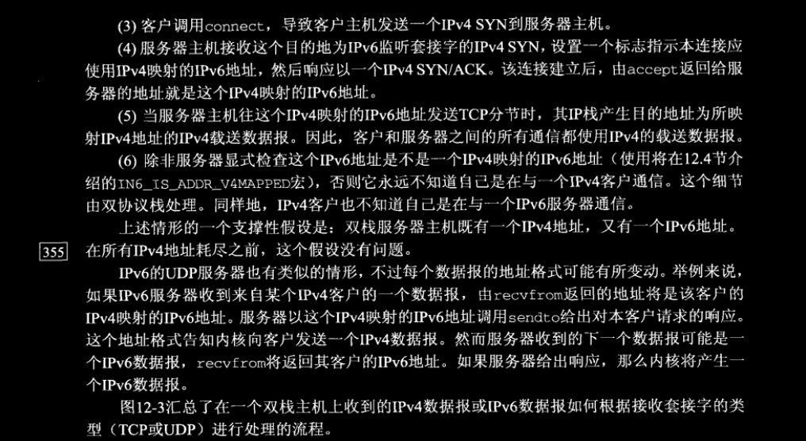
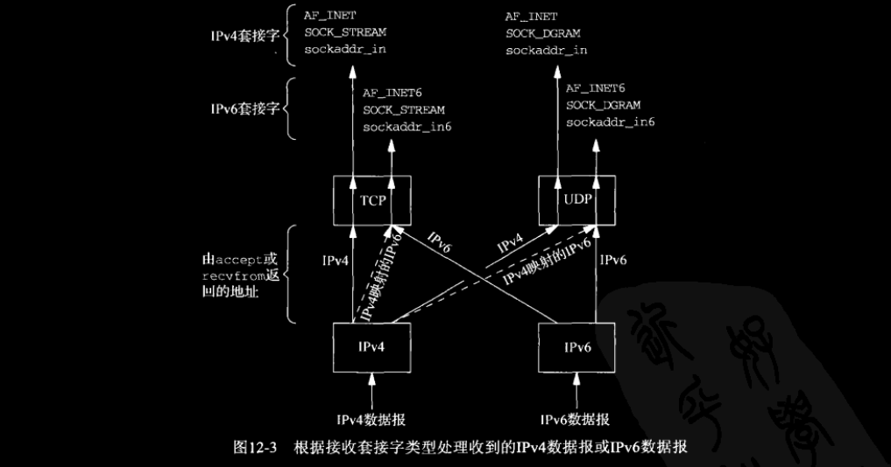

# ch12 IPv4 与 IPv6 的互操作性

## 12.1 概述

我们贯穿本章假设主机都运行着 **双栈（dual stack）**，意指一个IPv4协议栈和一个IPv6协议栈。（事实上当今主机均为双栈主机。）

在本章中，我们将讨论IPv4应用进程和IPv6应用进程如何才能彼此通信。对于客户和服务器使用相同协议的那两种情形我们不再过多讨论。我们感兴趣的是客户和服务器使用不同协议的那两种情形。

## 12.2 IPv4 客户与 IPv6 服务器

双栈主机的一个基本特性是其上的IPv6服务器既能处理IPv4客户，又能处理IPv6客户。这是通过使用IPv4映射的IPv6地址实现的。（这就完事儿了，看几张图片吧 :joy: ，不想看图片的话直接看后面的规则就行。）

大多数双栈主机在处理监听套接字时应使用以下规则。

- IPv4监听套接字只能接受来自IPv4客户的外来连接。
- 如果服务器有一个绑定了通配地址的IPv6监听套接字，而且该套接字未设置 `IPV6_V6ONLY`（7.8节）套接字选项，那么该套接字既能接受来自IPv4客户的外来连接，又能接受来自IPv6客户的外来连接。对于来自IPv4客户的连接而言，其服务器端的本地地址将是与某个本地IPv4地址对应的IPv4映射的IPv6地址。
- 如果服务器有一个IPv6监听套接字，而且绑定在其上的是除IPv4映射的IPv6地址之外的某个非通配IPv6地址，或者绑定在其上的是通配地址，不过设置了 `IPV6_V6ONLY` 套接字选项，那么该套接字只能接受来自IPv6客户的外来连接。

## 12.3 IPv6 客户与 IPv4 服务器

看图吧，不想看图就看最后一段话就行。

上一节讨论的IPv4数据报到达某个IPv6套接字的情形中，内核把收到的IPv4地址转换成IPv4映射的IPv6地址，并通过 `accept` 或 `recvfrom` 把映射地址透明的返回给应用进程。本节讨论的通过某个IPv6套接字发送IPv4数据报的情形中，从IPv4地址到IPv4映射的IPv6地址之间的转换却由解析器根据图11-8中的规则完成，映射地址随后由应用进程透明地传递给 `connect` 或 `sendto`。

### 对互操作性的总结

图中标为 “IPv4” 或 “IPv6” 的栏目表示相应组合有效，并指出了实际使用的协议；标为 “无” 的栏目表示组合无效。最后一行第三列标注了星号，因为该栏目的互操作性取决于客户选择的地址。如果选择AAAA记录从而发送IPv6数据报，那就不能工作。然而如果选择A记录，而这个A记录实际作为一个IPv4映射的IPv6地址返回给客户，使得客户发送IPv4数据报，那就能够工作。通过图11-4（也就是第11章中daytimetcpcli1.c文件）所示在一个循环中遍试由 `getaddrinfo` 返回的所有地址，可确保试用这个IPv4映射的IPv6地址。

## 12.4 IPv6 地址测试宏

有一小类的IPv6应用进程必须清楚与其通信的是不是IPv4对端。这些应用程序需要知道对端的地址是不是一个IPv4映射的IPv6地址。头文件 \<netinet/in.h\> 中定义的以下12个宏用于测试一个IPv6地址是否归属某个类型。

前7个宏测试IPv6地址的基本类型。后5个宏测试IPv6多播地址的范围。  
IPv6客户可以调用 `IN6_IS_ADDR_V4MAPPED` 宏测试由解析器返回的IPv6地址。IPv6服务器同样可以调用这个宏测试由 `accept` 或 `recvfrom` 返回的IPv6地址。只有少量的客户和服务器需要知道对端使用的具体协议（例如FTP），而 `IN6_IS_ADDR_V4MAPPED` 宏可用于判定对端是否在使用IPv4。