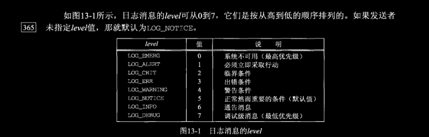
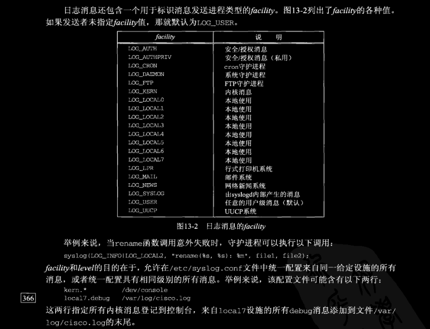

# ch13 守护进程与inetd超级服务器

## 13.1 概述

**守护进程（daemon）** 是在后台运行且不与任何控制终端关联的进程。Unix系统通常有很多守护进程（在20\~50个数量级）在后台运行，执行不同的管理任务。

守护进程没有控制终端通常源于它们由系统初始化脚本启动。然而守护进程也可能从某个终端由用户在shell提示符下键入命令行启动，这样的守护进程必须亲自脱离与控制终端的关联，从而避免与作业控制、终端会话管理、终端产生信号等发生任何不期望的交互，也可以避免在后台运行的守护进程非预期地输出到终端。

守护进程有多种启动方法。 
1. 在系统启动阶段，许多守护进程由系统初始化脚本启动。这些脚本通常位于 /etc 目录或以 /etc/rc 开头的某个目录中，它们的具体位置和内容却是实现相关的。由这些脚本启动的守护进程一开始就拥有超级用户特权。
有若干个网络服务器通常从这些脚本启动：inetd超级服务器、Web服务器、邮件服务器（经常是sendmail）。以及下一节要讲的 `syslogd` 守护进程通常也由某个系统初始化脚本启动。
2. 许多网络服务器由将在本章介绍的 inetd 超级服务器启动。inetd 自身由上一条中的某个脚本启动。inetd 监听网络请求（Telnet、FTP等），每当有一个请求到达时，启动相应的实际服务器（Telnet服务器、FTP服务器等）。
3. `cron` 守护进程按照规则定期执行一些程序，而由它启动执行的程序同样作为守护进程运行。`cron` 自身由第1条启动方法中的某个脚本启动。
4. `at` 命令用于指定将来某个时刻的程序执行。这些程序的执行时刻到来时，通常由 `cron` 守护进程启动它们，因此这些程序同样作为守护进程运行。
5. 守护进程还可以从用户终端或在前台或在后台启动。这么做往往是为了测试守护程序或重启因某种原因而终止了的某个守护进程。

关于第3点和第4点可参见 [Linux命令行与shell脚本编程大全](https://github.com/lixichongAAA/Linux_Shell-Bash-/tree/master/ch16-%E8%84%9A%E6%9C%AC%E6%8E%A7%E5%88%B6#6-%E5%AE%9A%E6%97%B6%E8%BF%90%E8%A1%8C%E8%84%9A%E6%9C%AC)
因为守护进程没有控制终端，所以当有事发生时它们得有输出消息的某种方法可用，而这些消息既可能是普通的通告性消息，也可能是需由系统管理员处理的紧急事件消息。`syslog` 函数是输出这些消息的标准方法，它把这些消息发送给 `syslogd` 守护进程。

## 13.2 `syslogd` 守护进程

Unix系统中的 `syslogd` 守护进程通常由某个系统初始化脚本启动，而且在系统工作期间一直运行。源自Berkeley 的 `syslogd` 实现在启动时执行以下步骤。

1. 读取配置文件。通常为 */etc/syslog.conf*  的配置文件指定本守护进程可能收取的各种日志消息（log message）应该如何处理。这些消息可能被添加到一个文件（/dev/console文件是一个特例，它把消息写到控制台上），或被写到指定用户的登录窗口（若该用户已登录到本守护进程所在系统中），或被转发给另一个主机上的 `syslogd` 进程。
2. 创建一个Unix域数据报套接字，给它捆绑路径名 /var/run/log（在某些系统上是 /dev/log）。 
3. 创建一个UDP套接字，给它捆绑端口514（`syslogd` 服务使用的端口号）。
4. 打开路径名 /dev/klog。来自内核中的任何出错消息看着像是这个设备的输入。

此后 `syslogd` 守护进程在一个无限循环中运行：调用 `select` 以等待它的3个描述符（分别来自上述第2步、第3步和第4步）之一变为可读，读入日志消息，并按照配置文件进程处理。如果守护进程收到 `SIGHUP` 信号，那就重新读取配置文件。  
通过创建一个Unix域数据报套接字，我们就可以从自己的守护进程中通过往 `syslogd` 绑定的路径名发送我们的消息达到发送日志消息的目的，然而更简单的接口是使用将在下一节讲解的 `syslog` 函数。另外，我们也可以创建一个UDP套接字，通过往环回地址和端口514发送我们的消息达到发送日志消息的目的。

> 

## 13.3 `syslog` 函数

既然守护进程没有控制终端，它们就不能把消息 `fprintf` 到 `stderr` 上。从守护进程中登记消息的常用技巧就是调用 `syslog` 函数。

```c
#include <syslog.h>
void openlog(const char *ident, int option, int facility);
void syslog(int priority, const char *format, ...);
void closelog(void);

void vsyslog(int priority, const char *format, va_list ap);
```

- *priority* 参数是 级别（level） 和 设施（facility）两者的组合，分别如图13-1和图13-2所示。
- *format* 参数类似于 `printf` 的格式串，不过增设了 `%m` 规范，它将被替换成与当前 `errno` 值对应的出错消息。该参数末尾可以出现一个换行符，不过并非必需。




当 `syslog` 被应用进程首次调用时，它创建一个Unix域数据报套接字，然后调用 `connect` 连接到由 `syslogd` 守护进程创建的Unix域数据报套接字的众所周知路径名（譬如/var/run/log）。这个套接字一直保持打开，直到进程终止为止。作为替换，进程也可以调用 `openlog` 和 `closelog`。

```c
#include <syslog.h>
void openlog(const char *ident, int option, int facility);
void closelog(void);
```

`openlog` 可以在首次调用 `syslog` 前调用，`closelog` 可以在应用进程不再需要发送日志消息时调用。

- *ident* 参数是一个由 `syslog` 冠于每个日志消息之前的字符串。它的值通常就是程序名。

> 注意 `openlog` 的大多数实现仅仅保存一个指向 *ident* 字符串的指针；它们不复制这个字符串。这就是说该字符串不应该在栈上分配（自动变量就是这样），因为以后调用 `syslog` 时如果相应的栈帧被弹走了，那么由 `openlog` 保存的指针将不再指向原 *ident* 字符串。

- *options* 参数由图13-3所示的一个或多个常值的逻辑或构成。


`openlog` 被调用时，通常并不立即创建Unix域套接字。相反，该套接字直到首次调用 `syslog` 时才打开。`LOG_NDELAY` 选项迫使该套接字在 `openlog` 被调用时就创建。  
`openlog` 的 *facility* 参数为没有指定设施的后续 `syslog` 调用指定一个默认值。有些守护进程通过调用 `openlog` 指定一个设施（对于一个给定守护进程，设施通常不变），然后在每次调用 `syslog` 时只指定级别（因为级别可随错误性质改变）。  
日志消息也可由 `logger` 命令产生。举例来说，`logger` 命令可用在shell脚本中向 `syslogd` 发送消息。

## 13.4 `daemon_init` 函数

图13-4给出了名为 `daemon_init` 的函数，通过调用它（通常从服务器程序中），我们能够把一个普通进程变为一个守护进程。该函数在所有Unix变体上都应该适合使用，不过有些Unix变体提供了一个名为 `daemon` 的C库函数，实现类似的功能。BSD和Linux均提供这个daemon函数。

*我们可以看看这个函数实现原理，了解一下就行，毕竟在Linux上有现成的*


### 例子：作为守护进程运行的时间获取服务器程序

图13-5修改自图11-14中协议无关时间获取服务器程序，它调用 `daemon_init` 函数以作为守护进程运行。

```c
// 图13-5
// inetd/daytimetcpsrv2.c
#include	"unp.h"
#include	<time.h>

int
main(int argc, char **argv)
{
	int listenfd, connfd;
	socklen_t addrlen, len;
	struct sockaddr	*cliaddr;
	char buff[MAXLINE];
	time_t ticks;

	if (argc < 2 || argc > 3)
		err_quit("usage: daytimetcpsrv2 [ <host> ] <service or port>");

	daemon_init(argv[0], 0);

	if (argc == 2)
		listenfd = Tcp_listen(NULL, argv[1], &addrlen);
	else
		listenfd = Tcp_listen(argv[1], argv[2], &addrlen);

	cliaddr = Malloc(addrlen);

	for ( ; ; ) {
		len = addrlen;
		connfd = Accept(listenfd, cliaddr, &len);
		err_msg("connection from %s", Sock_ntop(cliaddr, len));

		ticks = time(NULL);
		snprintf(buff, sizeof(buff), "%.24s\r\n", ctime(&ticks));
		Write(connfd, buff, strlen(buff));

		Close(connfd);
	}
}
```


## 13.5 inetd 守护进程

没啥好说的，直接把书上的内容都贴过来吧，看一遍就行。:joy::joy:


## 13.6 `daemon_inetd` 函数


### 例子：由 `inetd` 作为守护进程启动的时间获取服务器程序


## 13.7 小结

&emsp;&emsp;守护进程是在后台运行并独立于所有控制终端的进程。许多网络服务器作为守护进程运行。守护进程产生的所有输出通常通过调用 `syslog` 函数发送给 `syslogd` 守护进程。系统管理员可根据发送消息的守护进程以及消息的严重级别，完全控制这些消息的处理方式。  
&emsp;&emsp;启动任意一个程序并让它作为守护进程运行需要以下步骤：调用 `fork` 以转到后台运行，调用 `setid` 建立一个新的POSIX会话并成为会话头进程，再次 `fork` 以避免无意获得新的控制终端，改变工作目录和文件创建模式掩码，最后关闭所有非必要的描述符。我们的 `daemon_init` 函数处理所有这些细节。  
&emsp;&emsp;许多Unix服务器由 `inetd` 守护进程启动。它处理全部守护进程化所需的步骤，当启动真正的服务器时，套接字已在标准输入、标准输出和标准错误输出上打开。这样我们无需调用 `socket`、`bind`、`listen` 和 `accept`，因为这些步骤已由 `inetd` 处理。在Linux系统上，称为 `xinetd` 的扩展式因特网服务守护进程业已常见。`xinetd` 提供与 `inetd` 一致的基本服务，不过还提供数目众多的其它特性，包括根据客户的登记地址、接受或拒绝连接的选项、每个服务一个配置文件的做法，等等。其背后的概念也是与 `inetd` 一样的。